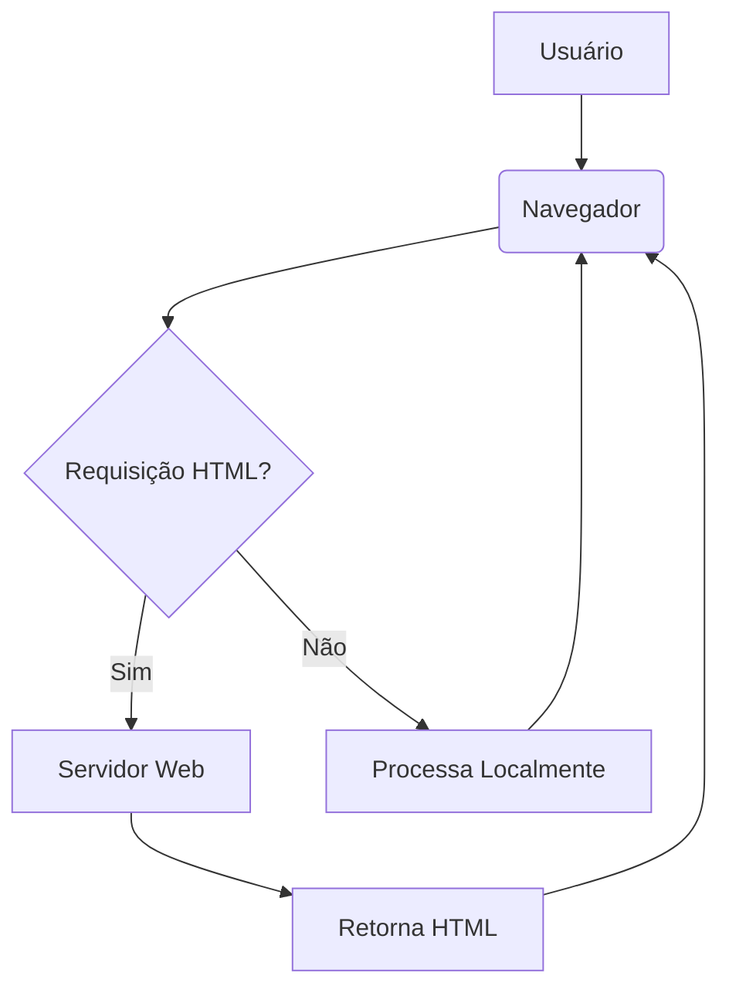

# Prompt para Geração de Skills de Programação para Treinamento de IA

## Objetivo

O objetivo deste prompt é guiar a criação de um vasto e detalhado conjunto de *skills* (habilidades/conhecimentos) em diversas áreas da programação, com foco em **Front-end**, **Back-end**, **PWA para Android** e **Inteligência Artificial**. Cada *skill* deve ser elaborada com o máximo de detalhes e explicações possíveis, servindo como um banco de dados robusto para o treinamento de uma IA.

## Estrutura de Pastas e Organização

A organização dos arquivos é crucial para a padronização e o uso eficiente no treinamento da IA. As *skills* devem ser criadas inicialmente em uma pasta de desenvolvimento e, após a conclusão, movidas para uma pasta de versão final, mantendo a mesma estrutura.

### Pasta de Desenvolvimento (Criação)

Todas as novas *skills* devem ser desenvolvidas e armazenadas temporariamente na seguinte estrutura de diretórios:

`D:\Sites\index\skills ia\dev\`

Dentro desta pasta, as subpastas devem ser criadas de forma organizada, seguindo a categorização das *skills*. Por exemplo:

*   `D:\Sites\index\skills ia\dev\front-end\html\`
*   `D:\Sites\index\skills ia\dev\front-end\css\`
*   `D:\Sites\index\skills ia\dev\front-end\javascript\`
*   `D:\Sites\index\skills ia\dev\front-end\react\`
*   `D:\Sites\index\skills ia\dev\front-end\web-security\`
*   `D:\Sites\index\skills ia\dev\front-end\3d-animation\`
*   `D:\Sites\index\skills ia\dev\front-end\design\`
*   `D:\Sites\index\skills ia\dev\back-end\`
*   `D:\Sites\index\skills ia\dev\databases\`
*   `D:\Sites\index\skills ia\dev\algorithms\`
*   `D:\Sites\index\skills ia\dev\artificial-intelligence\`
*   `D:\Sites\index\skills ia\dev\pwa\android\`

### Pasta de Versão Final (Organização)

Após a criação e revisão de cada *skill* na pasta `dev`, o arquivo final (ou conjunto de arquivos) deve ser movido para a pasta de versão final, mantendo a **mesma estrutura de subpastas e padronização de nomes**:

`D:\Sites\index\skills ia\ver\`

Exemplo:

*   `D:\Sites\index\skills ia\ver\front-end\html\`
*   `D:\Sites\index\skills ia\ver\front-end\css\`
*   `D:\Sites\index\skills ia\ver\front-end\javascript\`
*   `D:\Sites\index\skills ia\ver\front-end\react\`
*   `D:\Sites\index\skills ia\ver\front-end\web-security\`
*   `D:\Sites\index\skills ia\ver\front-end\3d-animation\`
*   `D:\Sites\index\skills ia\ver\front-end\design\`
*   `D:\Sites\index\skills ia\ver\back-end\`
*   `D:\Sites\index\skills ia\ver\databases\`
*   `D:\Sites\index\skills ia\ver\algorithms\`
*   `D:\Sites\index\skills ia\ver\artificial-intelligence\`
*   `D:\Sites\index\skills ia\ver\pwa\android\`

## Conteúdo das Skills

Para cada skill, o conteúdo deve ser o mais explicativo possível, abrangendo tanto o necessário quanto o "desnecessário" para fornecer um banco de dados rico e abrangente. A profundidade e a abrangência são cruciais para o treinamento da IA. Os tópicos a serem abordados incluem, mas não se limitam a:

Cada *skill* deve ser o mais explicativa possível, abrangendo tanto o necessário quanto o desnecessário para fornecer um banco de dados rico e abrangente. Os tópicos a serem abordados incluem, mas não se limitam a:

### 1. Front-end

*   **HTML**: Estrutura, semântica, novas tags (HTML5), acessibilidade, SEO básico.
*   **CSS**: Seletores, especificidade, box model, flexbox, grid, responsividade (media queries), pré-processadores (Sass/Less), animações e transições.
*   **JavaScript (JS)**: Fundamentos (variáveis, tipos de dados, operadores, estruturas de controle), funções, escopo, closures, protótipos, ES6+, manipulação do DOM, eventos, AJAX, Fetch API, async/await.
*   **JSON**: Estrutura, uso em APIs, parsing e stringify.
*   **React**: Componentes (funcionais e de classe), Hooks, gerenciamento de estado (Context API, Redux), roteamento (React Router), ciclo de vida, performance, testes.
*   **Segurança Web (Front-end)**: XSS, CSRF, CORS, Content Security Policy (CSP), boas práticas de autenticação e autorização.
*   **Animação 3D**: Bibliotecas como Three.js, WebGL, conceitos de modelagem, texturização, iluminação e interatividade.
*   **Design (UI/UX para Front-end)**: Princípios de design, usabilidade, wireframing, prototipagem, design systems, ferramentas de design (Figma, Sketch, Adobe XD).

### 2. Back-end

*   **Linguagens e Frameworks**: Node.js (Express), Python (Django/Flask), Ruby (Rails), PHP (Laravel), Java (Spring Boot).
*   **APIs RESTful e GraphQL**: Design, autenticação (JWT, OAuth), versionamento, documentação (Swagger/OpenAPI).
*   **Microsserviços**: Arquitetura, comunicação entre serviços, orquestração.

### 3. Banco de Dados

*   **SQL**: Modelagem de dados, consultas complexas, otimização, transações (ACID).
*   **NoSQL**: Tipos (documento, chave-valor, coluna, grafo), MongoDB, Cassandra, Redis.
*   **ORM/ODM**: Mapeamento objeto-relacional/documento.

### 4. Algoritmos e Estruturas de Dados

*   **Fundamentos**: Arrays, listas encadeadas, árvores, grafos, tabelas hash.
*   **Algoritmos de Busca e Ordenação**: Busca binária, quicksort, mergesort.
*   **Complexidade de Algoritmos**: Notação Big O.

### 5. Inteligência Artificial (IA)

*   **Fundamentos**: Machine Learning (supervisionado, não supervisionado, por reforço), Deep Learning, Redes Neurais.
*   **Bibliotecas**: TensorFlow, PyTorch, scikit-learn.
*   **Aplicações**: Processamento de Linguagem Natural (PLN), Visão Computacional.

### 6. PWA (Progressive Web Apps) para Android

*   **Manifest Web App**: Configuração, ícones, splash screen.
*   **Service Workers**: Cache offline, notificações push, sincronização em segundo plano.
*   **Capacidades Nativas**: Acesso a hardware (câmera, geolocalização), instalação na tela inicial.
*   **Otimização**: Performance, Lighthouse, estratégias de carregamento.
*   **Considerações para Android**: Comportamento em diferentes versões do Android, integração com o ecossistema Android.

## Diretrizes para Geração de Conteúdo Detalhado

Para maximizar a utilidade de cada *skill* no treinamento da IA, é imperativo que o conteúdo transcenda a mera explicação superficial, aprofundando-se em aspectos técnicos, nuances e cenários complexos. A IA deve ser instruída a:

1.  **Profundidade Técnica Extrema**: Cada conceito deve ser explorado em sua totalidade, incluindo:
    *   **Mecanismos Internos**: Como as coisas funcionam "por baixo do capô" (e.g., o *event loop* do JavaScript, o funcionamento do *garbage collector*, a arquitetura de um *Service Worker*).
    *   **Performance e Otimização**: Detalhes sobre gargalos comuns, métricas de performance (e.g., Core Web Vitals para Front-end, latência de banco de dados para Back-end), e técnicas avançadas de otimização (e.g., *tree shaking*, *code splitting*, indexação de banco de dados, *caching*).
    *   **Arquitetura e Design Patterns**: Explicação de padrões de projeto relevantes (e.g., MVC, MVVM, Observer, Factory) e como eles se aplicam em diferentes contextos (e.g., arquitetura de microsserviços, design de componentes React).
    *   **Trade-offs e Decisões de Design**: Análise crítica das escolhas tecnológicas, prós e contras de diferentes abordagens (e.g., SQL vs. NoSQL, REST vs. GraphQL, SPA vs. SSR), e os fatores que influenciam essas decisões.

2.  **Casos de Borda (Edge Cases) e Cenários de Falha**: Não se limitar ao "caminho feliz". Incluir:
    *   **Tratamento de Erros**: Como lidar com exceções, *fallback mechanisms*, e estratégias de resiliência (e.g., *circuit breakers*, *retries*).
    *   **Vulnerabilidades e Mitigações**: Para segurança web, detalhar vetores de ataque específicos e as contramedidas exatas (e.g., como um ataque XSS funciona e como o CSP o previne).
    *   **Comportamentos Inesperados**: Como a tecnologia se comporta em condições adversas (e.g., perda de conexão para PWAs, concorrência em bancos de dados, falhas de rede em APIs).

3.  **Interconectividade e Referências Cruzadas: Construindo um Cérebro de Conhecimento**: As *skills* não devem ser silos isolados; elas são os neurônios de um vasto **cérebro interconectado de conhecimento**. A IA deve atuar como um arquiteto neural, garantindo que cada *skill* estabeleça **sinapses** robustas com outras, permitindo uma navegação fluida e inferência de relações complexas. Para isso, a IA deve:
    *   **Referenciar Skills Relacionadas de Forma Explícita**: Sempre que um conceito abordado em uma *skill* depender, complementar ou se relacionar diretamente com o conteúdo de outra *skill*, uma referência explícita e clara deve ser inserida. Utilize o formato `[[Nome da Skill Relacionada]]` para facilitar a identificação e a construção do grafo de conhecimento (e.g., "Para uma compreensão aprofundada sobre a manipulação do DOM, consulte a *skill* `[[JavaScript: Fundamentos]]`").
    *   **Mapear Dependências e Complementaridades**: Além de referências diretas, a IA deve identificar e, se possível, descrever brevemente a natureza da relação (e.g., "Pré-requisito para", "Aprofundamento em", "Aplicação de").
    *   **Construir um Grafo de Conhecimento Dinâmico**: O objetivo final é que, ao analisar todas as *skills*, a IA possa mapear e visualizar as conexões, entendendo como diferentes áreas da programação se influenciam e se complementam, formando um modelo mental coeso e abrangente.
    *   **Contextualização Abrangente**: Explicar não apenas o funcionamento de uma tecnologia, mas também seu posicionamento no ecossistema tecnológico maior, suas integrações e as implicações de sua escolha em diferentes contextos (e.g., como React se integra com Webpack e Babel, ou como um microsserviço se comunica com um *message broker* e as implicações de performance e resiliência dessa comunicação).

4.  **Exemplos Práticos Abrangentes**: Os exemplos de código devem ser:
    *   **Completos e Executáveis**: Não apenas snippets, mas exemplos que possam ser copiados e executados para demonstrar o conceito.
    *   **Comentados Exaustivamente**: Cada linha ou bloco de código deve ter comentários explicando seu propósito e funcionamento.
    *   **Variados**: Apresentar diferentes abordagens para o mesmo problema, mostrando as vantagens e desvantagens de cada uma.

## Formato das Skills

Cada *skill* deve ser apresentada em formato Markdown (`.md`), seguindo uma estrutura clara, hierárquica e exaustivamente detalhada. O objetivo é que cada seção seja preenchida com o máximo de informações possível, abrangendo tanto o **essencial** quanto o **"desnecessário"** para construir um repositório de conhecimento sem precedentes. A IA deve buscar a granularidade máxima em cada ponto, explorando cada faceta do tópico. As seções obrigatórias incluem:

*   **Título**: Nome da *skill* (claro e conciso).
*   **Introdução**: Breve descrição do que será abordado, seu propósito e relevância no contexto geral da programação e do treinamento da IA.
*   **Glossário Técnico**: Uma seção dedicada a definir termos técnicos específicos da *skill*, evitando ambiguidades e garantindo que a IA compreenda a terminologia exata.
*   **Conceitos Fundamentais**: Explicação detalhada dos princípios básicos, terminologias essenciais e a lógica subjacente à *skill*. Deve incluir a teoria por trás da prática.
*   **Histórico e Evolução**: Contexto histórico da tecnologia ou conceito, como surgiu, suas principais versões/evoluções e as tendências futuras. Isso ajuda a IA a entender a trajetória e a relevância duradoura.
*   **Exemplos Práticos e Casos de Uso**: Trechos de código completos e executáveis, demonstrações, casos de aplicação real e pequenos projetos que ilustrem os conceitos. Deve incluir exemplos de uso em diferentes cenários e complexidades.
*   **Análise de Fluxo e Diagramas (em Texto)**: Representações visuais de processos, arquiteturas ou fluxos de dados utilizando caracteres ASCII ou Markdown (e.g., fluxogramas simples, diagramas de sequência) para facilitar a compreensão de interações complexas.
*   **Boas Práticas e Padrões de Projeto**: Recomendações, padrões da indústria, dicas de performance, segurança, manutenção e padrões de projeto aplicáveis. Incluir o que fazer e o que evitar, com justificativas técnicas.
*   **Comparativos Detalhados**: Tabelas comparando a *skill* ou tecnologia com alternativas existentes, destacando vantagens, desvantagens, cenários de uso ideais e *trade-offs* técnicos (e.g., React vs. Vue, SQL vs. NoSQL, REST vs. GraphQL).
*   **Ferramentas e Recursos**: Lista abrangente de ferramentas, bibliotecas, frameworks, documentações oficiais, tutoriais, artigos e links úteis para aprofundamento no tema.
*   **Tópicos Avançados e Pesquisa Futura**: Aprofundamento em aspectos mais complexos, experimentais ou menos comuns da *skill*. Pode incluir otimizações de baixo nível, padrões de design avançados, integrações complexas ou direções de pesquisa.
*   **Perguntas Frequentes (FAQ)**: Respostas a dúvidas comuns que podem surgir sobre a *skill*, formatadas como pergunta e resposta.
*   **Cenários de Aplicação Real (Case Studies)**: Exemplos de como a *skill* é utilizada em projetos reais, empresas renomadas ou em contextos de alta demanda, com links para referências se possível.
*   **Referências**: Lista completa de todas as fontes consultadas para a criação desta *skill*, com links diretos para os recursos, seguindo um padrão de citação consistente.

O objetivo é que cada arquivo `.md` seja um recurso completo e autossuficiente sobre o tema abordado, permitindo que a IA absorva o máximo de conhecimento possível de forma estruturada.

## Modelo de Estrutura Interna de Skill (.md)

Para garantir a padronização e a riqueza de detalhes, cada arquivo `.md` deve seguir o seguinte modelo, preenchendo cada seção com o máximo de informações possível, abrangendo tanto o essencial quanto o "desnecessário":

```markdown
# [Nome da Skill: Exemplo - Fundamentos de HTML]

## Introdução

Uma descrição abrangente do que esta skill abordará, seu propósito fundamental, sua relevância estratégica no contexto do desenvolvimento web/programação e como ela se interconecta com outras áreas do conhecimento. Deve ser um panorama completo do que a IA pode esperar aprender.

## Glossário Técnico

Definições precisas e detalhadas de todos os termos técnicos, acrônimos e jargões específicos desta skill. Cada termo deve ser explicado de forma clara e concisa, com exemplos se aplicável, para evitar qualquer ambiguidade.

*   **Termo 1**: Definição detalhada.
*   **Termo 2**: Definição detalhada.

## Conceitos Fundamentais

Explicação exaustiva dos princípios básicos, teorias subjacentes e a lógica operacional da skill. Inclua a teoria por trás da prática, os modelos mentais necessários para compreensão e as bases conceituais que sustentam a tecnologia.

### Subtópico 1.1: [Exemplo - Estrutura Básica de um Documento HTML]

Explique os elementos fundamentais como `<!DOCTYPE html>`, `<html>`, `<head>`, `<body>` em profundidade, incluindo seus atributos, a ordem de processamento pelo navegador, e as implicações de cada um para SEO e acessibilidade.

### Subtópico 1.2: [Exemplo - Tags Semânticas]

Aborde o uso de tags como `<header>`, `<nav>`, `<main>`, `<article>`, `<section>`, `<footer>`, `<aside>`, `<figure>`, `<figcaption>` e seus benefícios detalhados para acessibilidade (leitores de tela), SEO (rastreadores de busca) e manutenção do código. Inclua exemplos de uso correto e incorreto.

## Histórico e Evolução

Um panorama completo da trajetória da tecnologia ou conceito. Como surgiu, os problemas que visava resolver, suas principais versões, marcos importantes, as razões por trás de cada evolução e as tendências futuras. Inclua referências a figuras-chave e eventos históricos.

## Exemplos Práticos e Casos de Uso

Trechos de código completos, funcionais e exaustivamente comentados, que possam ser copiados e executados. Demonstrações de uso em diferentes cenários, desde o básico até o complexo. Inclua casos de aplicação real, pequenos projetos passo a passo e exemplos de como a skill pode ser combinada com outras.

```html
<!-- Exemplo de estrutura HTML básica com comentários detalhados -->
<!DOCTYPE html>
<html lang="pt-br"> <!-- Define o idioma principal do documento para acessibilidade e SEO -->
<head>
    <meta charset="UTF-8"> <!-- Define a codificação de caracteres para suportar diversos idiomas -->
    <meta name="viewport" content="width=device-width, initial-scale=1.0"> <!-- Configura a viewport para responsividade em dispositivos móveis -->
    <title>Minha Primeira Página Web Semântica</title> <!-- Título da página, exibido na aba do navegador e importante para SEO -->
    <!-- Link para CSS externo, se houver -->
    <!-- <link rel="stylesheet" href="styles.css"> -->
</head>
<body>
    <header> <!-- Elemento semântico para o cabeçalho do documento ou seção -->
        <h1>Bem-vindo ao Mundo do HTML Semântico!</h1> <!-- Título principal da página -->
        <p>Explorando a estrutura e o significado do conteúdo web.</p>
    </header>
    <nav> <!-- Elemento semântico para navegação principal -->
        <ul>
            <li><a href="#introducao">Introdução</a></li>
            <li><a href="#conceitos">Conceitos Fundamentais</a></li>
            <li><a href="#exemplos">Exemplos Práticos</a></li>
        </ul>
    </nav>
    <main> <!-- Elemento semântico para o conteúdo principal e único da página -->
        <section id="introducao"> <!-- Seção temática de conteúdo -->
            <h2>Introdução ao HTML</h2>
            <p>O HTML (HyperText Markup Language) é a linguagem padrão para criar páginas web. Ele define a estrutura e o significado do conteúdo web.</p>
        </section>
        <article id="conceitos"> <!-- Conteúdo independente e auto-contido -->
            <h3>A Importância das Tags Semânticas</h3>
            <p>Tags semânticas como `header`, `nav`, `main`, `article`, `section`, `footer` e `aside` fornecem significado estrutural ao conteúdo, o que é crucial para SEO e acessibilidade.</p>
            <figure> <!-- Para conteúdo auto-contido como imagens, diagramas, etc. -->
                
                <figcaption>Diagrama ilustrando o uso de tags semânticas.</figcaption>
            </figure>
        </article>
    </main>
    <footer> <!-- Elemento semântico para o rodapé do documento ou seção -->
        <p>&copy; 2023 Desenvolvido por [Seu Nome/Organização]. Todos os direitos reservados.</p>
        <address> <!-- Informações de contato -->
            <a href="mailto:contato@exemplo.com">contato@exemplo.com</a>
        </address>
    </footer>
</body>
</html>
```

## Análise de Fluxo e Diagramas (em Texto)

Representações visuais de processos, arquiteturas, fluxos de dados ou interações complexas utilizando caracteres ASCII ou Markdown. Exemplos incluem fluxogramas simples, diagramas de sequência, árvores de decisão ou representações de estado. Cada diagrama deve ser acompanhado de uma explicação detalhada.



## Boas Práticas e Padrões de Projeto

Recomendações detalhadas, padrões da indústria, dicas de performance, segurança, manutenção, acessibilidade e padrões de projeto aplicáveis. Inclua o que fazer e o que evitar, com justificativas técnicas aprofundadas e exemplos de código quando relevante.

*   **Validação Rigorosa**: Sempre valide seu HTML, CSS e JS. Explique a importância da validação para compatibilidade e depuração.
*   **Semântica Acurada**: Utilize tags semânticas de forma consistente e correta para melhorar a estrutura do documento, a acessibilidade e o SEO. Detalhe como a semântica impacta os *screen readers* e os motores de busca.
*   **Organização e Manutenibilidade**: Mantenha o código limpo, organizado e bem documentado. Discuta padrões de nomenclatura, modularização e a importância de comentários claros.
*   **Performance Web**: Aborde técnicas de otimização de carregamento (e.g., *lazy loading*, otimização de imagens, minificação de recursos), *render blocking resources* e o impacto na experiência do usuário.

## Comparativos Detalhados

Tabelas comparativas exaustivas da skill ou tecnologia com alternativas existentes. Cada comparação deve destacar vantagens, desvantagens, cenários de uso ideais, *trade-offs* técnicos, complexidade de implementação, curva de aprendizado e impacto no ecossistema. Use métricas e dados concretos sempre que possível.

| Característica       | HTML Semântico                                     | HTML Não Semântico (apenas `div`/`span`)                 |
| :------------------- | :------------------------------------------------- | :------------------------------------------------------- |
| **Acessibilidade**   | Alta (facilita navegação para leitores de tela)    | Baixa (dificulta interpretação por tecnologias assistivas) |
| **SEO**              | Alta (motores de busca entendem melhor o conteúdo) | Baixa (conteúdo menos relevante para motores de busca)   |
| **Manutenibilidade** | Média (estrutura clara)                            | Baixa (difícil de entender e manter)                     |
| **Legibilidade**     | Alta (código autoexplicativo)                      | Baixa (depende de classes e IDs para significado)        |

## Ferramentas e Recursos

Lista abrangente e categorizada de ferramentas, bibliotecas, frameworks, documentações oficiais, tutoriais, artigos, cursos, comunidades e links úteis para aprofundamento no tema. Inclua ferramentas de desenvolvimento, depuração, teste e otimização.

*   **Documentação Oficial**:
    *   [MDN Web Docs - HTML](https://developer.mozilla.org/pt-BR/docs/Web/HTML)
    *   [W3C HTML Standard](https://html.spec.whatwg.org/multipage/)
*   **Ferramentas de Validação**:
    *   [W3C HTML Validator](https://validator.w3.org/)
    *   [Lighthouse (Google Developers)](https://developer.chrome.com/docs/lighthouse/overview/)
*   **Cursos e Tutoriais**:
    *   [freeCodeCamp - Responsive Web Design](https://www.freecodecamp.org/learn/responsive-web-design/)

## Tópicos Avançados e Pesquisa Futura

Aprofundamento em aspectos mais complexos, experimentais ou menos comuns da skill. Pode incluir otimizações de baixo nível, padrões de design avançados, integrações complexas com outras tecnologias, discussões sobre propostas de novas especificações (e.g., HTML Custom Elements, Web Components), ou direções de pesquisa e desenvolvimento na área.

## Perguntas Frequentes (FAQ)

Respostas exaustivas a dúvidas comuns e não tão comuns que podem surgir sobre a skill. Cada pergunta deve ter uma resposta detalhada, com exemplos e referências quando apropriado.

*   **P: Qual a diferença fundamental entre `<div>` e `<section>` e quando devo usar cada um?**
    *   R: Enquanto `<div>` é um elemento genérico de agrupamento sem significado semântico intrínseco, `<section>` é um elemento semântico que representa uma seção genérica de conteúdo tematicamente agrupado. Use `<div>` para fins puramente estilísticos ou de script sem significado estrutural, e `<section>` para agrupar conteúdo relacionado que faria sentido em um índice de um documento. Detalhe exemplos de uso para ambos.

## Cenários de Aplicação Real (Case Studies)

Exemplos detalhados de como a skill é utilizada em projetos reais, empresas renomadas ou em contextos de alta demanda. Analise a arquitetura, os desafios enfrentados, as soluções implementadas e os resultados obtidos. Inclua links para artigos, apresentações ou repositórios de código, se disponíveis.

*   **Case Study 1: [Nome da Empresa/Projeto] e o uso de [Skill]**
    *   **Desafio**: Descreva o problema que a empresa/projeto enfrentava.
    *   **Solução**: Explique como a skill foi aplicada para resolver o problema.
    *   **Resultados**: Apresente os benefícios e impactos da solução.
    *   **Referências**: [Link para o case study]

## Referências

Lista completa e organizada de todas as fontes consultadas para a criação desta skill, com links diretos para os recursos. Siga um padrão de citação consistente (e.g., [Número] [Título do Recurso](URL)). Inclua artigos científicos, documentações oficiais, livros, blogs técnicos e vídeos relevantes.

[1] [MDN Web Docs - HTML: Elementos HTML](https://developer.mozilla.org/pt-BR/docs/Web/HTML/Element)
[2] [W3C HTML Standard - Seções e Estrutura](https://html.spec.whatwg.org/multipage/sections-and-outlines.html)
[3] [Google Developers - Web Vitals](https://web.dev/vitals/)
```

Este modelo deve ser preenchido para cada nova *skill* criada, garantindo consistência e profundidade em todo o seu banco de dados.

## Instrução para a IA

**Com base nas diretrizes acima, inicie imediatamente a criação das *skills* solicitadas, começando pelas categorias de Front-end e PWA para Android. Priorize a profundidade técnica, a cobertura de casos de borda e a construção de um **cérebro interconectado de conhecimento** através da interconectividade explícita entre os tópicos. Salve cada *skill* no formato Markdown (`.md`) na estrutura de pastas `D:\Sites\index\skills ia\dev\` e, após a revisão, mova-as para `D:\Sites\index\skills ia\ver\`, mantendo a padronização.**

**Aja como um especialista em cada área, fornecendo o máximo de detalhes e explicações, mesmo que pareçam "desnecessários" à primeira vista. O objetivo é construir o banco de dados mais completo e exaustivo possível para o treinamento de IA.**

**Comece agora.**
