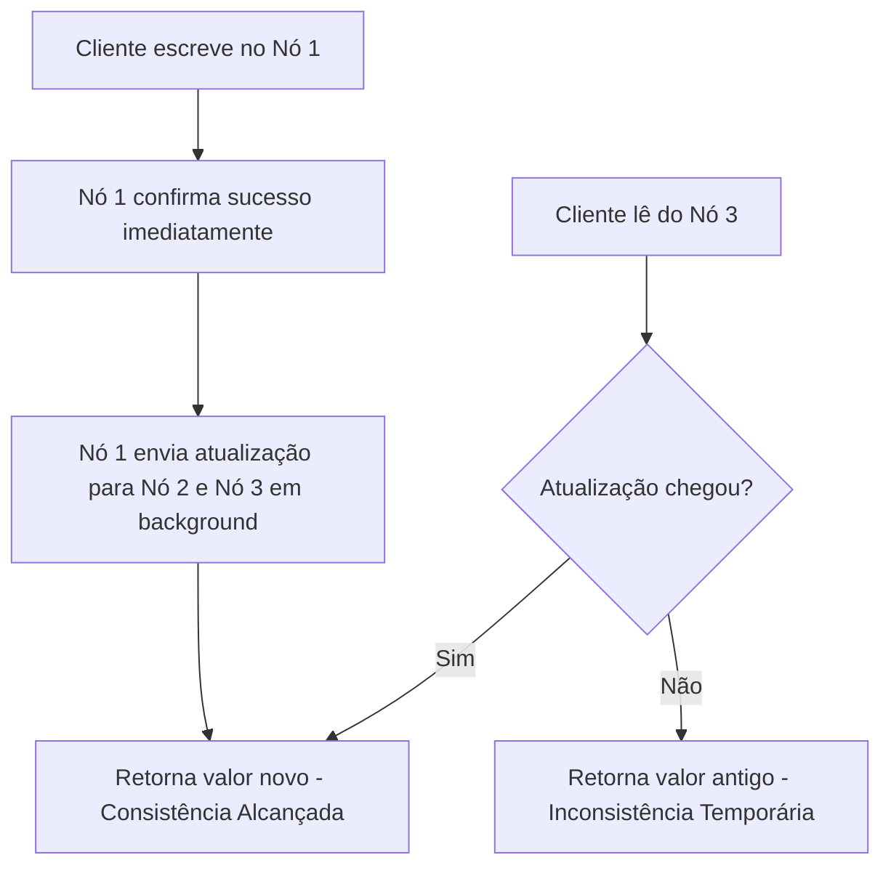

# Skill: Database: Introdução ao NoSQL, Teorema CAP e Eventual Consistency

## Introdução

Esta skill aborda o ecossistema **NoSQL (Not Only SQL)**, uma mudança de paradigma fundamental no armazenamento de dados que surgiu para lidar com os desafios de escala, velocidade e variedade de dados da era da Web 2.0. Enquanto os bancos de dados relacionais (SQL) focam em consistência forte e esquemas rígidos, o NoSQL oferece flexibilidade de esquema, escalabilidade horizontal nativa e modelos de dados variados (documentos, chave-valor, colunares e grafos).

Exploraremos o **Teorema CAP**, a lei fundamental dos sistemas distribuídos que dita os limites do que é possível alcançar em termos de Consistência, Disponibilidade e Tolerância a Partições. Discutiremos o modelo **BASE** (Basically Available, Soft state, Eventual consistency) em contraste com o ACID, e como a **Consistência Eventual** permite que sistemas globais como Amazon, Facebook e Netflix operem com latência mínima. Este conhecimento é vital para arquitetos de sistemas que precisam escolher a ferramenta certa para problemas de Big Data e alta disponibilidade.

## Glossário Técnico

*   **NoSQL (Not Only SQL)**: Termo que descreve bancos de dados não relacionais projetados para escala e flexibilidade.
*   **Teorema CAP**: Teorema de Eric Brewer que afirma que um sistema distribuído só pode garantir duas das três propriedades: Consistência, Disponibilidade e Tolerância a Partições.
*   **Consistência (Consistency)**: Todos os nós veem os mesmos dados ao mesmo tempo.
*   **Disponibilidade (Availability)**: Cada requisição recebe uma resposta (sucesso ou falha), sem garantia de que contém o dado mais recente.
*   **Tolerância a Partições (Partition Tolerance)**: O sistema continua operando apesar de falhas na rede que dividem os nós.
*   **BASE**: Acrônimo para Basically Available (Basicamente Disponível), Soft state (Estado Suave) e Eventual consistency (Consistência Eventual).
*   **Consistência Eventual**: Garantia de que, se nenhuma nova atualização for feita, eventualmente todos os nós terão o mesmo valor.
*   **Escalabilidade Horizontal (Sharding)**: Adicionar mais máquinas ao cluster para aumentar a capacidade.
*   **Esquema Flexível (Schema-less)**: Capacidade de armazenar dados sem uma estrutura pré-definida rígida.

## Conceitos Fundamentais

### 1. O Teorema CAP: A Escolha Impossível

O Teorema CAP é a bússola para o design de sistemas NoSQL. Em um sistema distribuído, falhas de rede (Partições) são inevitáveis. Portanto, você deve escolher entre:

| Combinação | Descrição | Exemplo de SGBD |
| :--- | :--- | :--- |
| **CP (Consistência + Partição)** | Garante dados corretos, mas pode ficar indisponível se houver falha de rede. | MongoDB, HBase, Redis. |
| **AP (Disponibilidade + Partição)** | Garante que o sistema responda sempre, mas os dados podem estar desatualizados. | Cassandra, DynamoDB, CouchDB. |
| **CA (Consistência + Disponibilidade)** | Não tolera falhas de rede. Na prática, sistemas distribuídos não podem ser CA. | RDBMS tradicionais (em um único nó). |

### 2. ACID vs. BASE

Enquanto o SQL segue o rigor do ACID, o NoSQL frequentemente adota o modelo BASE para ganhar escala:
*   **Basically Available**: O sistema garante disponibilidade, mesmo que partes dele falhem.
*   **Soft State**: O estado do sistema pode mudar ao longo do tempo, mesmo sem entrada de dados (devido à convergência da replicação).
*   **Eventual Consistency**: O sistema se torna consistente "com o tempo". É o preço pago pela alta performance de escrita e leitura global.

### 3. Por que NoSQL? (Os 3 Vs do Big Data)

*   **Volume**: Lidar com Terabytes e Petabytes de dados que não cabem em um único servidor.
*   **Velocidade**: Processar milhões de requisições por segundo com latência de milissegundos.
*   **Variedade**: Armazenar dados semi-estruturados (JSON), não estruturados (Logs) e polimórficos sem precisar de migrações de esquema constantes.

## Histórico e Evolução

O termo NoSQL foi usado pela primeira vez em 1998, mas o movimento ganhou força real em 2009. O marco inicial foi a publicação do paper do **Google Bigtable** (2006) e do **Amazon Dynamo** (2007). Esses documentos descreveram como as gigantes da tecnologia resolveram seus problemas de escala proprietários. Isso inspirou a criação de projetos open-source como Cassandra, MongoDB e Redis, que democratizaram o acesso a tecnologias de escala massiva.

## Exemplos Práticos e Casos de Uso

### Cenário: Feed de Notícias de uma Rede Social (Modelo AP)

Em uma rede social, a **Disponibilidade** é mais importante que a **Consistência**. Se você postar uma foto e seu amigo na Austrália demorar 2 segundos a mais para vê-la (Consistência Eventual), o sistema ainda é considerado funcional. No entanto, se o site ficar fora do ar porque um servidor na Ásia caiu (Falta de Disponibilidade), a experiência do usuário é arruinada. Por isso, usa-se bancos como Cassandra (AP).

### Cenário: Sistema de Inventário de E-commerce (Modelo CP)

Aqui, a **Consistência** é vital. Você não pode vender o último item do estoque para duas pessoas diferentes. O sistema prefere dar um erro (Indisponibilidade temporária) do que permitir uma venda inconsistente. Por isso, usa-se bancos como MongoDB ou RDBMS tradicionais com travas fortes (CP).

## Análise de Fluxo e Diagramas (em Texto)

### Fluxo de Consistência Eventual (Replicação)

**Explicação**: O diagrama mostra como a latência de rede entre os nós cria a janela de inconsistência. O sistema é "Eventualmente Consistente" porque, assim que a mensagem (C) chega a todos os nós, todos os leitores verão o mesmo dado.

## Boas Práticas e Padrões de Projeto

*   **Entenda seu RPO/RTO**: Escolha entre CP e AP baseado no impacto de dados desatualizados vs. sistema fora do ar.
*   **Modelagem Baseada em Consultas**: No NoSQL, você modela os dados para atender a consultas específicas, não para normalizar (ao contrário do SQL).
*   **Evite Joins**: NoSQL não lida bem com Joins. Desnormalize os dados ou use referências manuais na aplicação.
*   **Use Quorum**: Configure o número de nós que devem confirmar uma leitura/escrita para ajustar o nível de consistência dinamicamente.
*   **Idempotência**: Como a rede pode falhar e causar reenvios, garanta que suas operações de escrita possam ser executadas múltiplas vezes sem efeitos colaterais indesejados.

## Comparativos Detalhados

| Característica | SQL (Relacional) | NoSQL (Não Relacional) |
| :--- | :--- | :--- |
| **Esquema** | Rígido (Tabelas/Colunas) | Flexível (Documentos/Pares) |
| **Escalabilidade** | Vertical (Mais CPU/RAM) | Horizontal (Mais Servidores) |
| **Transações** | ACID (Forte) | BASE (Eventual) |
| **Consultas** | SQL Padronizado | APIs específicas / MapReduce |
| **Relacionamentos** | Joins complexos | Referências ou Desnormalização |

## Ferramentas e Recursos

*   **Documentos**: MongoDB, CouchDB.
*   **Chave-Valor**: Redis, Riak, DynamoDB.
*   **Colunares**: Cassandra, HBase.
*   **Grafos**: Neo4j, JanusGraph.
*   **Monitoramento**: Prometheus, Grafana (essenciais para clusters NoSQL).

## Tópicos Avançados e Pesquisa Futura

O futuro do NoSQL está na convergência com o SQL, resultando no movimento **NewSQL** e nos bancos de dados **Multimodais** (que suportam documentos, grafos e tabelas no mesmo motor). Outra área de pesquisa é a **Consistência Causal**, que tenta oferecer garantias mais fortes que a eventual sem o custo total da consistência forte. Além disso, bancos de dados NoSQL estão sendo otimizados para **Edge Computing**, onde os dados residem o mais próximo possível do usuário final.

## Perguntas Frequentes (FAQ)

*   **P: NoSQL vai substituir o SQL?**
    *   R: Não. Eles são ferramentas diferentes para problemas diferentes. O SQL continua imbatível para transações complexas e relatórios ad-hoc. O NoSQL brilha em escala e flexibilidade.
*   **P: O que é "Sharding" no NoSQL?**
    *   R: É a técnica de dividir os dados horizontalmente entre vários servidores. A maioria dos bancos NoSQL faz isso de forma automática e transparente.

## Referências Cruzadas

*   **`[[13_Transacoes_ACID_Atomicidade_Consistencia_Isolamento_Durabilidade]]`**
*   **`[[17_Particionamento_de_Tabelas_e_Sharding_Horizontal]]`**
*   **`[[22_Bancos_de_Dados_Documentais_MongoDB_e_CouchDB]]`**

## Referências

[1] Brewer, E. (2000). *Towards Robust Distributed Systems*. PODC.
[2] Vogels, W. (2009). *Eventually Consistent*. Communications of the ACM.
[3] Kleppmann, M. (2017). *Designing Data-Intensive Applications*. O'Reilly Media.
