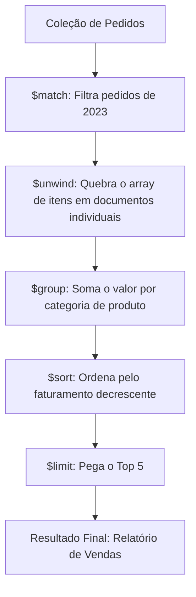

# Skill: Database: Bancos de Dados Documentais - MongoDB e CouchDB

## Introdução

Esta skill aborda os **Bancos de Dados Documentais**, a categoria mais popular de NoSQL, que armazena informações em estruturas de dados semi-estruturadas conhecidas como **Documentos** (geralmente JSON ou BSON). Diferente das tabelas rígidas do SQL, os bancos de documentos permitem que cada registro tenha uma estrutura diferente, facilitando a evolução rápida de aplicações e o armazenamento de dados complexos e aninhados em uma única unidade lógica.

Exploraremos o funcionamento do **MongoDB**, o líder de mercado, e do **CouchDB**, conhecido por sua robustez em sincronização offline. Discutiremos as vantagens da desnormalização, o uso de índices em campos aninhados e como realizar consultas ricas sem o uso de Joins tradicionais. Este conhecimento é essencial para desenvolvedores Full-Stack e arquitetos que buscam agilidade no desenvolvimento e escalabilidade horizontal nativa para aplicações web e mobile modernas.

## Glossário Técnico

*   **Documento**: A unidade básica de armazenamento, contendo pares chave-valor (ex: JSON).
*   **Coleção (Collection)**: Um agrupamento de documentos, equivalente a uma tabela no SQL.
*   **BSON (Binary JSON)**: Formato de serialização binária usado pelo MongoDB para armazenar documentos de forma eficiente.
*   **Esquema Flexível (Dynamic Schema)**: Capacidade de documentos na mesma coleção terem campos diferentes.
*   **Embedding (Aninhamento)**: Prática de armazenar dados relacionados dentro do mesmo documento (ex: endereços dentro do documento de usuário).
*   **Referencing (Referência)**: Prática de armazenar o ID de um documento em outro, similar a uma chave estrangeira, mas sem integridade referencial nativa forte.
*   **Aggregation Framework**: Conjunto de operadores no MongoDB para processar e transformar dados (similar ao `GROUP BY` e Joins do SQL).
*   **MapReduce**: Técnica de processamento de dados em larga escala usada para agregações complexas.
*   **Replication Set**: Conjunto de instâncias do MongoDB que mantêm os mesmos dados para alta disponibilidade.

## Conceitos Fundamentais

### 1. Modelagem de Dados: Embedding vs. Referencing

A decisão mais importante em bancos de documentos é como estruturar os relacionamentos:

| Estratégia | Quando Usar | Vantagem | Desvantagem |
| :--- | :--- | :--- | :--- |
| **Embedding** | Relacionamentos 1:1 ou 1:Poucos (ex: Comentários em um Post). | Leitura atômica e rápida (um único I/O). | Documentos podem crescer demais e atingir limites de tamanho (16MB no Mongo). |
| **Referencing** | Relacionamentos 1:Muitos ou N:N (ex: Autores e Livros). | Evita redundância e facilita atualizações em massa. | Exige múltiplas consultas ou "Lookups" (Joins simulados), o que é mais lento. |

### 2. MongoDB: O Padrão da Indústria

O MongoDB brilha pela sua facilidade de uso e ecossistema rico. Ele oferece:
*   **Consultas Ad-hoc**: Suporte a buscas complexas, expressões regulares e consultas geoespaciais.
*   **Alta Disponibilidade**: Através de Replica Sets com failover automático.
*   **Escalabilidade**: Através de Sharding automático, distribuindo coleções entre múltiplos servidores.
*   **Performance**: Uso intensivo de memória RAM para cache de dados e índices.

### 3. CouchDB: Foco em Sincronização e Web

O CouchDB adota uma filosofia diferente:
*   **HTTP/JSON Nativo**: Toda a interação é feita via API REST.
*   **Multi-Master Replication**: Excelente para aplicações que precisam funcionar offline e sincronizar quando houver conexão.
*   **MVCC**: Usa controle de concorrência multiversão, garantindo que leitores nunca sejam bloqueados por escritores.

## Histórico e Evolução

O MongoDB foi lançado em 2009 pela 10gen (agora MongoDB Inc.) com o objetivo de resolver problemas de escalabilidade que os fundadores enfrentaram na DoubleClick. O CouchDB foi criado por Damien Katz em 2005 e tornou-se um projeto da Apache em 2008. Enquanto o MongoDB focou em performance e facilidade de consulta, o CouchDB focou em confiabilidade e sincronização. Recentemente, o MongoDB introduziu **Transações Multi-Documento ACID**, diminuindo a barreira entre o mundo relacional e o documental.

## Exemplos Práticos e Casos de Uso

### Cenário: Perfil de Usuário em uma Rede Social

No SQL, você teria tabelas separadas para `USUARIOS`, `ENDERECOS`, `TELEFONES` e `PREFERENCIAS`. No MongoDB, você armazena tudo em um único documento:

```json
{
  "_id": "user123",
  "nome": "João Silva",
  "email": "joao@email.com",
  "telefones": ["11-9999-8888", "11-3333-2222"],
  "endereco": {
    "rua": "Av. Paulista",
    "numero": 1000,
    "cidade": "São Paulo"
  },
  "preferencias": {
    "tema": "dark",
    "notificacoes": true
  }
}
```

**Vantagem**: Para carregar o perfil do usuário, a aplicação faz apenas uma busca por ID. Não há Joins, o que torna a resposta extremamente rápida e a lógica da aplicação mais simples.

## Análise de Fluxo e Diagramas (em Texto)

### Fluxo de Consulta com Aggregation Framework (MongoDB)



**Explicação**: O diagrama mostra o "Pipeline de Agregação". Cada estágio (B, C, D, E, F) transforma os dados e passa para o próximo, permitindo realizar análises complexas de forma eficiente dentro do servidor de banco de dados.

## Boas Práticas e Padrões de Projeto

*   **Modele para a Aplicação**: No NoSQL, o design do banco segue as telas e funcionalidades da sua aplicação, não a teoria da normalização.
*   **Cuidado com o Tamanho do Documento**: No MongoDB, o limite é 16MB. Se um array (ex: logs de acesso) pode crescer indefinidamente, use Referencing em vez de Embedding.
*   **Indexe Campos de Busca**: Assim como no SQL, consultas sem índices causam "Collection Scans" lentos. O MongoDB permite indexar campos dentro de objetos aninhados.
*   **Use Projeções**: Peça apenas os campos que você vai usar (`db.users.find({}, {nome: 1})`) para economizar banda e memória.
*   **Evite o "N+1 Problem"**: Se você usa Referencing, tente buscar todos os IDs necessários em uma única consulta `$in` em vez de fazer um loop na aplicação.

## Comparativos Detalhados

| Característica | MongoDB | CouchDB |
| :--- | :--- | :--- |
| **Interface** | Driver Binário (Performance) | HTTP/REST (Simplicidade) |
| **Consultas** | Query Language Rica (MQL) | MapReduce / Views |
| **Escalabilidade** | Sharding Nativo | Replicação Multi-Master |
| **Consistência** | Configurável (Padrão: Forte) | Eventual |
| **Uso Ideal** | Apps Web, Mobile, Catálogos, Analytics. | Apps Offline, Sincronização Mobile. |

## Ferramentas e Recursos

*   **MongoDB Compass**: Interface gráfica oficial para explorar dados e analisar performance de consultas.
*   **Mongoose**: O ODM (Object Data Modeling) mais popular para Node.js, que adiciona validação de esquema ao MongoDB.
*   **Atlas**: O serviço de banco de dados na nuvem (DBaaS) oficial da MongoDB Inc.
*   **Fauxton**: A interface web integrada do CouchDB para gerenciamento e consultas.

## Tópicos Avançados e Pesquisa Futura

O futuro dos bancos de documentos envolve a **Integração com IA e Busca Vetorial**, permitindo que documentos JSON sejam buscados por similaridade semântica (embeddings). Outra área de evolução é o **Serverless NoSQL**, onde o banco escala automaticamente de zero a milhões de requisições sem necessidade de gerenciar clusters. Além disso, a convergência com o SQL continua, com o MongoDB adicionando suporte a consultas SQL e o PostgreSQL aprimorando seu suporte a tipos de dados JSONB.

## Perguntas Frequentes (FAQ)

*   **P: O MongoDB é seguro para dados financeiros?**
    *   R: Sim, desde que configurado corretamente. Com o suporte a transações ACID e criptografia de ponta a ponta, ele atende aos requisitos de conformidade de muitas instituições financeiras.
*   **P: Posso fazer Joins no MongoDB?**
    *   R: Sim, através do operador `$lookup` no Aggregation Framework. No entanto, ele é menos eficiente que um Join nativo do SQL e deve ser usado com moderação.

## Referências Cruzadas

*   **`[[21_Introducao_ao_NoSQL_Teorema_CAP_e_Eventual_Consistency]]`**
*   **`[[28_IndexedDB_API_e_Armazenamento_de_Dados_Offline]]`**
*   **`[[34_ORM_Object-Relational_Mapping_Prós_e_Contras]]`**

## Referências

[1] Chodorow, K. (2013). *MongoDB: The Definitive Guide*. O'Reilly Media.
[2] Anderson, J. C., et al. (2010). *CouchDB: The Definitive Guide*. O'Reilly Media.
[3] MongoDB Documentation. *Data Modeling Introduction*.
