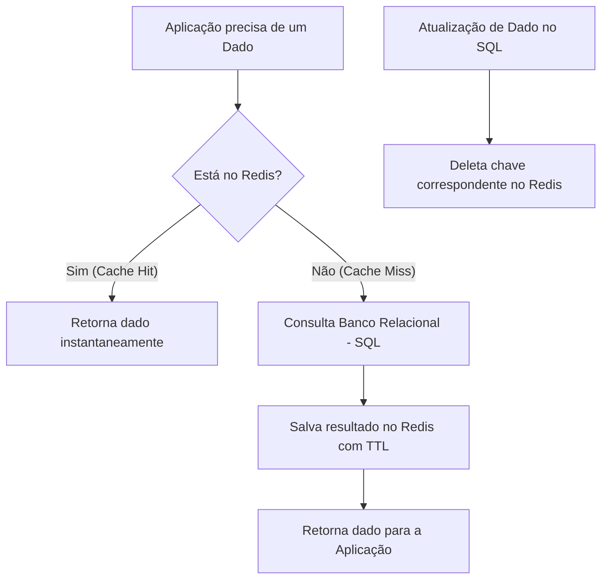

# Skill: Database: Bancos de Dados Chave-Valor - Redis e DynamoDB

## Introdução

Esta skill aborda os **Bancos de Dados Chave-Valor**, a categoria mais simples e rápida de NoSQL, onde os dados são armazenados como um conjunto de pares chave-valor. Imagine um dicionário gigante onde você fornece uma chave única e obtém instantaneamente o valor associado. Essa simplicidade permite uma performance extrema, com latências de leitura e escrita na casa dos microssegundos ou milissegundos, tornando-os ideais para cache, gerenciamento de sessões e aplicações de tempo real.

Exploraremos o **Redis**, o líder absoluto em bancos de dados em memória, e o **Amazon DynamoDB**, o serviço de banco de dados chave-valor e documentos totalmente gerenciado da AWS. Discutiremos as estruturas de dados ricas do Redis (listas, conjuntos, hashes), as estratégias de particionamento do DynamoDB e como esses bancos de dados permitem a escalabilidade massiva de aplicações globais. Este conhecimento é vital para engenheiros de software que precisam de velocidade extrema e escalabilidade sem limites.

## Glossário Técnico

*   **Chave-Valor (Key-Value)**: Modelo de dados onde uma chave única mapeia para um valor (que pode ser uma string, um objeto ou uma estrutura complexa).
*   **Redis (Remote Dictionary Server)**: Banco de dados em memória, de código aberto, usado como banco de dados, cache e message broker.
*   **In-Memory Database**: Banco de dados que armazena todos os seus dados na memória RAM para velocidade máxima.
*   **Persistência**: A capacidade de um banco de dados em memória salvar dados no disco para evitar perda em caso de queda de energia (ex: RDB e AOF no Redis).
*   **TTL (Time To Live)**: Tempo de vida de uma chave; após esse período, a chave é deletada automaticamente (essencial para cache).
*   **DynamoDB**: Banco de dados NoSQL proprietário da Amazon, conhecido por sua performance consistente em qualquer escala.
*   **Partition Key (Hash Key)**: A chave usada pelo DynamoDB para distribuir dados entre múltiplos servidores físicos.
*   **Sort Key (Range Key)**: Chave opcional usada para ordenar itens que compartilham a mesma Partition Key.
*   **GSI (Global Secondary Index)**: Índice no DynamoDB que permite consultar dados usando chaves diferentes da chave primária original.

## Conceitos Fundamentais

### 1. Redis: Muito Além de um Cache

O Redis é frequentemente chamado de "servidor de estruturas de dados" porque seus valores não são apenas strings, mas tipos complexos:
*   **Strings**: O tipo mais básico (até 512MB).
*   **Lists**: Coleções de strings ordenadas por inserção (ideal para filas).
*   **Sets**: Coleções de strings únicas e não ordenadas (ideal para tags ou seguidores).
*   **Sorted Sets**: Sets onde cada elemento tem um "score" numérico (ideal para rankings/leaderboards).
*   **Hashes**: Mapas entre campos e valores (ideal para representar objetos como usuários).
*   **Pub/Sub**: Sistema de mensageria para comunicação em tempo real entre partes da aplicação.

### 2. DynamoDB: Escalabilidade sem Gerenciamento

O DynamoDB é um serviço "Serverless" que oferece:
*   **Performance Previsível**: Latência de milissegundos de um dígito, independentemente do volume de dados.
*   **Escalabilidade Automática**: O banco ajusta a capacidade de leitura e escrita conforme a demanda.
*   **Replicação Global**: Tabelas globais que sincronizam dados entre regiões da AWS automaticamente.
*   **Eventual vs. Strong Consistency**: Permite escolher entre ler o dado mais recente (mais caro) ou aceitar um pequeno atraso (mais barato).

### 3. Estratégias de Cache: Cache-Aside e Write-Through

Bancos chave-valor são os pilares das estratégias de cache:
*   **Cache-Aside**: A aplicação tenta ler do cache; se não encontrar (Cache Miss), lê do banco principal e popula o cache.
*   **Write-Through**: A aplicação escreve no cache e no banco principal simultaneamente.
*   **Write-Behind**: A aplicação escreve no cache e o cache atualiza o banco principal de forma assíncrona (máxima performance de escrita).

## Histórico e Evolução

O Redis foi criado por Salvatore Sanfilippo (antirez) em 2009 para melhorar a performance de seu próprio produto de análise web. O DynamoDB foi lançado pela Amazon em 2012, baseado no paper original do **Dynamo** (2007), que descrevia como a Amazon resolvia problemas de disponibilidade durante o Black Friday. Recentemente, o Redis introduziu módulos para busca vetorial (RedisSearch) e processamento de grafos, enquanto o DynamoDB adicionou suporte a transações ACID e exportação direta para S3.

## Exemplos Práticos e Casos de Uso

### Cenário: Gerenciamento de Sessão de Usuário (Redis)

Em vez de consultar o banco relacional toda vez que um usuário carrega uma página, você armazena a sessão no Redis:

```bash
# Salvando a sessão com expiração de 30 minutos (1800 segundos)
SET session:user123 '{"id": 123, "nome": "João", "carrinho_id": 456}' EX 1800

# Recuperando a sessão instantaneamente
GET session:user123
```

**Vantagem**: A latência é de microssegundos. Se o servidor de aplicação cair, a sessão continua viva no Redis. O TTL garante que sessões inativas sejam limpas automaticamente, economizando memória.

### Cenário: Carrinho de Compras em Escala Global (DynamoDB)

O DynamoDB é usado para armazenar carrinhos de compras de milhões de usuários simultâneos:
*   **Partition Key**: `user_id`.
*   **Sort Key**: `product_id`.
Isso permite buscar todos os itens do carrinho de um usuário de forma extremamente eficiente.

## Análise de Fluxo e Diagramas (em Texto)

### Fluxo de Cache-Aside (Padrão Comum)



**Explicação**: O diagrama mostra como o Redis protege o banco principal (D) de sobrecarga. A invalidação do cache (H) é crucial para garantir que a aplicação não leia dados obsoletos após uma atualização.

## Boas Práticas e Padrões de Projeto

*   **Use Nomes de Chaves Padronizados**: Use prefixos e separadores (ex: `user:123:profile`).
*   **Sempre Defina TTL**: Evite que o Redis fique sem memória (OOM) definindo expiração para dados temporários.
*   **Cuidado com Chaves Grandes**: Chaves ou valores muito grandes podem causar latência de rede e bloquear o Redis (que é single-threaded para comandos).
*   **Escolha a Shard Key Correta no DynamoDB**: Evite "Hot Partitions" (um servidor recebendo todo o tráfego) escolhendo uma chave com alta cardinalidade.
*   **Monitore o Consumo de Memória**: No Redis, a memória é o recurso mais caro. Use estruturas de dados eficientes (como Hashes em vez de múltiplas Strings).
*   **Use Pipelines**: No Redis, envie múltiplos comandos de uma vez para reduzir o overhead de rede.

## Comparativos Detalhados

| Característica | Redis | DynamoDB |
| :--- | :--- | :--- |
| **Armazenamento** | Principalmente RAM (In-Memory) | SSD (Disco de alta performance) |
| **Latência** | Microssegundos | Milissegundos (1-9ms) |
| **Persistência** | Configurável (RDB/AOF) | Nativa e Durável |
| **Escalabilidade** | Cluster Manual / Gerenciado | Totalmente Automática (Serverless) |
| **Tipos de Dados** | Ricos (Lists, Sets, Hashes) | Simples (Strings, Numbers, Binary) |
| **Uso Ideal** | Cache, Sessões, Leaderboards, Pub/Sub. | Apps de larga escala, Carrinhos, Perfis. |

## Ferramentas e Recursos

*   **Redis Insight**: Ferramenta visual oficial para gerenciar e analisar dados no Redis.
*   **NoSQL Workbench**: Ferramenta da AWS para modelagem e visualização de dados no DynamoDB.
*   **Redisson / Jedis**: Bibliotecas populares para integração do Redis com Java/Spring.
*   **DynamoDB Local**: Versão para desenvolvedores rodarem o DynamoDB em suas máquinas locais (Docker).

## Tópicos Avançados e Pesquisa Futura

O futuro dos bancos chave-valor envolve a **Busca Vetorial em Memória**, permitindo que o Redis seja usado como o motor de busca de similaridade para aplicações de IA generativa. Outra área de evolução é o **Tiered Storage**, onde o Redis move automaticamente dados menos acessados da RAM para o SSD para reduzir custos sem perder a interface de acesso. Além disso, o DynamoDB continua a evoluir com integrações mais profundas com o ecossistema Serverless (Lambda, EventBridge), tornando-se o "cérebro" de arquiteturas orientadas a eventos.

## Perguntas Frequentes (FAQ)

*   **P: O Redis é seguro para dados permanentes?**
    *   R: Sim, se configurado com persistência AOF (Append Only File) e replicação. No entanto, ele ainda é limitado pelo tamanho da RAM disponível. Para volumes massivos de dados permanentes, o DynamoDB ou um banco documental é mais adequado.
*   **P: O que é o "Throttling" no DynamoDB?**
    *   R: Ocorre quando sua aplicação tenta ler ou escrever mais rápido do que a capacidade que você contratou (ou que o autoscaling proveu), resultando em erros temporários.

## Referências Cruzadas

*   **`[[21_Introducao_ao_NoSQL_Teorema_CAP_e_Eventual_Consistency]]`**
*   **`[[28_Caching_Estrategias_de_Cache_Lado_Servidor_e_Aplicacao]]`**
*   **`[[37_Bancos_de_Dados_Serverless_e_Cloud-Native]]`**

## Referências

[1] Sanfilippo, S. (2015). *Redis: The Definitive Guide*. O'Reilly Media.
[2] Sivasubramanian, S. (2012). *Amazon DynamoDB: A Seamlessly Scalable NoSQL Database Service*. SIGMOD.
[3] Redis Documentation. *Redis Data Types*.
