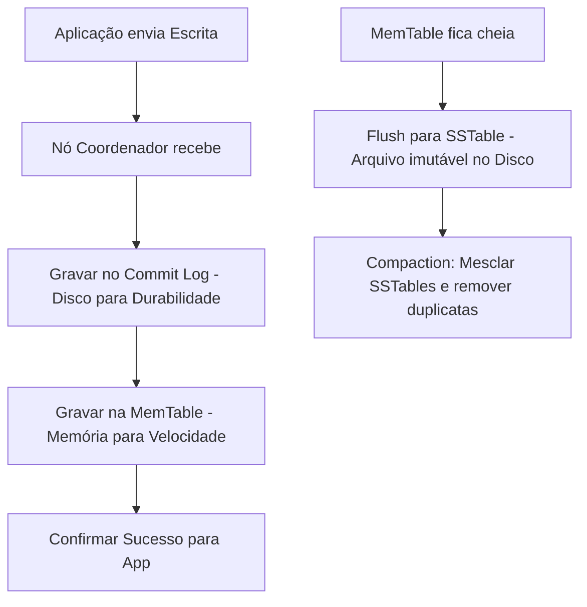

# Skill: Database: Bancos de Dados Colunares - Cassandra e HBase

## Introdução

Esta skill aborda os **Bancos de Dados Colunares** (ou Wide-Column Stores), a categoria de NoSQL projetada para lidar com volumes massivos de dados (Petabytes) distribuídos em centenas ou milhares de servidores. Diferente dos bancos relacionais que armazenam dados linha por linha, os bancos colunares organizam os dados em famílias de colunas, permitindo uma performance de escrita extrema e consultas eficientes em grandes conjuntos de dados esparsos.

Exploraremos o **Apache Cassandra**, o líder em disponibilidade e escalabilidade linear, e o **Apache HBase**, o banco de dados distribuído que roda sobre o ecossistema Hadoop (HDFS). Discutiremos a arquitetura sem mestre (Masterless) do Cassandra, o modelo de consistência configurável e como a modelagem de dados nesses bancos é orientada exclusivamente às consultas (Query-Driven Modeling). Este conhecimento é vital para engenheiros de Big Data e arquitetos que precisam construir sistemas de logs, análise de séries temporais e plataformas de mensagens em escala global.

## Glossário Técnico

*   **Wide-Column Store**: Modelo de dados que usa tabelas, linhas e colunas, mas o nome e o formato das colunas podem variar de linha para linha na mesma tabela.
*   **Cassandra**: Banco de dados NoSQL distribuído, altamente escalável e disponível, baseado no Dynamo da Amazon e no Bigtable do Google.
*   **HBase**: Banco de dados colunar de código aberto que roda sobre o HDFS (Hadoop Distributed File System).
*   **Column Family (Família de Colunas)**: Um agrupamento lógico de colunas relacionadas que são armazenadas juntas no disco.
*   **Partition Key**: A chave usada para distribuir os dados entre os nós do cluster (determina em qual servidor o dado reside).
*   **Clustering Key**: A chave usada para ordenar os dados dentro de uma partição física.
*   **LSM-Tree (Log-Structured Merge-Tree)**: Estrutura de dados usada para escrita rápida, onde as mudanças são gravadas sequencialmente no log e depois mescladas.
*   **Gossip Protocol**: Protocolo de comunicação entre os nós do Cassandra para compartilhar informações sobre o estado do cluster.
*   **Compaction**: O processo de mesclar arquivos de dados antigos e remover registros deletados (tombstones) para liberar espaço e melhorar a performance.

## Conceitos Fundamentais

### 1. Arquitetura do Cassandra: Escalabilidade Linear

O Cassandra usa uma arquitetura de anel (Ring Architecture) sem um ponto único de falha:
*   **Masterless**: Todos os nós são iguais. Qualquer nó pode receber qualquer requisição de leitura ou escrita.
*   **Escalabilidade Linear**: Se você dobrar o número de nós, você dobra a capacidade de processamento e armazenamento do cluster.
*   **Replicação Geográfica**: Suporte nativo para replicar dados entre múltiplos data centers com latência mínima.

### 2. HBase: O Banco do Ecossistema Hadoop

O HBase é projetado para buscas aleatórias e em tempo real sobre o Hadoop:
*   **Foco em Consistência**: Diferente do Cassandra (que é AP), o HBase foca em ser um sistema CP (Consistente e Tolerante a Partições).
*   **Integração com HDFS**: Aproveita a replicação e a durabilidade do sistema de arquivos do Hadoop.
*   **Region Servers**: Os dados são divididos em "Regions" que são gerenciadas por servidores específicos.

### 3. Modelagem de Dados: Query-Driven Design

No SQL, você normaliza os dados. No Cassandra, você **desnormaliza** agressivamente:
*   **Uma Tabela por Consulta**: Se você precisa listar usuários por cidade, você cria uma tabela `usuarios_por_cidade`. Se precisa por idade, cria `usuarios_por_idade`.
*   **Sem Joins**: O banco não suporta Joins. Toda a informação necessária para uma consulta deve estar em uma única tabela.
*   **Duplicação de Dados**: É normal e esperado ter o mesmo dado em múltiplas tabelas para otimizar diferentes tipos de busca.

## Histórico e Evolução

O HBase foi criado em 2007 como parte do projeto Hadoop, inspirado no paper do **Google Bigtable** (2006). O Cassandra foi criado no Facebook por Avinash Lakshman (um dos autores do Amazon Dynamo) e Prashant Malik, sendo lançado como open-source em 2008. O Cassandra uniu o modelo de dados do Bigtable com a arquitetura de anel do Dynamo. Recentemente, o Cassandra introduziu o suporte a **Storage-Attached Indexing (SAI)** e melhorias drásticas na performance de garbage collection com o Java 17+.

## Exemplos Práticos e Casos de Uso

### Cenário: Sistema de Logs de Sensores (IoT)

Uma empresa de energia monitora milhões de medidores inteligentes que enviam dados a cada minuto:
*   **Partition Key**: `sensor_id`.
*   **Clustering Key**: `timestamp` (ordenado de forma decrescente).

```sql
-- Exemplo de CQL (Cassandra Query Language)
CREATE TABLE leituras_sensores (
    sensor_id UUID,
    data_leitura DATE,
    timestamp TIMESTAMP,
    valor_kwh DECIMAL,
    PRIMARY KEY ((sensor_id, data_leitura), timestamp)
) WITH CLUSTERING ORDER BY (timestamp DESC);
```

**Vantagem**: O Cassandra pode receber milhões de escritas por segundo de forma sequencial (LSM-Tree). A busca pelas últimas leituras de um sensor específico é instantânea porque os dados estão fisicamente ordenados no disco por timestamp.

## Análise de Fluxo e Diagramas (em Texto)

### Fluxo de Escrita no Cassandra (Write Path)



**Explicação**: O diagrama mostra por que o Cassandra é tão rápido para escrita. Ele nunca altera um arquivo existente; ele apenas adiciona ao log (C) e à memória (D). O trabalho pesado de organizar os dados no disco (G, H) acontece em segundo plano, sem bloquear o usuário.

## Boas Práticas e Padrões de Projeto

*   **Evite Partições Gigantes**: Tente manter cada partição física abaixo de 100MB para evitar problemas de performance e memória.
*   **Escolha a Partition Key com Alta Cardinalidade**: Evite que um único nó receba todo o tráfego (Hot Partition).
*   **Use TTL para Dados Temporários**: O Cassandra lida muito bem com a expiração automática de dados (ex: logs de 30 dias).
*   **Cuidado com Tombstones**: Deletar dados no Cassandra cria "tombstones" que podem deixar as leituras lentas até que a compactação ocorra. Evite deletar registros individualmente em massa.
*   **Teste o Nível de Consistência**: Use `QUORUM` para um equilíbrio entre performance e consistência, ou `LOCAL_ONE` para máxima velocidade de leitura em réplicas locais.
*   **Não use o Cassandra como Fila**: O modelo de dados não é otimizado para inserções e deleções constantes no mesmo conjunto de chaves.

## Comparativos Detalhados

| Característica | Cassandra | HBase |
| :--- | :--- | :--- |
| **Arquitetura** | Masterless (Anel) | Master-Slave (Region Servers) |
| **Consistência** | Configurável (Eventual por padrão) | Forte (CP) |
| **Dependências** | Nenhuma (Autônomo) | Hadoop (HDFS) e Zookeeper |
| **Linguagem** | CQL (Similar ao SQL) | Java API / Thrift / REST |
| **Uso Ideal** | Logs, IoT, Mensagens, Apps Globais. | Analytics sobre Hadoop, Big Data Batch. |

## Ferramentas e Recursos

*   **cqlsh**: Interface de linha de comando para interagir com o Cassandra usando CQL.
*   **Datastax OpsCenter**: Ferramenta visual para monitoramento e gerenciamento de clusters Cassandra.
*   **Apache Ambari**: Usado para gerenciar e monitorar o HBase dentro do ecossistema Hadoop.
*   **Astra DB**: Versão Cloud-Native e Serverless do Cassandra oferecida pela DataStax.

## Tópicos Avançados e Pesquisa Futura

O futuro dos bancos colunares envolve a **Otimização para Armazenamento em Nuvem (Object Storage)**, permitindo que o Cassandra e o HBase usem S3 ou GCS como camada de armazenamento de baixo custo. Outra área de evolução é a **Busca Vetorial Nativa**, transformando o Cassandra em um banco de dados de alta escala para embeddings de IA. Além disso, o projeto **Stargate** busca oferecer APIs REST, GraphQL e Documentais sobre o Cassandra, tornando-o mais acessível para desenvolvedores web modernos.

## Perguntas Frequentes (FAQ)

*   **P: O Cassandra suporta transações?**
    *   R: Ele suporta "Lightweight Transactions" (LWT) usando o protocolo Paxos para operações atômicas simples (ex: `INSERT IF NOT EXISTS`), mas elas são muito mais lentas que as escritas normais.
*   **P: Por que não posso usar `WHERE` em qualquer coluna no Cassandra?**
    *   R: Porque o Cassandra só pode filtrar eficientemente por colunas que fazem parte da chave primária (Partition ou Clustering Keys). Filtrar por outras colunas exigiria ler todos os nós do cluster, o que é proibido por performance.

## Referências Cruzadas

*   **`[[17_Particionamento_de_Tabelas_e_Sharding_Horizontal]]`**
*   **`[[21_Introducao_ao_NoSQL_Teorema_CAP_e_Eventual_Consistency]]`**
*   **`[[33_Integracao_de_Dados_CDC_Change_Data_Capture_e_Kafka]]`**

## Referências

[1] Hewitt, E. (2010). *Cassandra: The Definitive Guide*. O'Reilly Media.
[2] George, L. (2011). *HBase: The Definitive Guide*. O'Reilly Media.
[3] Lakshman, A., & Malik, P. (2010). *Cassandra: A Decentralized Structured Storage System*. ACM SIGOPS Operating Systems Review.
