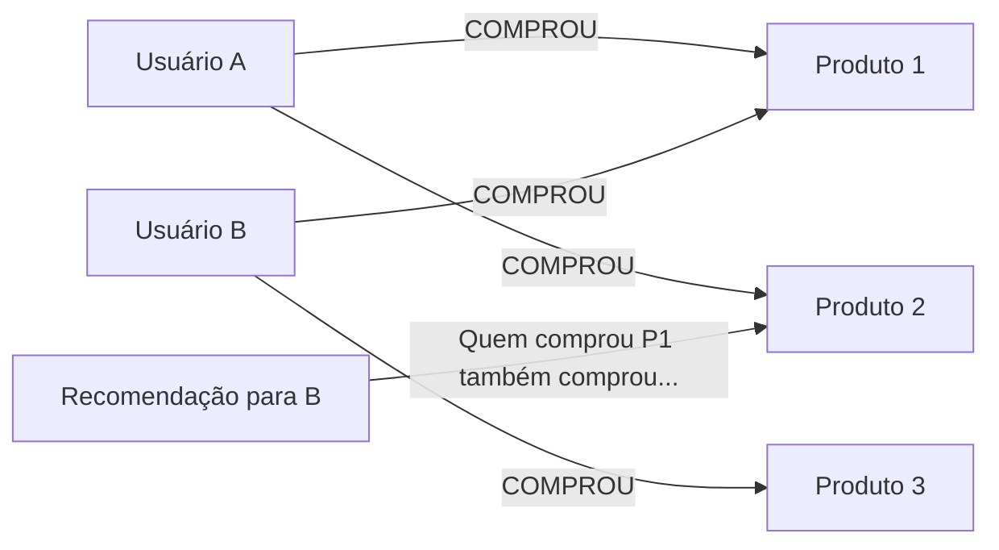

# Skill: Database: Bancos de Dados de Grafos - Neo4j e JanusGraph

## Introdução

Esta skill aborda os **Bancos de Dados de Grafos**, a categoria de NoSQL projetada especificamente para armazenar e consultar relacionamentos complexos entre dados. Enquanto os bancos relacionais sofrem com Joins lentos e o NoSQL documental desnormaliza dados, os bancos de grafos tratam as conexões como cidadãos de primeira classe. Eles usam estruturas de **Nós** (entidades), **Relacionamentos** (conexões) e **Propriedades** (atributos) para representar redes de informações de forma natural e performática.

Exploraremos o **Neo4j**, o líder absoluto em grafos nativos, e o **JanusGraph**, um banco de grafos distribuído e escalável que roda sobre o ecossistema Big Data (Cassandra/HBase). Discutiremos a linguagem de consulta **Cypher**, o conceito de **Index-Free Adjacency** e como os grafos permitem realizar travessias (traversals) de múltiplos níveis em milissegundos. Este conhecimento é vital para cientistas de dados e arquitetos que trabalham com redes sociais, sistemas de recomendação, detecção de fraudes e gestão de identidades.

## Glossário Técnico

*   **Grafo**: Uma estrutura matemática composta por vértices (nós) e arestas (relacionamentos).
*   **Nó (Node/Vertex)**: Representa uma entidade (ex: Pessoa, Produto, Cidade).
*   **Relacionamento (Relationship/Edge)**: Conecta dois nós e possui um tipo e uma direção (ex: "AMIGO_DE", "COMPROU", "MORA_EM").
*   **Propriedade (Property)**: Pares chave-valor armazenados em nós ou relacionamentos (ex: nome: "João", data: "2023-01-01").
*   **Rótulo (Label)**: Usado para agrupar nós em categorias (ex: `:Pessoa`, `:Empresa`).
*   **Cypher**: Linguagem de consulta declarativa do Neo4j, baseada em padrões visuais (ASCII-art).
*   **Gremlin**: Linguagem de travessia de grafos imperativa usada pelo JanusGraph e outros bancos compatíveis com o Apache TinkerPop.
*   **Index-Free Adjacency**: Técnica onde cada nó armazena ponteiros diretos para seus vizinhos, eliminando a necessidade de índices globais para travessias.
*   **Travessia (Traversal)**: O processo de navegar pelo grafo seguindo os relacionamentos de um nó para outro.

## Conceitos Fundamentais

### 1. Por que Grafos? (O Problema dos Joins)

Em um banco relacional, descobrir "amigos de amigos" exige Joins recursivos que crescem exponencialmente em custo. Em um banco de grafos, o custo é linear em relação ao número de conexões visitadas, independentemente do tamanho total do banco.
*   **Relacional**: `SELECT ... JOIN ... JOIN ... JOIN ...` (Lento e complexo).
*   **Grafos**: `(p:Pessoa)-[:AMIGO_DE]->(f:Pessoa)-[:AMIGO_DE]->(ff:Pessoa)` (Rápido e intuitivo).

### 2. Neo4j: O Grafo Nativo

O Neo4j é um banco de grafos nativo, o que significa que ele armazena os dados no disco otimizados para travessias:
*   **ACID Total**: Garante a integridade dos dados mesmo em operações complexas.
*   **Cypher**: Extremamente expressivo para padrões de busca (ex: encontrar o caminho mais curto entre dois nós).
*   **Visualização**: Ferramentas integradas para ver o grafo de forma gráfica, facilitando a descoberta de padrões.

### 3. JanusGraph: Grafos em Escala Big Data

O JanusGraph é projetado para grafos que não cabem em um único servidor:
*   **Armazenamento Distribuído**: Usa Cassandra, HBase ou ScyllaDB como backend.
*   **Busca Avançada**: Integra-se com Elasticsearch ou Solr para buscas textuais e geoespaciais complexas.
*   **Apache TinkerPop**: Segue o padrão da indústria para travessias de grafos (Gremlin).

## Histórico e Evolução

O Neo4j foi criado na Suécia em 2000 por Emil Eifrem e sua equipe, tornando-se open-source em 2007. O JanusGraph surgiu em 2017 como um fork do TitanDB, após este ser adquirido pela DataStax. Recentemente, o padrão **GQL (Graph Query Language)** foi aprovado pela ISO como a linguagem padrão internacional para grafos, unindo conceitos do Cypher e de outras linguagens. Além disso, a ascensão da **IA Generativa** trouxe os **Knowledge Graphs** (Grafos de Conhecimento) de volta ao centro das atenções para fornecer contexto estruturado aos LLMs.

## Exemplos Práticos e Casos de Uso

### Cenário: Detecção de Fraude em Cartão de Crédito

Um fraudador usa múltiplas identidades, mas compartilha o mesmo número de telefone ou endereço IP:
*   **Nós**: `:Pessoa`, `:Telefone`, `:IP`, `:Transacao`.
*   **Relacionamentos**: `:USA_TELEFONE`, `:USA_IP`, `:REALIZOU`.

```cypher
// Consulta Cypher para encontrar pessoas compartilhando o mesmo telefone
MATCH (p1:Pessoa)-[:USA_TELEFONE]->(t:Telefone)<-[:USA_TELEFONE]-(p2:Pessoa)
WHERE p1 <> p2
RETURN p1.nome, p2.nome, t.numero
```

**Vantagem**: O grafo revela instantaneamente anéis de fraude que seriam quase impossíveis de detectar em tabelas isoladas. A visualização das conexões permite que analistas humanos identifiquem padrões suspeitos rapidamente.

## Análise de Fluxo e Diagramas (em Texto)

### Fluxo de Recomendação de Produtos (Collaborative Filtering)



**Explicação**: O diagrama mostra como o grafo conecta usuários através de produtos comuns. Para recomendar algo ao Usuário B, o sistema navega de B para o Produto 1, depois para outros usuários que compraram o Produto 1 (Usuário A), e finalmente para outros produtos que o Usuário A comprou (Produto 2).

## Boas Práticas e Padrões de Projeto

*   **Modele para a Travessia**: Pense em como você vai navegar pelos dados antes de criar os nós e relacionamentos.
*   **Use Rótulos (Labels)**: Eles funcionam como índices de entrada para o grafo, permitindo que você comece a busca no conjunto certo de nós.
*   **Evite "Super Nodes"**: Nós com milhões de relacionamentos (ex: uma celebridade em uma rede social) podem causar problemas de performance. Use técnicas de particionamento ou filtragem agressiva.
*   **Propriedades vs. Nós**: Se você precisa filtrar ou agrupar por um atributo (ex: "Cidade"), transforme-o em um Nó. Se é apenas uma informação de exibição (ex: "Data de Nascimento"), deixe como Propriedade.
*   **Direção dos Relacionamentos**: Embora o Neo4j possa navegar em ambas as direções, definir uma direção lógica ajuda na legibilidade e em certas otimizações de consulta.
*   **Mantenha Relacionamentos Curtos**: Quanto mais específicos forem os tipos de relacionamento (ex: `:AMIGO_DE` em vez de apenas `:CONECTADO`), mais rápida será a travessia.

## Comparativos Detalhados

| Característica | Neo4j | JanusGraph |
| :--- | :--- | :--- |
| **Armazenamento** | Nativo (Otimizado para Grafos) | Distribuído (Cassandra/HBase) |
| **Linguagem** | Cypher (Declarativa) | Gremlin (Imperativa) |
| **Escalabilidade** | Vertical / Cluster (Causal Clustering) | Horizontal (Big Data) |
| **Transações** | ACID Forte | Eventual / Configurável |
| **Uso Ideal** | Recomendação, Fraude, Identidade. | Grafos Massivos, Análise de Redes. |

## Ferramentas e Recursos

*   **Neo4j Browser**: Interface interativa para executar consultas Cypher e visualizar resultados.
*   **Neo4j Bloom**: Ferramenta de exploração visual para usuários não técnicos.
*   **Gremlin Console**: Shell interativo para testar travessias no JanusGraph.
*   **Gephi**: Software de código aberto para visualização e análise estatística de grandes grafos.

## Tópicos Avançados e Pesquisa Futura

O futuro dos bancos de grafos está na **Graph Data Science (GDS)**, onde algoritmos de centralidade, detecção de comunidades e PageRank são executados diretamente no banco para extrair insights profundos. Outra área de evolução são os **Graph Neural Networks (GNNs)**, que usam a estrutura do grafo como entrada para modelos de deep learning. Além disso, a integração com **Vetores de Embedding** permite que o grafo armazene não apenas conexões explícitas, mas também similaridades semânticas entre nós.

## Perguntas Frequentes (FAQ)

*   **P: Posso usar um banco de grafos como meu banco de dados principal?**
    *   R: Sim, especialmente se sua aplicação for centrada em relacionamentos. No entanto, para relatórios contábeis ou grandes volumes de dados brutos (logs), um banco SQL ou Colunar pode ser mais eficiente como complemento.
*   **P: O que é o "Caminho Mais Curto" (Shortest Path)?**
    *   R: É um algoritmo clássico de grafos que encontra a menor sequência de relacionamentos entre dois nós (ex: como o LinkedIn mostra "Conexão de 2º grau").

## Referências Cruzadas

*   **`[[02_Modelagem_Relacional_Entidades_Atributos_e_Relacionamentos]]`**
*   **`[[21_Introducao_ao_NoSQL_Teorema_CAP_e_Eventual_Consistency]]`**
*   **`[[31_Bancos_de_Dados_Vetoriais_e_Busca_Semantica]]`**

## Referências

[1] Robinson, I., Webber, J., & Eifrem, E. (2015). *Graph Databases*. O'Reilly Media.
[2] Rodriguez, M. A. (2015). *The Gremlin Graph Traversal Machine and Language*. arXiv.
[3] Neo4j Documentation. *The Cypher Query Language*.
