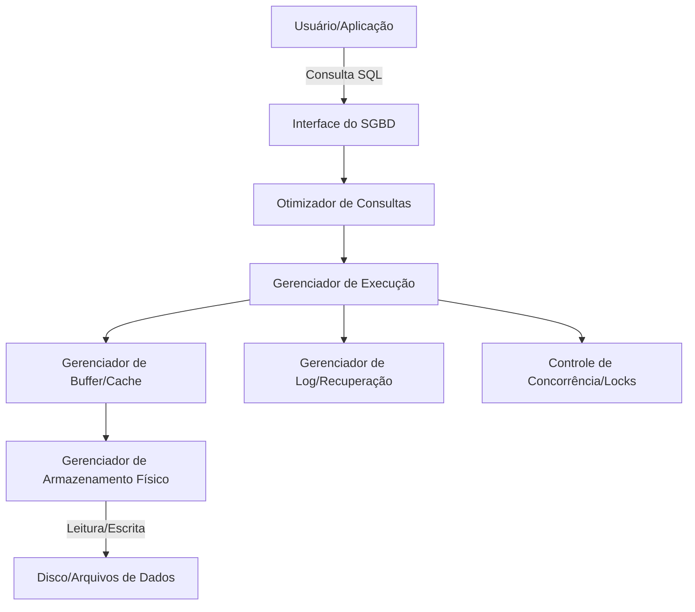

# Skill: Database: Introdução e Sistemas Gerenciadores (SGBD)

## Introdução

Esta skill estabelece os fundamentos essenciais sobre bancos de dados e os **Sistemas Gerenciadores de Bancos de Dados (SGBD)**. Um banco de dados é uma coleção organizada de informações estruturadas, ou dados, tipicamente armazenados eletronicamente em um sistema de computador. O SGBD é o software que interage com usuários finais, aplicações e o próprio banco de dados para capturar e analisar os dados. Ele serve como uma interface entre o banco de dados e seus usuários ou programas, garantindo que os dados sejam organizados de forma consistente e permaneçam facilmente acessíveis.

Abordaremos a evolução dos sistemas de arquivos para os SGBDs modernos, as funções principais de um SGBD (segurança, integridade, concorrência e recuperação), e os diferentes tipos de arquiteturas de banco de dados. Discutiremos a importância da abstração de dados e como os SGBDs resolvem problemas históricos de redundância e inconsistência. Este conhecimento é o alicerce para qualquer IA ou desenvolvedor que precise projetar, gerenciar ou interagir com sistemas de armazenamento de dados robustos e escaláveis.

## Glossário Técnico

*   **Banco de Dados (Database)**: Uma coleção organizada de dados estruturados.
*   **SGBD (Sistema Gerenciador de Banco de Dados)**: Software que gerencia o acesso, a organização e a manipulação dos dados (ex: MySQL, PostgreSQL, Oracle).
*   **Metadados**: Dados sobre os dados; informações que descrevem a estrutura, tipo e restrições dos dados armazenados no dicionário de dados.
*   **Independência de Dados**: A capacidade de modificar o esquema em um nível do sistema de banco de dados sem alterar o esquema nos níveis superiores.
*   **Redundância**: Repetição desnecessária de dados, que pode levar a inconsistências.
*   **Inconsistência**: Situação onde diferentes cópias do mesmo dado não coincidem.
*   **Abstração de Dados**: Técnica de ocultar detalhes complexos da implementação física dos dados, apresentando uma visão simplificada aos usuários.
*   **Dicionário de Dados**: Um repositório central de metadados que contém definições e representações de todos os elementos de dados no banco.

## Conceitos Fundamentais

### 1. Por que usar um SGBD em vez de Arquivos?

Antes dos SGBDs, os dados eram armazenados em sistemas de arquivos convencionais. Isso gerava diversos problemas que os SGBDs foram projetados para resolver:

*   **Redundância e Inconsistência**: Em arquivos, o mesmo dado pode estar em vários lugares. Se mudar em um e não no outro, temos inconsistência. O SGBD centraliza o controle.
*   **Dificuldade no Acesso**: Para cada nova consulta em arquivos, era necessário escrever um novo programa. O SGBD oferece linguagens de consulta (como SQL).
*   **Isolamento de Dados**: Dados espalhados em diferentes arquivos e formatos dificultam a integração.
*   **Problemas de Integridade**: É difícil aplicar regras (ex: "saldo não pode ser negativo") em arquivos simples.
*   **Anomalias no Acesso Concorrente**: Se dois usuários tentam alterar o mesmo arquivo ao mesmo tempo, os dados podem ser corrompidos. O SGBD gerencia o acesso simultâneo.
*   **Problemas de Segurança**: É difícil controlar quem pode ver ou alterar partes específicas de um arquivo.

### 2. Funções Principais de um SGBD

Um SGBD moderno deve desempenhar as seguintes funções:

1.  **Gerenciamento do Dicionário de Dados**: Armazena definições dos elementos de dados e seus relacionamentos.
2.  **Gerenciamento de Armazenamento**: Cria estruturas complexas para armazenamento físico eficiente.
3.  **Transformação e Apresentação de Dados**: Garante que o que o usuário vê seja independente de como o dado está guardado.
4.  **Gerenciamento de Segurança**: Controla o acesso e a privacidade dos dados.
5.  **Controle de Acesso Multi-usuário**: Garante a integridade dos dados durante acessos simultâneos.
6.  **Gerenciamento de Backup e Recuperação**: Provê mecanismos para recuperar dados após falhas.
7.  **Gerenciamento de Integridade**: Aplica regras de negócio e restrições aos dados.
8.  **Linguagens de Interface**: Provê linguagens para definição (DDL) e manipulação (DML) de dados.

### 3. Níveis de Abstração de Dados (Arquitetura ANSI/SPARC)

Para separar a visão do usuário da implementação física, os SGBDs utilizam três níveis de abstração:

*   **Nível Físico (Interno)**: O nível mais baixo, que descreve *como* os dados estão realmente armazenados (estruturas de arquivos, índices, caminhos de acesso).
*   **Nível Conceitual (Lógico)**: Descreve *quais* dados estão armazenados e quais os relacionamentos entre eles. É aqui que o administrador do banco de dados (DBA) trabalha.
*   **Nível de Visão (Externo)**: O nível mais alto, que descreve apenas a parte do banco de dados que é relevante para um usuário ou aplicação específica.

## Histórico e Evolução

*   **Anos 60**: Sistemas de arquivos e modelos hierárquicos (IMS da IBM) e em rede (CODASYL).
*   **1970**: Edgar F. Codd publica o modelo relacional, revolucionando a área com base na teoria dos conjuntos.
*   **Anos 80**: Surgimento dos SGBDs relacionais comerciais (Oracle, DB2, SQL Server). O SQL torna-se o padrão.
*   **Anos 90**: Bancos de dados orientados a objetos e o surgimento do MySQL e PostgreSQL.
*   **Anos 2000**: Explosão do NoSQL (MongoDB, Cassandra) para lidar com Big Data e escalabilidade horizontal.
*   **Presente**: Bancos de dados NewSQL, bancos vetoriais para IA e soluções Cloud-Native/Serverless.

## Exemplos Práticos e Casos de Uso

*   **Sistemas Bancários**: Exigem altíssima consistência e controle de concorrência (SGBDs Relacionais como PostgreSQL ou Oracle).
*   **Redes Sociais**: Precisam lidar com volumes massivos de dados e conexões complexas (NoSQL como Cassandra ou Neo4j).
*   **E-commerce**: Gerenciamento de inventário, pedidos e perfis de usuários (Híbrido de Relacional para transações e NoSQL para catálogo/cache).
*   **Aplicações de IA**: Uso de bancos de dados vetoriais para armazenar embeddings e realizar buscas por similaridade.

## Análise de Fluxo e Diagramas (em Texto)

### Fluxo de Interação com um SGBD

**Explicação**: O usuário envia uma consulta (A), que é processada pela interface (B). O otimizador (C) decide o melhor caminho. O gerenciador de execução (D) coordena a tarefa, interagindo com o cache (E) e o armazenamento físico (F). Simultaneamente, o sistema garante a segurança via logs (H) e travas de concorrência (I).

## Boas Práticas e Padrões de Projeto

*   **Escolha o SGBD Correto**: Não use uma marreta para matar uma mosca. Avalie se o problema exige consistência ACID (Relacional) ou escalabilidade horizontal (NoSQL).
*   **Mantenha a Independência de Dados**: Evite que a lógica da aplicação dependa de detalhes físicos do banco.
*   **Documente o Metadado**: Um banco de dados sem dicionário de dados documentado torna-se um "pântano de dados".
*   **Segurança em Camadas**: Nunca confie apenas na segurança da aplicação; configure permissões granulares no SGBD.

## Comparativos Detalhados

| Característica | Sistema de Arquivos | SGBD Relacional (SQL) | SGBD NoSQL |
| :--- | :--- | :--- | :--- |
| **Redundância** | Alta e não controlada | Mínima (via Normalização) | Controlada (para performance) |
| **Consistência** | Difícil de garantir | Garantida via ACID | Eventual ou Configurável |
| **Acesso** | Via programas específicos | Via SQL (Padronizado) | APIs variadas / JSON |
| **Escalabilidade** | Limitada | Vertical (principalmente) | Horizontal (Nativa) |
| **Segurança** | Básica (nível de SO) | Avançada (nível de dado) | Variável por sistema |

## Ferramentas e Recursos

*   **SGBDs Relacionais Populares**: PostgreSQL, MySQL, MariaDB, Microsoft SQL Server, Oracle Database, SQLite.
*   **SGBDs NoSQL Populares**: MongoDB (Documentos), Redis (Chave-Valor), Cassandra (Colunar), Neo4j (Grafos).
*   **Ferramentas de Administração**: pgAdmin, DBeaver, MySQL Workbench, MongoDB Compass.

## Tópicos Avançados e Pesquisa Futura

*   **Bancos de Dados Autônomos**: SGBDs que usam IA para auto-ajuste, indexação automática e correção de falhas.
*   **Arquiteturas Serverless**: Bancos de dados que escalam automaticamente para zero quando não estão em uso.
*   **Bancos de Dados Quânticos**: Pesquisas sobre como a computação quântica afetará a busca e a criptografia de dados.

## Perguntas Frequentes (FAQ)

*   **P: Posso usar um SGBD para arquivos pequenos?**
    *   R: Sim, o SQLite é excelente para isso, pois não requer um servidor e armazena tudo em um único arquivo, oferecendo as vantagens de um SGBD.
*   **P: Qual a diferença entre Banco de Dados e SGBD?**
    *   R: O Banco de Dados é o conjunto de dados. O SGBD é o software que gerencia esses dados. É como a diferença entre um livro (dados) e uma biblioteca/bibliotecário (SGBD).

## Referências Cruzadas

*   `[[02_Modelagem_Relacional_Entidades_Atributos_e_Relacionamentos]]`
*   `[[13_Transacoes_ACID_Atomicidade_Consistencia_Isolamento_Durabilidade]]`
*   `[[21_Introducao_ao_NoSQL_Teorema_CAP_e_Eventual_Consistency]]`

## Referências

[1] Silberschatz, A., Korth, H. F., & Sudarshan, S. (2019). *Database System Concepts*. McGraw-Hill.
[2] Elmasri, R., & Navathe, S. B. (2015). *Fundamentals of Database Systems*. Pearson.
[3] Date, C. J. (2003). *An Introduction to Database Systems*. Addison-Wesley.
