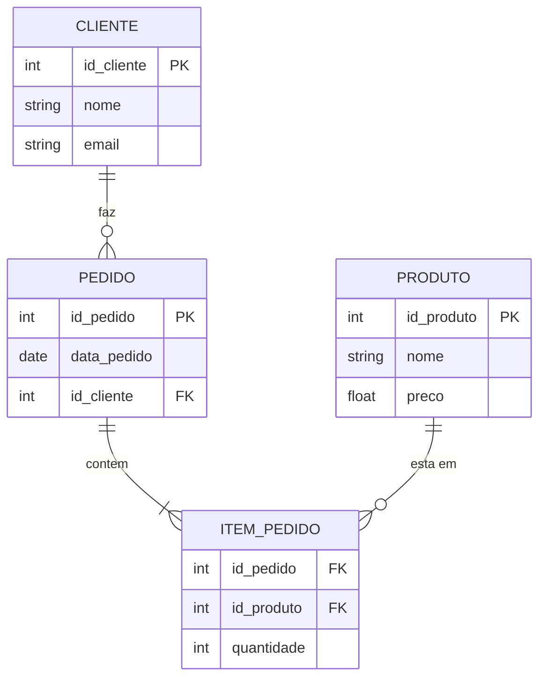

# Skill: Database: Modelagem Relacional, Entidades, Atributos e Relacionamentos

## Introdução

Esta skill aborda a **Modelagem Relacional**, o processo de projetar a estrutura de um banco de dados para representar a realidade de um negócio ou sistema. A modelagem é a etapa mais crítica no desenvolvimento de um banco de dados, pois uma estrutura mal projetada pode levar a redundâncias, inconsistências e problemas de performance impossíveis de corrigir apenas com código. O modelo relacional, proposto por E.F. Codd em 1970, utiliza a teoria dos conjuntos para organizar dados em tabelas (relações) interconectadas.

Exploraremos os componentes fundamentais do **Modelo Entidade-Relacionamento (MER)**: Entidades (objetos do mundo real), Atributos (características das entidades) e Relacionamentos (como as entidades interagem). Discutiremos a transição do modelo conceitual para o modelo lógico e físico, e como as chaves primárias e estrangeiras garantem a integridade referencial. Este conhecimento é vital para IAs e arquitetos de dados que precisam criar sistemas de armazenamento que sejam ao mesmo tempo flexíveis e rigorosos.

## Glossário Técnico

*   **Entidade**: Um objeto ou conceito do mundo real que pode ser identificado de forma única (ex: Cliente, Produto, Pedido).
*   **Atributo**: Uma propriedade ou característica de uma entidade (ex: Nome do Cliente, Preço do Produto).
*   **Relacionamento**: Uma associação entre duas ou mais entidades (ex: Cliente *faz* Pedido).
*   **Cardinalidade**: Define o número de ocorrências de uma entidade que podem estar associadas a ocorrências de outra entidade (1:1, 1:N, N:N).
*   **Chave Primária (PK)**: Um atributo (ou conjunto de atributos) que identifica unicamente cada registro em uma tabela.
*   **Chave Estrangeira (FK)**: Um atributo em uma tabela que estabelece um link com a chave primária de outra tabela, garantindo a integridade referencial.
*   **Tabela (Relação)**: A estrutura básica do modelo relacional, composta por linhas (tuplas) e colunas (atributos).
*   **Domínio**: O conjunto de valores válidos que um atributo pode assumir (ex: Inteiro, String de 50 caracteres, Data).

## Conceitos Fundamentais

### 1. O Modelo Entidade-Relacionamento (MER)

O MER é uma técnica de modelagem conceitual que descreve os dados como entidades e relacionamentos. Ele é independente de qualquer SGBD específico.

*   **Entidades Fortes**: Existem por si mesmas (ex: `CLIENTE`).
*   **Entidades Fracas**: Dependem de outra entidade para existir (ex: `DEPENDENTE` de um `FUNCIONARIO`).
*   **Atributos Simples**: Não podem ser divididos (ex: `IDADE`).
*   **Atributos Compostos**: Podem ser divididos em partes menores (ex: `ENDERECO` composto por `RUA`, `NUMERO`, `CEP`).
*   **Atributos Multivalorados**: Podem ter mais de um valor para uma única entidade (ex: `TELEFONE`).
*   **Atributos Derivados**: Cujo valor pode ser calculado a partir de outros atributos (ex: `TOTAL_PEDIDO`).

### 2. Cardinalidade de Relacionamentos

A cardinalidade descreve as regras de negócio do sistema:

*   **Um para Um (1:1)**: Uma ocorrência de A está associada a no máximo uma de B, e vice-versa (ex: `USUARIO` e `PERFIL_DETALHADO`).
*   **Um para Muitos (1:N)**: Uma ocorrência de A pode estar associada a várias de B, mas uma de B está associada a apenas uma de A (ex: `DEPARTAMENTO` e `FUNCIONARIO`).
*   **Muitos para Muitos (N:N)**: Várias ocorrências de A podem estar associadas a várias de B (ex: `ALUNO` e `DISCIPLINA`). No modelo lógico, relacionamentos N:N tornam-se uma tabela intermediária.

### 3. Integridade Referencial e Chaves

*   **Integridade de Entidade**: Nenhuma chave primária pode ser nula.
*   **Integridade Referencial**: Se uma tabela A contém uma chave estrangeira que aponta para a chave primária da tabela B, o valor da FK em A deve existir como PK em B ou ser nulo. Isso evita "registros órfãos".

## Histórico e Evolução

*   **1970**: E.F. Codd publica "A Relational Model of Data for Large Shared Data Banks".
*   **1976**: Peter Chen introduz o Modelo Entidade-Relacionamento (ER), fornecendo uma notação visual para o modelo de Codd.
*   **Anos 80/90**: Consolidação das ferramentas CASE (Computer-Aided Software Engineering) para desenho de diagramas ER.
*   **Presente**: Modelagem ágil e ferramentas modernas como dbdiagram.io e Lucidchart, que integram o desenho com a geração automática de código SQL.

## Exemplos Práticos e Casos de Uso

### Cenário: Sistema de Biblioteca

1.  **Entidades**: `LIVRO`, `AUTOR`, `USUARIO`, `EMPRESTIMO`.
2.  **Atributos**:
    *   `LIVRO`: `ISBN` (PK), `Titulo`, `Ano`.
    *   `AUTOR`: `ID_Autor` (PK), `Nome`, `Nacionalidade`.
3.  **Relacionamentos**:
    *   `AUTOR` escreve `LIVRO` (1:N ou N:N).
    *   `USUARIO` realiza `EMPRESTIMO` (1:N).
    *   `EMPRESTIMO` contém `LIVRO` (1:N).

## Análise de Fluxo e Diagramas (em Texto)

### Diagrama ER Simplificado (Notação Crow's Foot)

**Explicação**: O diagrama mostra que um `CLIENTE` pode fazer vários `PEDIDO`s (1:N). Cada `PEDIDO` pode ter vários `ITEM_PEDIDO`s, e cada `ITEM_PEDIDO` refere-se a um `PRODUTO`. A tabela `ITEM_PEDIDO` resolve o relacionamento N:N entre `PEDIDO` e `PRODUTO`.

## Boas Práticas e Padrões de Projeto

*   **Use Nomes Significativos**: Tabelas no singular ou plural (seja consistente), colunas claras.
*   **Evite Chaves Compostas se Possível**: Chaves substitutas (Surrogate Keys) como IDs autoincrementais costumam ser mais eficientes para indexação e joins.
*   **Documente o Dicionário de Dados**: Explique o propósito de cada tabela e coluna.
*   **Cuidado com Atributos Multivalorados**: Eles devem ser movidos para tabelas separadas para manter a Primeira Forma Normal (1NF).
*   **Defina Restrições (Constraints)**: Use `NOT NULL`, `UNIQUE` e `CHECK` para garantir a qualidade dos dados no nível do banco.

## Comparativos Detalhados

| Conceito | Modelo Conceitual (ER) | Modelo Lógico (Relacional) | Modelo Físico (SQL) |
| :--- | :--- | :--- | :--- |
| **Foco** | Negócio e Realidade | Estrutura de Dados | Implementação e Performance |
| **Elementos** | Entidades, Relacionamentos | Tabelas, Colunas, Chaves | Scripts SQL, Índices, Partições |
| **Independência** | Total (Independe de SGBD) | Parcial (Assume Relacional) | Nenhuma (Específico do SGBD) |
| **Público** | Analistas e Clientes | Desenvolvedores e DBAs | DBAs e Engenheiros de Dados |

## Ferramentas e Recursos

*   **Design de Diagramas**: MySQL Workbench, pgModeler, dbdiagram.io, Lucidchart, Draw.io.
*   **Documentação**: SchemaSpy, Dataedo.

## Tópicos Avançados e Pesquisa Futura

*   **Modelagem de Dados para Big Data**: Como o modelo relacional se adapta (ou não) a volumes massivos de dados não estruturados.
*   **Modelagem Dimensional**: Uso de tabelas Fato e Dimensão para Data Warehousing (Star Schema).
*   **Grafos vs. Relacional**: Quando usar relacionamentos de primeira classe em bancos de grafos em vez de joins relacionais.

## Perguntas Frequentes (FAQ)

*   **P: Devo sempre usar IDs como Chave Primária?**
    *   R: Na maioria dos casos, sim. Chaves naturais (como CPF ou e-mail) podem mudar ou ser nulas em casos excepcionais, o que quebra a integridade. IDs são estáveis.
*   **P: O que acontece se eu deletar um registro que tem Chaves Estrangeiras apontando para ele?**
    *   R: Depende da configuração da FK: `RESTRICT` (impede o delete), `CASCADE` (deleta os dependentes), ou `SET NULL` (limpa a referência).

## Referências Cruzadas

*   `[[01_Database_Introducao_e_Sistemas_Gerenciadores_SGBD]]`
*   `[[03_Normalizacao_de_Dados_1NF_2NF_3NF_e_BCNF]]`
*   `[[05_Tipos_de_Dados_SQL_e_Restricoes_Constraints]]`

## Referências

[1] Chen, P. P. (1976). *The Entity-Relationship Model—Toward a Unified View of Data*. ACM Transactions on Database Systems.
[2] Codd, E. F. (1970). *A Relational Model of Data for Large Shared Data Banks*. Communications of the ACM.
[3] Teorey, T. J., et al. (2011). *Database Modeling and Design: Logical Design*. Morgan Kaufmann.
