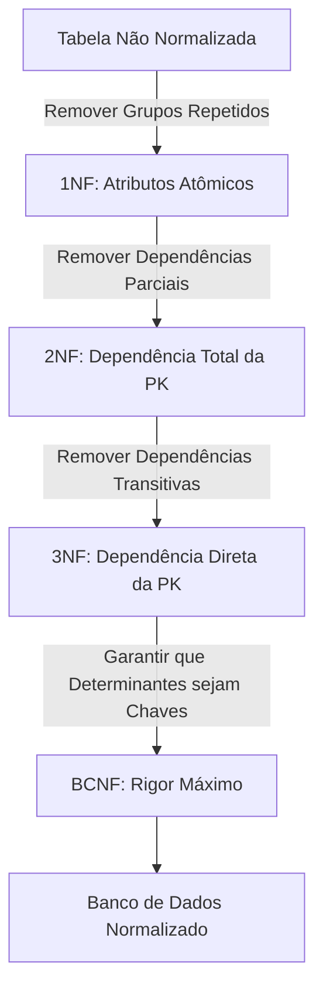

# Skill: Database: Normalização de Dados (1NF, 2NF, 3NF e BCNF)

## Introdução

Esta skill aborda a **Normalização de Dados**, uma técnica sistemática para projetar a estrutura de um banco de dados relacional de forma a minimizar a redundância e evitar anomalias de inserção, atualização e exclusão. A normalização envolve a decomposição de tabelas complexas em tabelas menores e mais simples, garantindo que cada dado seja armazenado em apenas um lugar e que as dependências entre os dados sejam lógicas e consistentes.

Exploraremos as três primeiras formas normais (1NF, 2NF, 3NF) e a Forma Normal de Boyce-Codd (BCNF). Discutiremos como identificar dependências funcionais e como aplicar as regras de normalização passo a passo. Este conhecimento é fundamental para qualquer IA ou desenvolvedor que precise criar bancos de dados que sejam fáceis de manter, escaláveis e livres de inconsistências de dados.

## Glossário Técnico

*   **Normalização**: O processo de organizar os dados em um banco de dados para reduzir a redundância e melhorar a integridade dos dados.
*   **Anomalia de Inserção**: Ocorre quando não é possível inserir um dado em uma tabela porque outro dado necessário ainda não existe.
*   **Anomalia de Atualização**: Ocorre quando a atualização de um dado exige a alteração de múltiplas linhas, levando a inconsistências se alguma linha for esquecida.
*   **Anomalia de Exclusão**: Ocorre quando a exclusão de um dado resulta na perda não intencional de outro dado importante.
*   **Dependência Funcional**: Uma relação entre dois atributos em que o valor de um atributo determina unicamente o valor do outro (A -> B).
*   **Dependência Parcial**: Ocorre quando um atributo depende de apenas uma parte de uma chave primária composta.
*   **Dependência Transitiva**: Ocorre quando um atributo não-chave depende de outro atributo não-chave, que por sua vez depende da chave primária (A -> B -> C).
*   **Chave Primária (PK)**: Um atributo ou conjunto de atributos que identifica unicamente cada linha em uma tabela.
*   **Chave Candidata**: Qualquer atributo ou conjunto de atributos que poderia servir como chave primária.

## Conceitos Fundamentais

### 1. Por que Normalizar?

A normalização resolve problemas comuns em bancos de dados mal projetados:

*   **Redução de Redundância**: Evita o armazenamento repetido da mesma informação, economizando espaço e facilitando atualizações.
*   **Integridade de Dados**: Garante que as alterações nos dados sejam consistentes em todo o banco.
*   **Facilidade de Manutenção**: Tabelas menores e mais focadas são mais fáceis de entender e modificar.
*   **Melhoria de Performance (em alguns casos)**: Reduz o tamanho das tabelas e melhora a eficiência de certos tipos de consultas, embora possa exigir mais joins.

### 2. As Formas Normais (FN)

#### Primeira Forma Normal (1NF)
Uma tabela está na 1NF se:
*   Todos os atributos contêm apenas valores atômicos (indivisíveis).
*   Não existem grupos repetidos ou atributos multivalorados.
*   Cada linha é identificada de forma única por uma chave primária.

*Exemplo*: Se uma coluna `Telefones` contém múltiplos números separados por vírgula, a tabela não está na 1NF. Cada telefone deve estar em sua própria linha ou em uma tabela separada.

#### Segunda Forma Normal (2NF)
Uma tabela está na 2NF se:
*   Já está na 1NF.
*   Não existem dependências parciais. Todos os atributos não-chave devem depender da chave primária *inteira*.

*Exemplo*: Em uma tabela com chave composta `(ID_Pedido, ID_Produto)`, se o atributo `Nome_Produto` depende apenas de `ID_Produto`, temos uma dependência parcial. `Nome_Produto` deve ser movido para uma tabela `PRODUTO`.

#### Terceira Forma Normal (3NF)
Uma tabela está na 3NF se:
*   Já está na 2NF.
*   Não existem dependências transitivas. Atributos não-chave devem depender apenas da chave primária, e não de outros atributos não-chave.

*Exemplo*: Em uma tabela `FUNCIONARIO` com `ID_Funcionario` (PK), `ID_Departamento` e `Nome_Departamento`, o `Nome_Departamento` depende de `ID_Departamento`, que depende de `ID_Funcionario`. Isso é uma dependência transitiva. `Nome_Departamento` deve ser movido para uma tabela `DEPARTAMENTO`.

#### Forma Normal de Boyce-Codd (BCNF)
Uma versão mais rigorosa da 3NF. Uma tabela está na BCNF se:
*   Para cada dependência funcional não trivial A -> B, A deve ser uma chave candidata.

*Exemplo*: Ocorre em tabelas com múltiplas chaves candidatas compostas que se sobrepõem. É menos comum na prática, mas importante para garantir a integridade total.

## Histórico e Evolução

*   **1970**: E.F. Codd introduz a 1NF.
*   **1971**: Codd introduz a 2NF e a 3NF.
*   **1974**: Raymond F. Boyce e E.F. Codd introduzem a BCNF.
*   **Anos 80/90**: Consolidação das regras de normalização como padrão para o design de bancos de dados relacionais.
*   **Presente**: Discussões sobre **Desnormalização** controlada para otimização de performance em sistemas de larga escala e Data Warehousing.

## Exemplos Práticos e Casos de Uso

### Cenário: Tabela de Vendas Não Normalizada

| ID_Venda | Data | ID_Cliente | Nome_Cliente | ID_Produto | Nome_Produto | Preco | Qtd |
| :--- | :--- | :--- | :--- | :--- | :--- | :--- | :--- |
| 1 | 2023-01-01 | 101 | João Silva | 501 | Mouse | 50.00 | 2 |
| 1 | 2023-01-01 | 101 | João Silva | 502 | Teclado | 100.00 | 1 |

**Processo de Normalização**:
1.  **1NF**: Garantir que cada célula tenha um valor atômico (já está).
2.  **2NF**: Remover dependências parciais. `Nome_Produto` e `Preco` dependem apenas de `ID_Produto`. Criar tabela `PRODUTO`.
3.  **3NF**: Remover dependências transitivas. `Nome_Cliente` depende de `ID_Cliente`. Criar tabela `CLIENTE`.

**Resultado Final**:
*   `VENDA`: `ID_Venda` (PK), `Data`, `ID_Cliente` (FK).
*   `ITEM_VENDA`: `ID_Venda` (FK), `ID_Produto` (FK), `Qtd`.
*   `PRODUTO`: `ID_Produto` (PK), `Nome_Produto`, `Preco`.
*   `CLIENTE`: `ID_Cliente` (PK), `Nome_Cliente`.

## Análise de Fluxo e Diagramas (em Texto)

### Fluxo de Normalização

**Explicação**: O fluxo mostra a progressão das formas normais, onde cada nível superior resolve um tipo específico de redundância ou anomalia identificada no nível anterior.

## Boas Práticas e Padrões de Projeto

*   **Normalizar até a 3NF**: Na maioria das aplicações comerciais, a 3NF é o "ponto ideal" entre integridade e performance.
*   **Entenda o Negócio**: As dependências funcionais são baseadas nas regras de negócio, não apenas nos dados atuais.
*   **Desnormalização Controlada**: Em sistemas de leitura intensiva (como dashboards), pode ser necessário desnormalizar algumas tabelas para evitar joins excessivos e melhorar a performance. Faça isso com cautela e documentação.
*   **Use Chaves Artificiais (Surrogate Keys)**: IDs autoincrementais simplificam a normalização e a criação de chaves estrangeiras.

## Comparativos Detalhados

| Forma Normal | Problema Resolvido | Regra Principal |
| :--- | :--- | :--- |
| **1NF** | Grupos repetidos, dados não atômicos | Valores atômicos, PK definida |
| **2NF** | Dependências parciais (em chaves compostas) | Atributos dependem da PK inteira |
| **3NF** | Dependências transitivas | Atributos dependem apenas da PK |
| **BCNF** | Anomalias em chaves candidatas sobrepostas | Todo determinante deve ser chave candidata |

## Ferramentas e Recursos

*   **Modelagem Visual**: MySQL Workbench, pgModeler, dbdiagram.io.
*   **Análise de Esquema**: Ferramentas que identificam automaticamente violações de formas normais.

## Tópicos Avançados e Pesquisa Futura

*   **Quarta e Quinta Formas Normais (4NF, 5NF)**: Lidam com dependências multivaloradas e de junção. Raramente usadas na prática, mas importantes para casos complexos.
*   **Normalização em Bancos NoSQL**: Como o conceito de normalização muda em bancos de documentos (onde o aninhamento é comum).
*   **Impacto da Normalização em Sistemas Distribuídos**: O custo de joins em bancos de dados fragmentados (sharding).

## Perguntas Frequentes (FAQ)

*   **P: Normalizar sempre melhora a performance?**
    *   R: Nem sempre. A normalização reduz o tamanho das tabelas e melhora a performance de escrita, mas pode tornar as consultas de leitura mais lentas devido à necessidade de múltiplos joins.
*   **P: Quando devo parar de normalizar?**
    *   R: Geralmente na 3NF. Se você perceber que a performance de leitura está sendo severamente impactada e a complexidade dos joins está muito alta, pode ser hora de considerar uma desnormalização estratégica.

## Referências Cruzadas

*   `[[02_Modelagem_Relacional_Entidades_Atributos_e_Relacionamentos]]`
*   `[[08_Consultas_Avancadas_com_SELECT_Joins_e_Subqueries]]`
*   `[[17_Particionamento_de_Tabelas_e_Sharding_Horizontal]]`

## Referências

[1] Codd, E. F. (1970). *A Relational Model of Data for Large Shared Data Banks*. Communications of the ACM.
[2] Date, C. J. (2003). *An Introduction to Database Systems*. Addison-Wesley.
[3] Kent, W. (1983). *A Simple Guide to Five Normal Forms in Relational Database Theory*. Communications of the ACM.
