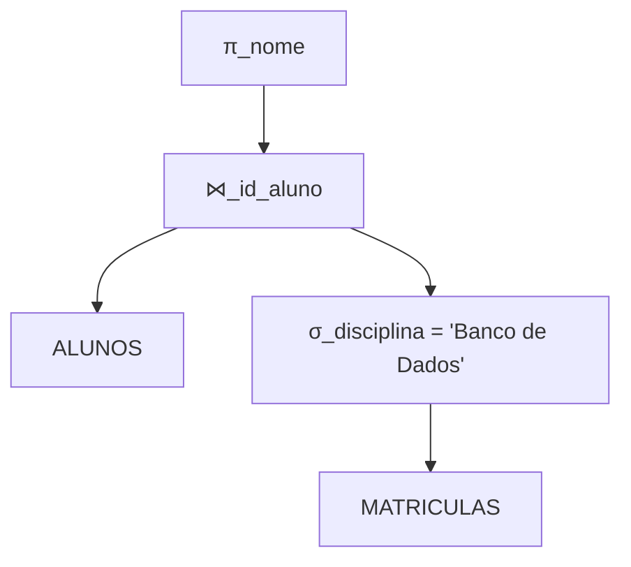

# Skill: Database: Álgebra Relacional e Fundamentos Teóricos do SQL

## Introdução

Esta skill explora a **Álgebra Relacional**, a base teórica e matemática sobre a qual a linguagem SQL foi construída. Proposta por E.F. Codd, a álgebra relacional define um conjunto de operações sobre relações (tabelas) que produzem novas relações como resultado. Compreender esses fundamentos é essencial para entender como os SGBDs processam e otimizam consultas, permitindo que IAs e desenvolvedores escrevam SQL mais eficiente e compreendam a lógica por trás de operações complexas de junção e filtragem.

Abordaremos as operações fundamentais (Seleção, Projeção, União, Diferença, Produto Cartesiano e Renomeação) e as operações derivadas (Junção, Interseção e Divisão). Discutiremos como essas operações se traduzem diretamente em cláusulas SQL e como a teoria dos conjuntos garante a consistência dos resultados. Este conhecimento é o "motor" que impulsiona a manipulação de dados em qualquer banco de dados relacional.

## Glossário Técnico

*   **Relação**: Um conjunto de tuplas (linhas) que compartilham o mesmo esquema (colunas).
*   **Tupla**: Um elemento individual de uma relação, correspondente a uma linha em uma tabela.
*   **Atributo**: Uma propriedade ou característica de uma relação, correspondente a uma coluna em uma tabela.
*   **Seleção (σ)**: Operação que filtra tuplas de uma relação com base em uma condição (equivalente ao `WHERE` no SQL).
*   **Projeção (π)**: Operação que seleciona atributos específicos de uma relação (equivalente ao `SELECT` no SQL).
*   **União (∪)**: Combina tuplas de duas relações compatíveis em uma única relação (equivalente ao `UNION` no SQL).
*   **Diferença (-)**: Retorna tuplas que estão na primeira relação, mas não na segunda (equivalente ao `EXCEPT` ou `MINUS` no SQL).
*   **Produto Cartesiano (×)**: Combina cada tupla da primeira relação com cada tupla da segunda relação (equivalente ao `CROSS JOIN` no SQL).
*   **Junção (⋈)**: Combina tuplas de duas relações com base em uma condição comum (equivalente ao `JOIN` no SQL).
*   **Renomeação (ρ)**: Altera o nome de uma relação ou de seus atributos (equivalente ao `AS` no SQL).

## Conceitos Fundamentais

### 1. Operações Fundamentais da Álgebra Relacional

As operações fundamentais são o conjunto mínimo necessário para realizar qualquer consulta relacional:

*   **Seleção (σ)**: Filtra linhas. Exemplo: `σ_idade > 18 (USUARIOS)` retorna todos os usuários com mais de 18 anos.
*   **Projeção (π)**: Filtra colunas. Exemplo: `π_nome, email (USUARIOS)` retorna apenas os nomes e e-mails de todos os usuários.
*   **União (∪)**: Combina resultados. As relações devem ser compatíveis (mesmo número e tipo de atributos).
*   **Diferença (-)**: Subtrai resultados. Retorna o que está em A mas não em B.
*   **Produto Cartesiano (×)**: Cria todas as combinações possíveis. Se A tem 10 linhas e B tem 5, o resultado terá 50 linhas.
*   **Renomeação (ρ)**: Útil para evitar conflitos de nomes em operações complexas ou auto-junções.

### 2. Operações Derivadas e Junções

Operações derivadas simplificam consultas comuns que poderiam ser expressas usando as fundamentais:

*   **Junção Natural (⋈)**: Combina tabelas com base em colunas com o mesmo nome. É a forma mais comum de junção.
*   **Theta Join (⋈_θ)**: Uma junção baseada em uma condição arbitrária (ex: `>`, `<`, `=`).
*   **Interseção (∩)**: Retorna tuplas que estão em ambas as relações. Pode ser expressa como `A - (A - B)`.
*   **Divisão (÷)**: Usada para consultas do tipo "encontre todos os A que estão relacionados com todos os B". É uma das operações mais complexas de expressar em SQL puro.

### 3. De Álgebra Relacional para SQL

O SQL é uma linguagem declarativa baseada na álgebra relacional (que é procedimental). O SGBD traduz o SQL em operações de álgebra relacional para execução.

| Álgebra Relacional | SQL Equivalente |
| :--- | :--- |
| Projeção (π) | `SELECT col1, col2` |
| Seleção (σ) | `WHERE condicao` |
| União (∪) | `UNION` |
| Diferença (-) | `EXCEPT` / `MINUS` |
| Produto Cartesiano (×) | `CROSS JOIN` |
| Junção (⋈) | `INNER JOIN ... ON` |
| Renomeação (ρ) | `AS` |

## Histórico e Evolução

*   **1970**: E.F. Codd publica o modelo relacional e define a álgebra relacional.
*   **1974**: Surgimento do SEQUEL (Structured English Query Language), que evoluiu para o SQL, implementando os conceitos da álgebra relacional.
*   **Anos 80**: Padronização do SQL pela ANSI e ISO.
*   **Presente**: Otimizadores de consulta modernos usam transformações de álgebra relacional para encontrar o plano de execução mais eficiente (ex: empurrar seleções para baixo na árvore de execução).

## Exemplos Práticos e Casos de Uso

### Cenário: Encontrar nomes de alunos matriculados em 'Banco de Dados'

1.  **Álgebra Relacional**:
    `π_nome (ALUNOS ⋈ (σ_disciplina = 'Banco de Dados' (MATRICULAS)))`
2.  **SQL**:
    ```sql
    SELECT a.nome
    FROM ALUNOS a
    JOIN MATRICULAS m ON a.id_aluno = m.id_aluno
    WHERE m.disciplina = 'Banco de Dados';
    ```

## Análise de Fluxo e Diagramas (em Texto)

### Árvore de Consulta (Query Tree)



**Explicação**: Este diagrama mostra como o SGBD visualiza internamente uma consulta. A seleção (σ) é aplicada primeiro na tabela `MATRICULAS` para reduzir o número de linhas antes da junção (⋈). Finalmente, a projeção (π) seleciona apenas a coluna desejada. Esta é uma técnica básica de otimização chamada "Selection Pushdown".

## Boas Práticas e Padrões de Projeto

*   **Filtre Cedo (Selection Pushdown)**: Aplique filtros o mais cedo possível para reduzir o volume de dados processados em junções.
*   **Selecione Apenas o Necessário**: Evite `SELECT *`. Use a projeção (π) para trazer apenas as colunas requeridas, economizando memória e I/O.
*   **Entenda os Joins**: Saiba a diferença entre `INNER`, `LEFT`, `RIGHT` e `FULL JOIN` e como eles se comportam em termos de álgebra relacional.
*   **Evite Produtos Cartesianos Acidentais**: Sempre verifique se suas junções têm condições adequadas para evitar explosão de dados.

## Comparativos Detalhados

| Característica | Álgebra Relacional | SQL |
| :--- | :--- | :--- |
| **Natureza** | Procedimental (Diz *como* fazer) | Declarativa (Diz *o que* quer) |
| **Base** | Matemática (Teoria dos Conjuntos) | Linguagem de Programação / Interface |
| **Uso Principal** | Teoria, Otimização de Consultas | Desenvolvimento de Aplicações |
| **Resultado** | Sempre uma nova Relação | Conjunto de Resultados (Result Set) |

## Ferramentas e Recursos

*   **Simuladores de Álgebra Relacional**: Ferramentas online que permitem escrever expressões algébricas e ver o resultado em tabelas de exemplo.
*   **EXPLAIN PLAN**: Comando SQL que mostra a árvore de álgebra relacional que o SGBD usará para executar a consulta.

## Tópicos Avançados e Pesquisa Futura

*   **Cálculo Relacional**: Uma alternativa à álgebra relacional baseada na lógica de predicados de primeira ordem.
*   **Otimização Heurística**: Como os SGBDs usam regras de álgebra relacional para reescrever consultas de forma mais eficiente.
*   **Álgebra Relacional para Dados Não Estruturados**: Extensões da álgebra para lidar com JSON, XML e grafos.

## Perguntas Frequentes (FAQ)

*   **P: Por que preciso saber álgebra relacional se já sei SQL?**
    *   R: Saber a teoria ajuda a entender por que certas consultas são lentas e como o banco de dados as processa. Isso é fundamental para o tuning de performance e para entender conceitos avançados como planos de execução.
*   **P: O SQL implementa toda a álgebra relacional?**
    *   R: Sim, e vai além, incluindo operações de agregação, ordenação e manipulação de dados que não fazem parte da álgebra relacional pura original.

## Referências Cruzadas

*   `[[01_Database_Introducao_e_Sistemas_Gerenciadores_SGBD]]`
*   `[[08_Consultas_Avancadas_com_SELECT_Joins_e_Subqueries]]`
*   `[[12_Planos_de_Execucao_Explain_Plan_e_Otimizacao_de_Queries]]`

## Referências

[1] Codd, E. F. (1970). *A Relational Model of Data for Large Shared Data Banks*. Communications of the ACM.
[2] Silberschatz, A., Korth, H. F., & Sudarshan, S. (2019). *Database System Concepts*. McGraw-Hill.
[3] Date, C. J. (2003). *An Introduction to Database Systems*. Addison-Wesley.
