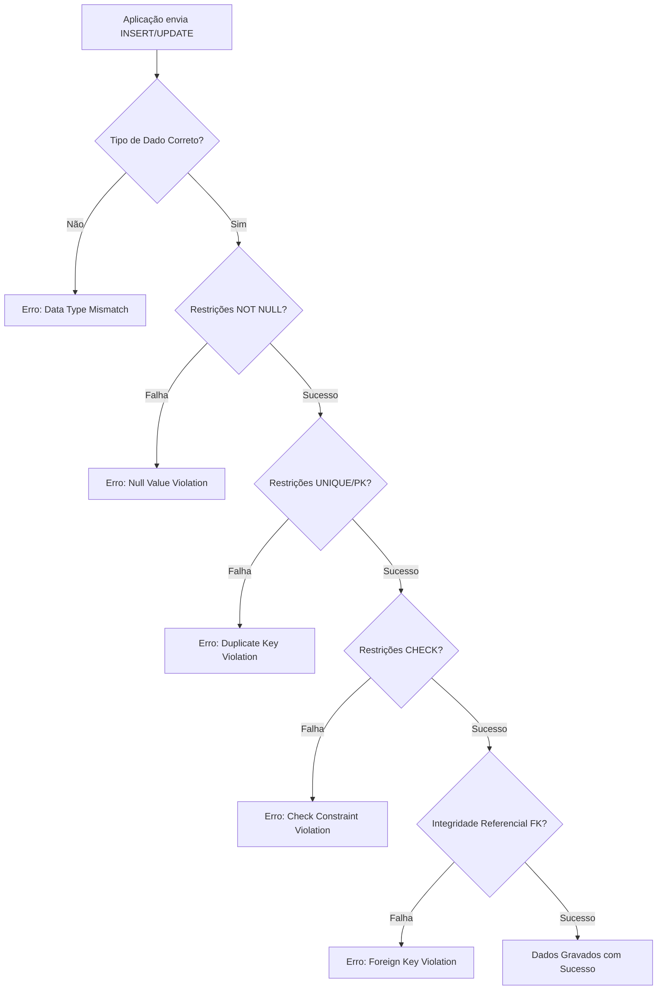

# Skill: Database: Tipos de Dados SQL e Restrições (Constraints)

## Introdução

Esta skill aborda os **Tipos de Dados** e as **Restrições (Constraints)** no SQL, os elementos fundamentais que definem a natureza e a integridade das informações armazenadas em um banco de dados. Escolher o tipo de dado correto é crucial para a eficiência do armazenamento e a performance das consultas, enquanto as restrições garantem que os dados sigam as regras de negócio e permaneçam consistentes ao longo do tempo.

Exploraremos as categorias comuns de tipos de dados (Numéricos, Caracteres, Data/Hora, Binários e Especiais) e as restrições essenciais (`NOT NULL`, `UNIQUE`, `PRIMARY KEY`, `FOREIGN KEY`, `CHECK` e `DEFAULT`). Discutiremos como essas definições formam o esquema do banco de dados e como elas previnem a entrada de dados inválidos ou inconsistentes. Este conhecimento é a base para qualquer IA ou desenvolvedor que precise criar tabelas robustas e confiáveis em qualquer SGBD relacional.

## Glossário Técnico

*   **Tipo de Dado (Data Type)**: Uma definição que especifica o tipo de valor que uma coluna pode conter (ex: Inteiro, Texto, Data).
*   **Restrição (Constraint)**: Uma regra aplicada a uma coluna ou tabela para limitar os tipos de dados que podem ser inseridos.
*   **`NOT NULL`**: Garante que uma coluna não possa ter um valor nulo.
*   **`UNIQUE`**: Garante que todos os valores em uma coluna sejam diferentes.
*   **`PRIMARY KEY` (PK)**: Uma combinação de `NOT NULL` e `UNIQUE` que identifica unicamente cada linha em uma tabela.
*   **`FOREIGN KEY` (FK)**: Uma restrição que garante a integridade referencial entre duas tabelas.
*   **`CHECK`**: Garante que todos os valores em uma coluna satisfaçam uma condição específica.
*   **`DEFAULT`**: Fornece um valor padrão para uma coluna quando nenhum valor é especificado.
*   **`AUTO_INCREMENT` / `SERIAL`**: Gera automaticamente um valor numérico único para cada nova linha.

## Conceitos Fundamentais

### 1. Categorias de Tipos de Dados SQL

Embora cada SGBD tenha suas variações, as categorias principais são padronizadas:

*   **Numéricos**:
    *   `INT`, `INTEGER`, `SMALLINT`, `BIGINT`: Números inteiros de diferentes tamanhos.
    *   `DECIMAL(p, s)`, `NUMERIC(p, s)`: Números decimais exatos (ideal para valores financeiros).
    *   `FLOAT`, `REAL`, `DOUBLE PRECISION`: Números de ponto flutuante (aproximados).
*   **Caracteres (Strings)**:
    *   `CHAR(n)`: String de comprimento fixo (preenchida com espaços).
    *   `VARCHAR(n)`: String de comprimento variável (mais eficiente para a maioria dos casos).
    *   `TEXT`, `CLOB`: Grandes volumes de texto.
*   **Data e Hora**:
    *   `DATE`: Apenas a data (AAAA-MM-DD).
    *   `TIME`: Apenas a hora (HH:MM:SS).
    *   `DATETIME`, `TIMESTAMP`: Data e hora combinadas.
*   **Binários**:
    *   `BINARY`, `VARBINARY`: Dados binários de comprimento fixo ou variável.
    *   `BLOB`: Grandes objetos binários (ex: imagens, arquivos).
*   **Especiais**:
    *   `BOOLEAN`: Valores verdadeiro/falso.
    *   `JSON`, `JSONB`: Armazenamento de dados estruturados em formato JSON.
    *   `UUID`: Identificadores únicos universais.

### 2. Restrições de Integridade (Constraints)

As restrições são aplicadas no momento da criação da tabela (`CREATE TABLE`) ou posteriormente (`ALTER TABLE`):

*   **`PRIMARY KEY`**: Essencial para identificar cada registro. Uma tabela deve ter apenas uma PK.
*   **`FOREIGN KEY`**: Cria o elo entre tabelas. Exemplo: `id_cliente` na tabela `PEDIDOS` aponta para `id_cliente` na tabela `CLIENTES`.
*   **`NOT NULL`**: Impede que informações obrigatórias sejam omitidas.
*   **`UNIQUE`**: Útil para colunas como e-mail, CPF ou nome de usuário.
*   **`CHECK`**: Aplica regras de negócio simples. Exemplo: `CHECK (idade >= 18)`.
*   **`DEFAULT`**: Simplifica a inserção de dados. Exemplo: `status VARCHAR(20) DEFAULT 'Ativo'`.

## Histórico e Evolução

*   **Anos 70/80**: Definição dos tipos de dados básicos no padrão SQL original.
*   **Anos 90**: Introdução de tipos de dados complexos como BLOBs e CLOBs.
*   **Anos 2000**: Suporte nativo a XML em muitos SGBDs.
*   **Anos 2010**: Explosão do suporte a JSON e tipos de dados geoespaciais (GIS).
*   **Presente**: Tipos de dados especializados para IA (vetores) e suporte a dados semi-estruturados de alta performance (JSONB).

## Exemplos Práticos e Casos de Uso

### Cenário: Criação de uma Tabela de Produtos

```sql
CREATE TABLE PRODUTOS (
    id_produto INT PRIMARY KEY AUTO_INCREMENT,
    nome VARCHAR(100) NOT NULL,
    descricao TEXT,
    preco DECIMAL(10, 2) NOT NULL CHECK (preco > 0),
    estoque INT DEFAULT 0,
    data_cadastro TIMESTAMP DEFAULT CURRENT_TIMESTAMP,
    codigo_barras VARCHAR(50) UNIQUE
);
```

**Análise**:
*   `id_produto`: Chave primária autoincremental.
*   `nome`: Obrigatório (`NOT NULL`).
*   `preco`: Decimal exato para evitar erros de arredondamento, com uma regra de que deve ser positivo (`CHECK`).
*   `estoque`: Começa com zero se não informado (`DEFAULT`).
*   `codigo_barras`: Não pode haver dois produtos com o mesmo código (`UNIQUE`).

## Análise de Fluxo e Diagramas (em Texto)

### Fluxo de Validação de Dados pelo SGBD



**Explicação**: Este diagrama mostra a ordem lógica em que o SGBD valida os dados antes de permitir a gravação. Qualquer falha em uma dessas etapas interrompe a operação e retorna um erro específico, garantindo a integridade do banco.

## Boas Práticas e Padrões de Projeto

*   **Escolha o Menor Tipo de Dado Suficiente**: Use `SMALLINT` em vez de `INT` se os valores forem pequenos. Isso economiza espaço e melhora a performance do cache.
*   **Use `DECIMAL` para Dinheiro**: Nunca use `FLOAT` ou `DOUBLE` para valores financeiros devido a erros de precisão binária.
*   **Sempre Defina Chaves Primárias**: Toda tabela deve ter uma PK para garantir a unicidade e facilitar a indexação.
*   **Use `VARCHAR` com Limites Realistas**: Não use `VARCHAR(MAX)` ou `TEXT` para tudo; defina limites que façam sentido para o dado (ex: `VARCHAR(255)` para e-mails).
*   **Aplique Regras de Negócio no Banco**: Use `CHECK` e `NOT NULL` para garantir que os dados sejam válidos mesmo que a aplicação falhe em validá-los.

## Comparativos Detalhados

| Tipo de Dado | Uso Ideal | Vantagem | Desvantagem |
| :--- | :--- | :--- | :--- |
| **`CHAR(n)`** | Códigos fixos (ex: UF, ISO) | Performance de acesso fixo | Desperdício de espaço se variável |
| **`VARCHAR(n)`** | Nomes, e-mails, descrições | Economia de espaço | Pequeno overhead de processamento |
| **`INT`** | IDs, contadores, quantidades | Performance matemática rápida | Limite de valor máximo |
| **`DECIMAL`** | Valores financeiros, medidas exatas | Precisão absoluta | Mais lento que ponto flutuante |
| **`TIMESTAMP`** | Auditoria, logs de eventos | Ajuste automático de fuso horário | Range de datas menor que `DATETIME` |

## Ferramentas e Recursos

*   **Documentação do SGBD**: Sempre consulte os tipos de dados específicos do seu banco (ex: PostgreSQL tem tipos como `INET` para IPs e `JSONB`).
*   **Ferramentas de Modelagem**: MySQL Workbench, pgAdmin, DBeaver (ajudam a visualizar e escolher tipos de dados).

## Tópicos Avançados e Pesquisa Futura

*   **Tipos de Dados Definidos pelo Usuário (UDT)**: Criar seus próprios tipos de dados complexos.
*   **Bancos de Dados Vetoriais**: Tipos de dados específicos para armazenar e buscar vetores de alta dimensão usados em IA.
*   **Compressão de Dados**: Como o SGBD armazena tipos de dados de forma comprimida para economizar disco.

## Perguntas Frequentes (FAQ)

*   **P: Qual a diferença entre `NULL` e uma string vazia `''`?**
    *   R: `NULL` significa "desconhecido" ou "ausência de valor". Uma string vazia é um valor conhecido (um texto de tamanho zero). As restrições `NOT NULL` impedem o `NULL`, mas permitem a string vazia.
*   **P: Posso mudar o tipo de dado de uma coluna com dados?**
    *   R: Sim, usando `ALTER TABLE`, mas pode ser perigoso. Se o novo tipo for incompatível (ex: mudar `VARCHAR` com letras para `INT`), o SGBD retornará um erro ou você precisará de uma cláusula de conversão (`USING` no PostgreSQL).

## Referências Cruzadas

*   `[[02_Modelagem_Relacional_Entidades_Atributos_e_Relacionamentos]]`
*   `[[03_Normalizacao_de_Dados_1NF_2NF_3NF_e_BCNF]]`
*   `[[06_Linguagem_de_Definicao_de_Dados_DDL_Create_Alter_Drop]]`

## Referências

[1] Silberschatz, A., Korth, H. F., & Sudarshan, S. (2019). *Database System Concepts*. McGraw-Hill.
[2] ISO/IEC 9075-1:2016. *Information technology — Database languages — SQL*.
[3] PostgreSQL Documentation. *Data Types*.
