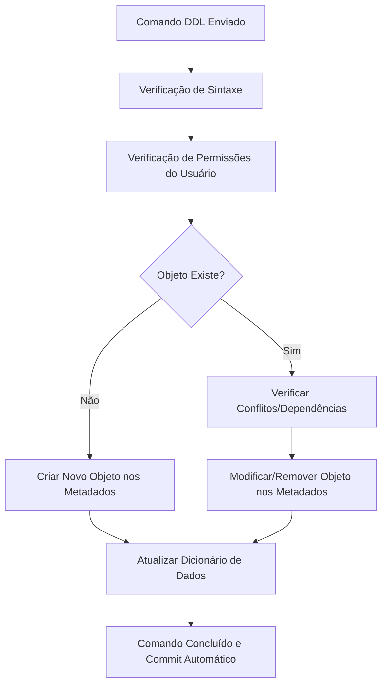

# Skill: Database: Linguagem de Definição de Dados (DDL) - CREATE, ALTER, DROP

## Introdução

Esta skill aborda a **Linguagem de Definição de Dados (DDL)**, o subconjunto do SQL utilizado para definir, modificar e remover a estrutura dos objetos em um banco de dados. Enquanto outras partes do SQL lidam com os dados em si, a DDL foca no "esqueleto" ou esquema do banco, incluindo tabelas, índices, visões, gatilhos e procedimentos. Dominar a DDL é essencial para arquitetos de dados e desenvolvedores que precisam gerenciar o ciclo de vida das estruturas de armazenamento de forma precisa e segura.

Exploraremos os comandos fundamentais: `CREATE` (para criar novos objetos), `ALTER` (para modificar objetos existentes) e `DROP` (para remover objetos permanentemente). Discutiremos as implicações de cada comando na integridade do banco e na performance do sistema, além de abordar o comando `TRUNCATE`, que transita entre a definição e a manipulação de dados. Este conhecimento é a base para a automação de migrações de banco de dados e para a manutenção de ambientes de desenvolvimento e produção consistentes.

## Glossário Técnico

*   **DDL (Data Definition Language)**: Conjunto de comandos SQL usados para definir a estrutura do banco de dados.
*   **Esquema (Schema)**: Uma coleção de objetos de banco de dados (tabelas, visões, etc.) pertencentes a um usuário ou aplicação.
*   **`CREATE`**: Comando usado para criar novos objetos, como tabelas (`CREATE TABLE`), índices (`CREATE INDEX`) ou visões (`CREATE VIEW`).
*   **`ALTER`**: Comando usado para modificar a estrutura de um objeto existente, como adicionar uma coluna a uma tabela (`ALTER TABLE ADD COLUMN`).
*   **`DROP`**: Comando usado para excluir permanentemente um objeto do banco de dados.
*   **`TRUNCATE`**: Comando que remove todos os registros de uma tabela de forma rápida, mas mantém sua estrutura intacta.
*   **`RENAME`**: Comando usado para alterar o nome de um objeto existente.
*   **Metadados**: Informações sobre a estrutura do banco de dados que são atualizadas sempre que um comando DDL é executado.

## Conceitos Fundamentais

### 1. O Comando CREATE: Construindo a Estrutura

O comando `CREATE` é o ponto de partida para qualquer banco de dados. Ele define não apenas o nome do objeto, mas todas as suas propriedades iniciais, como tipos de dados e restrições.

| Objeto | Exemplo de Sintaxe | Propósito |
| :--- | :--- | :--- |
| **Tabela** | `CREATE TABLE nome (...)` | Define a estrutura básica de armazenamento de dados. |
| **Índice** | `CREATE INDEX nome ON tabela (col)` | Melhora a performance de busca em colunas específicas. |
| **Visão** | `CREATE VIEW nome AS SELECT ...` | Cria uma tabela virtual baseada em uma consulta SQL. |
| **Esquema** | `CREATE SCHEMA nome` | Organiza objetos em namespaces lógicos. |

Ao criar tabelas, é fundamental definir as chaves primárias e estrangeiras imediatamente para garantir a integridade referencial desde o início. O uso de cláusulas como `IF NOT EXISTS` é uma boa prática para scripts de automação, evitando erros caso o objeto já tenha sido criado.

### 2. O Comando ALTER: Evoluindo o Esquema

Sistemas de software raramente são estáticos. O comando `ALTER` permite que o banco de dados evolua junto com a aplicação sem a necessidade de recriar as tabelas do zero, o que seria impraticável em ambientes com grandes volumes de dados.

As operações comuns de `ALTER` incluem a adição de novas colunas, a modificação de tipos de dados existentes (quando compatíveis), a renomeação de colunas ou tabelas e a adição ou remoção de restrições de integridade. É importante notar que operações de `ALTER` em tabelas muito grandes podem bloquear o acesso aos dados por um período significativo, exigindo planejamento cuidadoso em ambientes de produção.

### 3. Os Comandos DROP e TRUNCATE: Removendo Estruturas e Dados

A remoção de objetos deve ser feita com extrema cautela, pois o comando `DROP` é irreversível na maioria dos SGBDs (a menos que haja um backup recente). O `DROP TABLE`, por exemplo, remove a estrutura da tabela, todos os seus dados, índices e gatilhos associados.

O comando `TRUNCATE` é frequentemente confundido com o `DELETE` da DML, mas ele é tecnicamente um comando DDL em muitos sistemas. Ele remove todos os dados de uma tabela de forma muito mais rápida que o `DELETE`, pois não gera logs individuais para cada linha removida e reinicia os contadores de autoincremento. No entanto, o `TRUNCATE` não pode ser desfeito com um comando `ROLLBACK` em alguns bancos de dados e geralmente não dispara gatilhos de exclusão.

## Histórico e Evolução

A DDL evoluiu de scripts manuais executados por DBAs para sistemas automatizados de migração de código. Nos primórdios do SQL, as mudanças no esquema eram raras e exigiam janelas de manutenção extensas. Com o surgimento de metodologias ágeis e DevOps, ferramentas como Liquibase e Flyway tornaram-se padrão, permitindo que comandos DDL sejam versionados junto com o código da aplicação. SGBDs modernos também introduziram o conceito de "Online DDL", permitindo que muitas alterações de estrutura sejam feitas sem bloquear as operações de leitura e escrita dos usuários.

## Exemplos Práticos e Casos de Uso

### Cenário: Ciclo de Vida de uma Tabela de Clientes

```sql
-- 1. Criando a tabela inicial
CREATE TABLE CLIENTES (
    id_cliente INT PRIMARY KEY,
    nome VARCHAR(100) NOT NULL,
    email VARCHAR(100) UNIQUE
);

-- 2. Evoluindo a estrutura: adicionando data de nascimento
ALTER TABLE CLIENTES ADD COLUMN data_nascimento DATE;

-- 3. Modificando um tipo de dado: aumentando o tamanho do nome
ALTER TABLE CLIENTES MODIFY COLUMN nome VARCHAR(200);

-- 4. Removendo a tabela (após migração ou fim do projeto)
-- DROP TABLE CLIENTES;
```

Este ciclo demonstra como a DDL acompanha o crescimento de um sistema. Em um ambiente real, cada um desses comandos seria parte de um script de migração versionado, garantindo que todos os ambientes (desenvolvimento, homologação e produção) possuam a mesma estrutura.

## Análise de Fluxo e Diagramas (em Texto)

### Fluxo de Execução de um Comando DDL



**Explicação**: Diferente dos comandos de manipulação de dados (DML), a maioria dos comandos DDL em SGBDs como MySQL e Oracle executa um "commit" implícito. Isso significa que, uma vez executado com sucesso, a mudança na estrutura é permanente e não pode ser revertida com um `ROLLBACK`. O fluxo destaca a importância da verificação de dependências (ex: não se pode dar `DROP` em uma tabela que é referenciada por uma chave estrangeira de outra).

## Boas Práticas e Padrões de Projeto

*   **Versionamento de Esquema**: Nunca execute comandos DDL manualmente em produção. Use ferramentas de migração para manter um histórico de todas as alterações.
*   **Cláusulas de Segurança**: Utilize `IF EXISTS` ou `IF NOT EXISTS` para tornar seus scripts idempotentes e evitar erros em execuções repetidas.
*   **Cuidado com o Bloqueio**: Em tabelas grandes, prefira realizar alterações de esquema em horários de baixo tráfego ou utilize ferramentas que suportem DDL online.
*   **Backup Antes de Grandes Mudanças**: Antes de executar um `ALTER` complexo ou um `DROP`, certifique-se de ter um backup atualizado dos dados.
*   **Nomes Padronizados**: Siga uma convenção de nomenclatura clara para tabelas, colunas e índices (ex: `pk_nome_tabela`, `fk_tabela_origem_destino`).

## Comparativos Detalhados

| Comando | Ação Principal | Impacto nos Dados | Reversibilidade |
| :--- | :--- | :--- | :--- |
| **`CREATE`** | Cria nova estrutura | Nenhum (estrutura vazia) | Via `DROP` |
| **`ALTER`** | Modifica estrutura | Pode truncar ou converter dados | Difícil (exige novo `ALTER`) |
| **`DROP`** | Remove estrutura e dados | Perda total e permanente | Apenas via Backup |
| **`TRUNCATE`** | Esvazia a tabela | Perda total dos dados | Geralmente Irreversível |

## Ferramentas e Recursos

As ferramentas de gerenciamento de banco de dados como DBeaver, pgAdmin e MySQL Workbench oferecem interfaces gráficas para gerar comandos DDL automaticamente a partir de diagramas ou edições visuais. Para automação em pipelines de CI/CD, ferramentas como Flyway, Liquibase e os sistemas de migração integrados em frameworks (como Django Migrations ou Entity Framework) são indispensáveis para garantir a consistência do esquema entre diferentes ambientes.

## Tópicos Avançados e Pesquisa Futura

O futuro da DDL está ligado aos bancos de dados "Schema-less" ou "Schema-on-read", onde a estrutura é definida no momento da leitura e não da gravação. No entanto, mesmo em sistemas NoSQL, o conceito de evolução de esquema permanece vital. Outra tendência forte é a "DDL Declarativa", onde o desenvolvedor define o estado final desejado do banco de dados e uma ferramenta de IA ou automação gera os comandos `ALTER` necessários para chegar a esse estado, minimizando erros humanos e otimizando o tempo de inatividade.

## Perguntas Frequentes (FAQ)

*   **P: Qual a diferença entre `DROP` e `TRUNCATE`?**
    *   R: O `DROP` remove a tabela inteira (estrutura e dados) do banco de dados. O `TRUNCATE` remove apenas os dados, mantendo a estrutura da tabela pronta para novas inserções.
*   **P: Por que não consigo dar `DROP` em uma tabela?**
    *   R: Geralmente é devido a restrições de integridade referencial. Se outra tabela possui uma chave estrangeira apontando para a tabela que você quer excluir, o SGBD impedirá a ação para evitar dados inconsistentes. Você deve remover a restrição ou a tabela dependente primeiro.

## Referências Cruzadas

*   `[[01_Database_Introducao_e_Sistemas_Gerenciadores_SGBD]]`
*   `[[05_Tipos_de_Dados_SQL_e_Restricoes_Constraints]]`
*   `[[35_Database_Migration_Ferramentas_e_Versionamento_de_Esquema]]`

## Referências

[1] Silberschatz, A., Korth, H. F., & Sudarshan, S. (2019). *Database System Concepts*. McGraw-Hill.
[2] Beaulieu, A. (2020). *Learning SQL: Generate, Manipulate, and Retrieve Data*. O'Reilly Media.
[3] Celko, J. (2014). *SQL for Smarties: Advanced SQL Programming*. Morgan Kaufmann.
