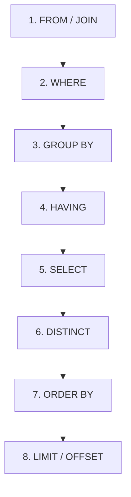

# Skill: Database: Consultas Avançadas com SELECT, Joins e Subqueries

## Introdução

Esta skill aborda as **Consultas Avançadas** no SQL, focando no comando `SELECT` e em suas poderosas extensões para recuperar e combinar dados de múltiplas fontes. Enquanto consultas simples filtram uma única tabela, as consultas avançadas permitem que IAs e desenvolvedores construam visões complexas da realidade do negócio, unindo informações dispersas através de **Joins** e aninhando lógicas de busca com **Subqueries**. Dominar essas técnicas é o que diferencia um usuário básico de SQL de um especialista capaz de extrair insights profundos de grandes volumes de dados.

Exploraremos os diferentes tipos de junções (`INNER`, `LEFT`, `RIGHT`, `FULL` e `CROSS JOIN`), a lógica de subconsultas (escalares, de linha e de tabela) e o uso de operadores como `IN`, `EXISTS`, `ANY` e `ALL`. Discutiremos como a ordem de execução das cláusulas SQL afeta o resultado e a performance, além de abordar técnicas de otimização para evitar consultas lentas ou redundantes. Este conhecimento é a ferramenta principal para a geração de relatórios, análise de dados e suporte à decisão em qualquer sistema moderno.

## Glossário Técnico

*   **`SELECT`**: O comando principal para recuperar dados de um banco de dados.
*   **`JOIN`**: Operação que combina colunas de uma ou mais tabelas com base em valores comuns.
*   **`INNER JOIN`**: Retorna apenas as linhas que possuem correspondência em ambas as tabelas.
*   **`LEFT JOIN` (ou `LEFT OUTER JOIN`)**: Retorna todas as linhas da tabela à esquerda e as correspondentes da direita (preenchendo com `NULL` onde não houver par).
*   **`RIGHT JOIN` (ou `RIGHT OUTER JOIN`)**: O inverso do `LEFT JOIN`, priorizando a tabela à direita.
*   **`FULL JOIN` (ou `FULL OUTER JOIN`)**: Retorna todas as linhas de ambas as tabelas, unindo-as onde houver correspondência.
*   **`CROSS JOIN`**: Produz o produto cartesiano de duas tabelas (todas as combinações possíveis).
*   **Subquery (Subconsulta)**: Uma consulta `SELECT` aninhada dentro de outra consulta (no `SELECT`, `FROM`, `WHERE` ou `HAVING`).
*   **`EXISTS`**: Operador que verifica se uma subconsulta retorna algum resultado (muito eficiente para filtros de presença).
*   **`IN`**: Operador que verifica se um valor pertence a uma lista ou ao resultado de uma subconsulta.

## Conceitos Fundamentais

### 1. A Arte dos Joins: Combinando Tabelas

Os Joins são a essência do modelo relacional, permitindo que dados normalizados sejam reconstruídos para apresentação. A escolha do tipo de Join depende da pergunta que se quer responder:

| Tipo de Join | Pergunta Respondida | Resultado |
| :--- | :--- | :--- |
| **`INNER JOIN`** | Quais registros existem em ambos os lados? | Apenas a interseção. |
| **`LEFT JOIN`** | Quais registros da esquerda existem, mesmo sem par na direita? | Toda a esquerda + pares da direita. |
| **`RIGHT JOIN`** | Quais registros da direita existem, mesmo sem par na esquerda? | Toda a direita + pares da esquerda. |
| **`FULL JOIN`** | Quais registros existem em qualquer um dos lados? | União total de ambos os lados. |
| **`CROSS JOIN`** | Quais são todas as combinações possíveis entre A e B? | Produto cartesiano (A x B). |

É fundamental definir corretamente a condição de junção (cláusula `ON`) para evitar resultados incorretos ou explosão de dados. O uso de apelidos (`Aliases`) para as tabelas torna a consulta mais legível e evita ambiguidades em colunas com nomes iguais.

### 2. Subqueries: Consultas dentro de Consultas

Subconsultas permitem que o resultado de uma busca seja usado como critério para outra. Elas podem ser classificadas por sua localização e pelo tipo de dado que retornam:

*   **Subqueries Escalares**: Retornam um único valor (uma linha e uma coluna). Podem ser usadas em quase qualquer lugar, como no `SELECT` para trazer um total calculado.
*   **Subqueries de Lista**: Retornam uma coluna com múltiplas linhas. São comumente usadas com o operador `IN` no `WHERE`.
*   **Subqueries Correlacionadas**: Referenciam colunas da consulta externa. Elas são executadas uma vez para cada linha da consulta principal, o que pode ser lento se não forem bem otimizadas.
*   **Subqueries no FROM (Derived Tables)**: Tratam o resultado de um `SELECT` como se fosse uma tabela física, permitindo realizar novos filtros ou agrupamentos sobre dados já processados.

### 3. Operadores de Comparação de Conjuntos

Além do `IN`, o SQL oferece operadores poderosos para comparar valores com conjuntos de resultados:

*   **`EXISTS`**: Frequentemente mais rápido que o `IN` para verificar a existência de registros relacionados, pois o SGBD para a busca assim que encontra a primeira correspondência.
*   **`ANY` / `SOME`**: Compara um valor com qualquer elemento do conjunto (ex: `preco > ANY (SELECT ...)`).
*   **`ALL`**: Compara um valor com todos os elementos do conjunto (ex: `preco > ALL (SELECT ...)`).

## Histórico e Evolução

A capacidade de realizar junções complexas foi o que tornou o modelo relacional superior aos modelos hierárquicos e em rede dos anos 60. Com o tempo, os SGBDs evoluíram seus otimizadores de consulta para transformar subconsultas em Joins equivalentes sempre que possível, visando melhor performance. Recentemente, a introdução de **Common Table Expressions (CTEs)** com a cláusula `WITH` ofereceu uma alternativa mais legível e modular às subconsultas aninhadas, permitindo que lógicas complexas sejam quebradas em passos lógicos sequenciais.

## Exemplos Práticos e Casos de Uso

### Cenário: Relatório de Vendas por Cliente

```sql
-- Usando JOIN para combinar tabelas
SELECT c.nome, p.data_pedido, i.nome_produto, i.quantidade
FROM CLIENTES c
INNER JOIN PEDIDOS p ON c.id_cliente = p.id_cliente
INNER JOIN ITENS_PEDIDO i ON p.id_pedido = i.id_pedido
WHERE p.status = 'Concluído';

-- Usando Subquery para encontrar clientes que nunca compraram
SELECT nome
FROM CLIENTES
WHERE NOT EXISTS (
    SELECT 1 FROM PEDIDOS WHERE id_cliente = CLIENTES.id_cliente
);

-- Usando Subquery no SELECT para trazer o total de cada cliente
SELECT nome,
       (SELECT SUM(valor_total) FROM PEDIDOS WHERE id_cliente = c.id_cliente) AS total_gasto
FROM CLIENTES c;
```

Estes exemplos mostram como os Joins são usados para construir visões detalhadas e como as subconsultas resolvem problemas de filtragem ("quem não fez algo") ou cálculos agregados específicos por linha.

## Análise de Fluxo e Diagramas (em Texto)

### Ordem Lógica de Execução de um SELECT



**Explicação**: É crucial entender que o SQL não é executado na ordem em que é escrito. O SGBD primeiro identifica as tabelas e realiza os Joins (1), depois filtra as linhas (2), agrupa os dados (3), filtra os grupos (4) e só então seleciona as colunas (5). Isso explica por que você não pode usar um apelido criado no `SELECT` dentro da cláusula `WHERE`.

## Boas Práticas e Padrões de Projeto

*   **Prefira Joins a Subqueries Correlacionadas**: Joins costumam ser melhor otimizados pelo SGBD e são mais fáceis de ler.
*   **Use Aliases Claros**: Sempre use apelidos curtos e significativos para as tabelas (ex: `p` para `PEDIDOS`, `c` para `CLIENTES`).
*   **Evite SELECT ***: Projete apenas as colunas necessárias para reduzir o tráfego de rede e o uso de memória.
*   **Cuidado com o NULL em Joins**: Lembre-se que `INNER JOIN` descarta linhas com `NULL` na coluna de junção. Use `LEFT JOIN` se precisar manter esses registros.
*   **Use CTEs para Consultas Complexas**: Se uma consulta tem muitas subconsultas aninhadas, use `WITH` para torná-la modular e legível.
*   **Indexe as Colunas de Junção**: Certifique-se de que as colunas usadas no `ON` (geralmente PKs e FKs) possuam índices para garantir a performance.

## Comparativos Detalhados

| Técnica | Legibilidade | Performance | Uso Ideal |
| :--- | :--- | :--- | :--- |
| **`INNER JOIN`** | Alta | Excelente | Combinar dados relacionados obrigatórios. |
| **`LEFT JOIN`** | Alta | Boa | Manter registros da tabela principal sem par. |
| **`Subquery`** | Média | Variável | Filtros complexos ou cálculos pontuais. |
| **`EXISTS`** | Alta | Excelente | Verificar presença de dados sem retornar colunas. |
| **`CTE (WITH)`** | Muito Alta | Excelente | Organizar lógicas complexas em passos. |

## Ferramentas e Recursos

Ferramentas de visualização de planos de execução (como o `EXPLAIN` no PostgreSQL ou MySQL) são indispensáveis para entender como o SGBD está resolvendo seus Joins e subconsultas. IDEs como DataGrip ou DBeaver oferecem assistentes visuais para construir Joins e sugerir índices baseados na estrutura das tabelas.

## Tópicos Avançados e Pesquisa Futura

O futuro das consultas SQL envolve o uso de **Window Functions** para análises temporais e estatísticas sem a necessidade de múltiplos Joins ou subconsultas complexas. Outra área de evolução é o processamento de consultas em bancos de dados distribuídos, onde o SGBD deve decidir como realizar Joins entre tabelas que residem em servidores diferentes (Distributed Joins). Além disso, a integração de IA permite que o banco de dados aprenda com o histórico de consultas e crie índices automáticos ou reescreva consultas ineficientes em tempo real.

## Perguntas Frequentes (FAQ)

*   **P: Qual a diferença entre `WHERE` e `HAVING`?**
    *   R: O `WHERE` filtra linhas individuais antes do agrupamento. O `HAVING` filtra os grupos resultantes após o `GROUP BY`.
*   **P: Quando devo usar `LEFT JOIN` em vez de `INNER JOIN`?**
    *   R: Use `LEFT JOIN` quando você quiser ver todos os registros da tabela principal, mesmo aqueles que não têm correspondência na tabela relacionada (ex: listar todos os clientes, inclusive os que nunca fizeram um pedido).

## Referências Cruzadas

*   `[[04_Algebra_Relacional_e_Fundamentos_Teoricos_do_SQL]]`
*   `[[09_Funcoes_de_Agregacao_e_Agrupamento_GROUP_BY_HAVING]]`
*   `[[12_Planos_de_Execucao_Explain_Plan_e_Otimizacao_de_Queries]]`

## Referências

[1] Silberschatz, A., Korth, H. F., & Sudarshan, S. (2019). *Database System Concepts*. McGraw-Hill.
[2] Beaulieu, A. (2020). *Learning SQL: Generate, Manipulate, and Retrieve Data*. O'Reilly Media.
[3] Celko, J. (2014). *SQL for Smarties: Advanced SQL Programming*. Morgan Kaufmann.
