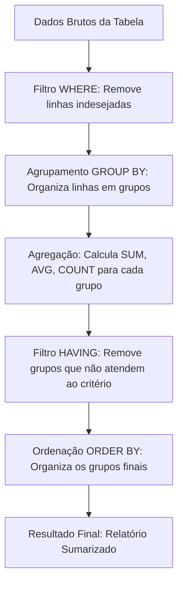

# Skill: Database: Funções de Agregação e Agrupamento (GROUP BY, HAVING)

## Introdução

Esta skill aborda as **Funções de Agregação** e as cláusulas de **Agrupamento** no SQL, ferramentas essenciais para transformar dados brutos em informações resumidas e insights estatísticos. Enquanto consultas simples retornam linhas individuais, as funções de agregação permitem que IAs e desenvolvedores realizem cálculos sobre conjuntos de dados, como somas, médias, contagens e identificação de valores extremos. O uso conjunto com as cláusulas `GROUP BY` e `HAVING` possibilita a criação de relatórios complexos e análises de tendências de forma eficiente e direta no banco de dados.

Exploraremos as funções fundamentais (`COUNT`, `SUM`, `AVG`, `MIN`, `MAX`), a lógica de agrupamento com `GROUP BY` e a filtragem de grupos com `HAVING`. Discutiremos a diferença crucial entre filtrar linhas individuais (`WHERE`) e filtrar resultados agregados (`HAVING`), além de abordar o tratamento de valores nulos em cálculos estatísticos. Este conhecimento é a base para a construção de dashboards, relatórios financeiros e qualquer sistema que exija a sumarização de grandes volumes de dados.

## Glossário Técnico

*   **Agregação**: O processo de combinar múltiplos valores em um único valor resumido.
*   **`COUNT()`**: Função que conta o número de linhas ou valores não nulos em um conjunto.
*   **`SUM()`**: Função que calcula a soma total de uma coluna numérica.
*   **`AVG()`**: Função que calcula a média aritmética de uma coluna numérica.
*   **`MIN()` / `MAX()`**: Funções que identificam o menor e o maior valor em um conjunto, respectivamente.
*   **`GROUP BY`**: Cláusula usada para agrupar linhas que possuem os mesmos valores em colunas específicas.
*   **`HAVING`**: Cláusula usada para filtrar os resultados de um agrupamento com base em uma condição de agregação.
*   **`DISTINCT`**: Operador que pode ser usado dentro de funções de agregação para considerar apenas valores únicos (ex: `COUNT(DISTINCT col)`).
*   **`NULL`**: Valor que representa a ausência de dado e que geralmente é ignorado pela maioria das funções de agregação (exceto `COUNT(*)`).

## Conceitos Fundamentais

### 1. Funções de Agregação: Sumarizando Dados

As funções de agregação operam sobre uma coleção de valores e retornam um único resultado. Elas são a base da análise de dados no SQL:

| Função | Descrição | Exemplo de Uso |
| :--- | :--- | :--- |
| **`COUNT(*)`** | Conta todas as linhas, incluindo nulos. | Total de pedidos realizados. |
| **`COUNT(col)`** | Conta apenas valores não nulos na coluna. | Total de clientes com e-mail cadastrado. |
| **`SUM(col)`** | Soma os valores da coluna. | Faturamento total de um período. |
| **`AVG(col)`** | Calcula a média dos valores. | Ticket médio por venda. |
| **`MIN(col)`** | Encontra o menor valor. | Data da primeira compra de um cliente. |
| **`MAX(col)`** | Encontra o maior valor. | Preço do produto mais caro no estoque. |

É importante notar que, ao usar funções de agregação no `SELECT`, todas as outras colunas selecionadas que não fazem parte de uma agregação **devem** estar presentes na cláusula `GROUP BY`.

### 2. Agrupamento com GROUP BY: Criando Categorias

A cláusula `GROUP BY` divide o conjunto de resultados em grupos de linhas. O SGBD então aplica as funções de agregação a cada grupo de forma independente. Por exemplo, em vez de calcular a média de vendas de toda a empresa, você pode usar `GROUP BY categoria` para obter a média de vendas de cada categoria de produto separadamente.

O agrupamento pode ser feito por uma ou mais colunas. Quando agrupamos por múltiplas colunas (ex: `GROUP BY ano, mes`), o SGBD cria um grupo para cada combinação única de valores dessas colunas, permitindo análises granulares e multidimensionais.

### 3. Filtragem de Grupos com HAVING: O WHERE dos Agregados

A cláusula `HAVING` é frequentemente confundida com o `WHERE`, mas elas operam em momentos diferentes do processamento da consulta. Enquanto o `WHERE` filtra as linhas **antes** do agrupamento ser realizado, o `HAVING` filtra os grupos resultantes **após** a aplicação das funções de agregação.

Por exemplo, se você quiser listar apenas os vendedores que venderam mais de R$ 10.000,00, você deve usar `HAVING SUM(valor_venda) > 10000`. O `WHERE` não funcionaria aqui porque ele não tem acesso ao resultado da soma, que só é calculado durante o processo de agrupamento.

## Histórico e Evolução

As funções de agregação e o agrupamento fazem parte do padrão SQL desde suas primeiras versões, refletindo a necessidade primordial de gerar relatórios a partir de bancos de dados. Com o tempo, os SGBDs evoluíram para suportar operações de agregação mais complexas, como desvios padrão e variâncias. Recentemente, a introdução de **Window Functions** (como `SUM() OVER()`) permitiu que cálculos agregados fossem realizados sem a necessidade de reduzir o número de linhas do resultado final, oferecendo uma flexibilidade analítica sem precedentes que complementa o uso tradicional do `GROUP BY`.

## Exemplos Práticos e Casos de Uso

### Cenário: Análise de Vendas por Categoria

```sql
-- 1. Calculando totais e médias por categoria
SELECT categoria,
       COUNT(*) AS total_produtos,
       SUM(estoque) AS estoque_total,
       AVG(preco) AS preco_medio
FROM PRODUTOS
GROUP BY categoria;

-- 2. Filtrando categorias com ticket médio alto
SELECT categoria,
       AVG(preco) AS preco_medio
FROM PRODUTOS
GROUP BY categoria
HAVING AVG(preco) > 500.00;

-- 3. Contando clientes únicos por região que fizeram pedidos
SELECT regiao,
       COUNT(DISTINCT id_cliente) AS clientes_ativos
FROM PEDIDOS
GROUP BY regiao
HAVING COUNT(*) > 100; -- Apenas regiões com mais de 100 pedidos totais
```

Estes exemplos demonstram como o `GROUP BY` organiza os dados em baldes lógicos e como o `HAVING` permite descartar baldes que não atendem a critérios estatísticos específicos, algo impossível de fazer apenas com o `WHERE`.

## Análise de Fluxo e Diagramas (em Texto)

### Fluxo de Processamento de Agregação



**Explicação**: O diagrama ilustra a "funilagem" dos dados. O `WHERE` reduz o volume de dados antes do trabalho pesado de agrupamento (C) e cálculo (D). O `HAVING` (E) atua sobre o resultado desses cálculos, garantindo que apenas os grupos relevantes cheguem ao relatório final (G).

## Boas Práticas e Padrões de Projeto

*   **Filtre Cedo com WHERE**: Sempre que possível, use o `WHERE` para remover linhas antes do agrupamento. Isso economiza recursos computacionais significativos.
*   **Cuidado com Colunas no SELECT**: Lembre-se da regra de ouro: qualquer coluna no `SELECT` que não seja uma função de agregação **deve** estar no `GROUP BY`.
*   **Tratamento de NULLs**: Lembre-se que `AVG` e `SUM` ignoram `NULL`s. Se você precisa tratar `NULL` como zero, use funções como `COALESCE(col, 0)` antes da agregação.
*   **Use Aliases Significativos**: Dê nomes claros aos resultados agregados (ex: `AS faturamento_total`) para facilitar a leitura do relatório.
*   **Evite Agrupamentos Excessivos**: Agrupar por muitas colunas pode tornar o resultado difícil de interpretar e lento para processar.
*   **Combine com ORDER BY**: Relatórios agregados quase sempre ficam melhores quando ordenados pelo valor da agregação (ex: `ORDER BY SUM(vendas) DESC`).

## Comparativos Detalhados

| Cláusula | Momento de Execução | Alvo do Filtro | Pode usar Agregações? |
| :--- | :--- | :--- | :--- |
| **`WHERE`** | Antes do `GROUP BY` | Linhas individuais | Não |
| **`HAVING`** | Após o `GROUP BY` | Grupos de linhas | Sim |

| Função | Ignora NULLs? | Tipo de Dado | Uso Comum |
| :--- | :--- | :--- | :--- |
| **`COUNT(*)`** | Não | Qualquer | Total de registros. |
| **`SUM()`** | Sim | Numérico | Totais financeiros/quantitativos. |
| **`AVG()`** | Sim | Numérico | Médias e indicadores de performance. |
| **`MIN/MAX()`** | Sim | Qualquer comparável | Datas extremas, preços limites. |

## Ferramentas e Recursos

A maioria das ferramentas de BI (Business Intelligence) como Tableau, Power BI e Metabase gera automaticamente consultas SQL com `GROUP BY` e `HAVING` a partir de interfaces de arrastar e soltar. No entanto, entender o SQL gerado é crucial para otimizar a performance e garantir que os cálculos de métricas complexas (como taxas de conversão ou retenção) estejam corretos.

## Tópicos Avançados e Pesquisa Futura

O futuro das agregações em bancos de dados envolve o processamento de **Agregações Aproximadas** (como o algoritmo HyperLogLog para `COUNT DISTINCT`) em conjuntos de dados massivos, onde a precisão absoluta é trocada por velocidade extrema. Outra área de evolução são as **Agregações em Tempo Real** sobre fluxos de dados (Streaming Aggregation), permitindo que dashboards reflitam mudanças instantâneas sem a necessidade de reprocessar todo o histórico. Além disso, a integração de IA permite que o banco de dados identifique automaticamente "outliers" (valores anômalos) durante o processo de agregação, alertando sobre possíveis erros ou fraudes.

## Perguntas Frequentes (FAQ)

*   **P: Posso usar `GROUP BY` sem funções de agregação?**
    *   R: Sim, ele funcionará de forma similar ao `DISTINCT`, retornando apenas os valores únicos das colunas especificadas. No entanto, o propósito principal do `GROUP BY` é ser usado com agregações.
*   **P: Por que não posso usar o apelido (alias) da coluna no `HAVING`?**
    *   R: Porque, na ordem lógica de execução do SQL, o `HAVING` é processado antes do `SELECT`. O SGBD ainda não "conhece" o nome que você deu à coluna no `SELECT` quando está filtrando os grupos.

## Referências Cruzadas

*   **`[[08_Consultas_Avancadas_com_SELECT_Joins_e_Subqueries]]`**
*   **`[[10_Views_e_Views_Materializadas_Estrategias_de_Abstracao]]`**
*   **`[[12_Planos_de_Execucao_Explain_Plan_e_Otimizacao_de_Queries]]`**

## Referências

[1] Silberschatz, A., Korth, H. F., & Sudarshan, S. (2019). *Database System Concepts*. McGraw-Hill.
[2] Beaulieu, A. (2020). *Learning SQL: Generate, Manipulate, and Retrieve Data*. O'Reilly Media.
[3] Celko, J. (2014). *SQL for Smarties: Advanced SQL Programming*. Morgan Kaufmann.
