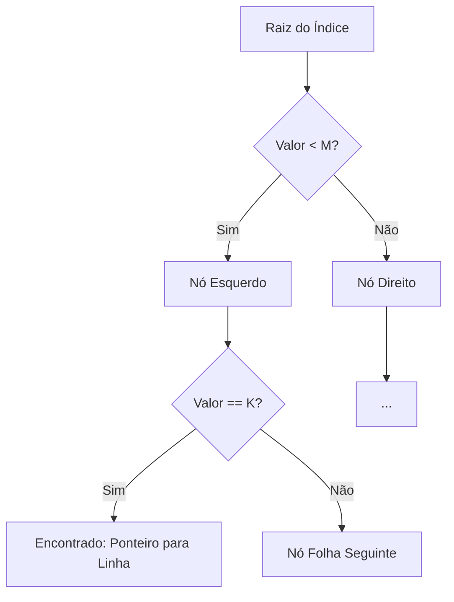

# Skill: Database: Indexação, B-Tree, Hash e Estratégias de Busca

## Introdução

Esta skill aborda a **Indexação** em bancos de dados, a técnica fundamental para acelerar a recuperação de informações e otimizar a performance de consultas SQL. Sem índices, o SGBD precisaria realizar uma varredura completa na tabela (Full Table Scan) para encontrar cada registro, o que seria impraticável em tabelas com milhões de linhas. Os índices funcionam como o sumário de um livro, permitindo que o banco de dados localize rapidamente os dados desejados sem precisar ler todas as páginas.

Exploraremos as estruturas de dados mais comuns para indexação, como **B-Tree** (Árvores B) e **Hash**, além de tipos especializados como índices de texto completo (Full-Text), espaciais e parciais. Discutiremos o equilíbrio crítico entre a velocidade de leitura e o custo de escrita, já que cada índice adicionado aumenta o tempo necessário para operações de `INSERT`, `UPDATE` e `DELETE`. Este conhecimento é essencial para DBAs e desenvolvedores que precisam realizar o "tuning" de performance em sistemas de alta carga.

## Glossário Técnico

*   **Índice**: Uma estrutura de dados auxiliar que melhora a velocidade das operações de recuperação de dados em uma tabela.
*   **B-Tree (Balanced Tree)**: A estrutura de índice mais comum, que mantém os dados ordenados e permite buscas, inserções e exclusões em tempo logarítmico.
*   **Hash Index**: Um índice baseado em uma tabela hash, ideal para buscas de igualdade exata (`=`), mas ineficiente para buscas de intervalo (`>`, `<`).
*   **Full Table Scan**: Operação onde o SGBD lê todas as linhas de uma tabela para encontrar os dados solicitados (geralmente lenta).
*   **Index Scan**: Operação onde o SGBD percorre o índice para localizar os registros.
*   **Clustered Index (Índice Clusterizado)**: Um índice que define a ordem física em que os dados são armazenados na tabela. Uma tabela pode ter apenas um índice clusterizado (geralmente a PK).
*   **Non-Clustered Index (Índice Não-Clusterizado)**: Um índice que contém uma cópia de parte dos dados e um ponteiro para a localização física da linha na tabela.
*   **Composite Index (Índice Composto)**: Um índice criado sobre duas ou mais colunas de uma tabela.
*   **Selectivity (Seletividade)**: A medida de quão bem um índice filtra os dados. Alta seletividade significa que o índice retorna poucas linhas para um valor específico.

## Conceitos Fundamentais

### 1. Estruturas de Índice: B-Tree vs. Hash

A escolha da estrutura do índice depende do tipo de consulta que será realizada com mais frequência:

| Estrutura | Como Funciona | Melhor Para | Limitações |
| :--- | :--- | :--- | :--- |
| **B-Tree** | Mantém uma árvore balanceada de chaves ordenadas. | Igualdade, intervalos (`BETWEEN`, `>`, `<`), ordenação (`ORDER BY`). | Ligeiramente mais lento que Hash para igualdade exata. |
| **Hash** | Usa uma função hash para mapear chaves a endereços físicos. | Igualdade exata (`=`, `IN`). | Não suporta intervalos ou ordenação. |

A maioria dos SGBDs usa B-Tree (ou variações como B+ Tree) como padrão, pois ela é extremamente versátil e eficiente para a grande maioria das consultas SQL.

### 2. Índices Clusterizados e Não-Clusterizados

A diferença entre esses dois tipos é fundamental para a performance de I/O:

*   **Índice Clusterizado**: Os dados da tabela são armazenados na mesma ordem do índice. Imagine uma lista telefônica onde os nomes estão em ordem alfabética e os números estão logo ao lado. Buscar por nome é instantâneo.
*   **Índice Não-Clusterizado**: O índice é uma estrutura separada. Imagine o índice remissivo no final de um livro técnico. Você encontra o termo e ele te dá o número da página onde o conteúdo real está. Isso exige um passo extra de "pular" para a página correta (Lookup).

### 3. O Custo da Indexação

Embora os índices acelerem as leituras, eles têm um preço:
*   **Espaço em Disco**: Cada índice ocupa espaço adicional.
*   **Performance de Escrita**: Sempre que você insere, altera ou deleta um registro, o SGBD precisa atualizar todos os índices associados àquela tabela.
*   **Manutenção**: Índices podem se tornar fragmentados ao longo do tempo, exigindo operações de reconstrução (`REBUILD`) ou reorganização.

## Histórico e Evolução

A indexação evoluiu junto com a teoria das estruturas de dados. As B-Trees foram propostas por Rudolf Bayer e Edward M. McCreight em 1970, no mesmo ano do modelo relacional de Codd. Desde então, os SGBDs adicionaram tipos de índices cada vez mais especializados, como os índices **GIN** e **GiST** do PostgreSQL para dados complexos (JSON, Geometria) e índices **Bitmap** para colunas com baixa seletividade (como "Gênero" ou "Estado Civil") em ambientes de Data Warehousing.

## Exemplos Práticos e Casos de Uso

### Cenário: Otimização de uma Tabela de Usuários

```sql
-- 1. Criando um índice simples para busca por e-mail (Alta Seletividade)
CREATE UNIQUE INDEX idx_usuarios_email ON USUARIOS (email);

-- 2. Criando um índice composto para busca por nome e sobrenome
CREATE INDEX idx_usuarios_nome_completo ON USUARIOS (sobrenome, nome);

-- 3. Criando um índice parcial (apenas para usuários ativos)
-- Disponível em SGBDs como PostgreSQL
CREATE INDEX idx_usuarios_ativos ON USUARIOS (id_usuario) WHERE status = 'Ativo';

-- 4. Criando um índice de texto completo para buscas em bio/descrição
CREATE FULLTEXT INDEX idx_usuarios_bio ON USUARIOS (biografia);
```

Neste cenário, o índice de e-mail garante que buscas de login sejam instantâneas. O índice composto é otimizado para consultas que filtram por sobrenome (ou sobrenome e nome), seguindo a regra do prefixo da esquerda. O índice parcial economiza espaço ao indexar apenas o que é relevante para a maioria das consultas.

## Análise de Fluxo e Diagramas (em Texto)

### Fluxo de Busca em B-Tree



**Explicação**: O diagrama simplifica como uma B-Tree permite que o SGBD descarte metade dos dados a cada passo da busca. Em uma tabela de 1 milhão de linhas, uma B-Tree pode encontrar um registro em apenas 20 saltos, enquanto um Full Table Scan exigiria ler 1 milhão de registros.

## Boas Práticas e Padrões de Projeto

*   **Indexe Colunas de Join (FKs)**: Quase sempre você deve indexar as chaves estrangeiras, pois elas são usadas constantemente em Joins.
*   **Cuidado com a Seletividade**: Não indexe colunas com poucos valores distintos (ex: "Ativo/Inativo"), a menos que seja um índice parcial ou bitmap. O SGBD pode decidir que é mais rápido ler a tabela toda.
*   **Ordem Importa em Índices Compostos**: Coloque a coluna mais filtrada ou com maior seletividade à esquerda no índice composto.
*   **Evite Índices em Excesso**: Cada índice a mais é um peso extra para as operações de `INSERT` e `UPDATE`.
*   **Use o EXPLAIN**: Sempre verifique se o SGBD está realmente usando o índice que você criou através do plano de execução.
*   **Monitore Índices Não Utilizados**: Remova índices que não são usados pelas consultas para economizar recursos.

## Comparativos Detalhados

| Tipo de Índice | Melhor Para | Pior Para |
| :--- | :--- | :--- |
| **B-Tree** | Quase tudo (Igualdade, Intervalos, Ordenação) | Dados não ordenáveis (ex: Geometria complexa) |
| **Hash** | Igualdade exata (`id = 10`) | Intervalos (`id > 10`), Ordenação |
| **Bitmap** | Colunas com poucos valores (Baixa Seletividade) | Tabelas com muitas atualizações frequentes |
| **Full-Text** | Buscas de palavras dentro de textos longos | Buscas exatas de strings curtas |

## Ferramentas e Recursos

Ferramentas como o `pg_stat_user_indexes` no PostgreSQL ou o `Missing Index DMV` no SQL Server ajudam a identificar quais índices estão sendo úteis e quais estão faltando. IDEs como DataGrip e DBeaver mostram visualmente a estrutura dos índices e permitem analisar o impacto de cada um na performance da consulta.

## Tópicos Avançados e Pesquisa Futura

O futuro da indexação envolve o uso de **Aprendizado de Máquina (Learned Indexes)**, onde modelos de IA aprendem a distribuição dos dados para prever a localização de um registro de forma ainda mais rápida que uma B-Tree tradicional. Outra área de evolução são os **Índices para Bancos de Dados Vetoriais**, como HNSW (Hierarchical Navigable Small World), essenciais para buscas de similaridade em aplicações de IA e LLMs. Além disso, a indexação em memória (In-Memory Indexing) continua a crescer, aproveitando as altas velocidades de RAM para sistemas de tempo real.

## Perguntas Frequentes (FAQ)

*   **P: Por que meu índice não está sendo usado na consulta?**
    *   R: Pode haver vários motivos: a tabela é muito pequena, a seletividade da coluna é baixa, você está usando uma função na coluna indexada (ex: `WHERE YEAR(data) = 2023`), ou o tipo de dado da consulta não bate com o do índice.
*   **P: Posso ter mais de um índice clusterizado?**
    *   R: Não. Como o índice clusterizado define a ordem física dos dados no disco, só pode haver uma ordem por tabela.

## Referências Cruzadas

*   **`[[05_Tipos_de_Dados_SQL_e_Restricoes_Constraints]]`**
*   **`[[08_Consultas_Avancadas_com_SELECT_Joins_e_Subqueries]]`**
*   **`[[12_Planos_de_Execucao_Explain_Plan_e_Otimizacao_de_Queries]]`**

## Referências

[1] Silberschatz, A., Korth, H. F., & Sudarshan, S. (2019). *Database System Concepts*. McGraw-Hill.
[2] Bayer, R., & McCreight, E. (1970). *Organization and Maintenance of Large Ordered Indices*. Acta Informatica.
[3] PostgreSQL Documentation. *Index Types*.
