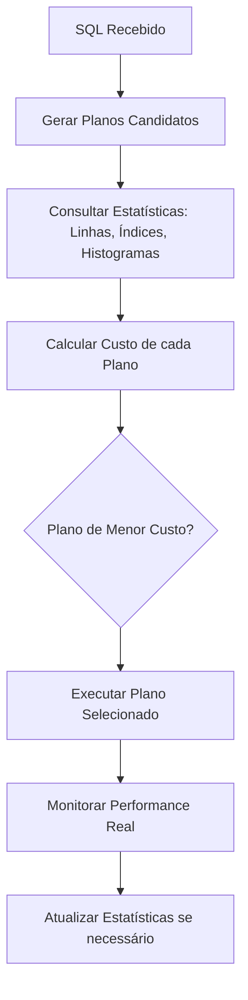

# Skill: Database: Planos de Execução, Explain Plan e Otimização de Queries

## Introdução

Esta skill aborda os **Planos de Execução** e o comando **EXPLAIN**, as ferramentas de diagnóstico mais poderosas para entender como o SGBD processa uma consulta SQL e identificar gargalos de performance. Um plano de execução é o roteiro detalhado que o otimizador do banco de dados cria para buscar os dados solicitados, decidindo quais índices usar, em que ordem unir as tabelas e quais algoritmos de junção aplicar. Dominar a leitura desses planos é o que separa um desenvolvedor comum de um especialista em "Query Tuning".

Exploraremos como gerar e interpretar planos de execução em diferentes SGBDs (PostgreSQL, MySQL, Oracle, SQL Server), os principais operadores (Index Scan, Seq Scan, Nested Loop, Hash Join) e como identificar problemas comuns como "Full Table Scans" desnecessários ou "Cartesian Products" acidentais. Discutiremos o papel das estatísticas do banco de dados na tomada de decisão do otimizador e como usar dicas (hints) para influenciar o plano quando necessário. Este conhecimento é vital para garantir que aplicações escalem de forma eficiente sob alta carga.

## Glossário Técnico

*   **Plano de Execução**: O conjunto de passos lógicos e físicos que o SGBD seguirá para executar uma consulta.
*   **Otimizador de Consultas (Query Optimizer)**: O componente do SGBD que analisa o SQL e escolhe o plano de execução mais eficiente (geralmente baseado em custo).
*   **`EXPLAIN`**: Comando SQL usado para exibir o plano de execução de uma consulta sem executá-la (ou executando-a para obter métricas reais com `EXPLAIN ANALYZE`).
*   **Cost (Custo)**: Uma unidade arbitrária que o otimizador usa para estimar o esforço necessário para cada passo do plano.
*   **Sequential Scan (Seq Scan)**: Leitura de todas as linhas de uma tabela (Full Table Scan).
*   **Index Scan**: Busca de registros usando um índice.
*   **Index Only Scan**: Busca onde todos os dados necessários estão no próprio índice, sem precisar ler a tabela física.
*   **Nested Loop Join**: Algoritmo de junção que percorre a tabela externa e, para cada linha, busca correspondências na tabela interna (ideal para conjuntos pequenos).
*   **Hash Join**: Algoritmo que cria uma tabela hash em memória para uma das tabelas da junção (ideal para conjuntos grandes).
*   **Merge Join**: Algoritmo que une duas tabelas já ordenadas (muito eficiente para grandes volumes).

## Conceitos Fundamentais

### 1. O Ciclo de Vida de uma Consulta

Antes de ser executada, uma consulta passa por várias fases:
1.  **Parsing**: Verificação de sintaxe e permissões.
2.  **Reescrita**: O SGBD pode simplificar a consulta ou substituir Views por suas definições.
3.  **Otimização**: O otimizador gera vários planos possíveis e escolhe o de menor "custo" baseado nas estatísticas disponíveis (número de linhas, distribuição de valores, etc.).
4.  **Execução**: O plano escolhido é transformado em código executável e os dados são retornados.

### 2. Interpretando o EXPLAIN

Ao ler um plano de execução, você deve focar em três métricas principais:
*   **Operação**: O que o banco está fazendo (ex: `Index Scan`).
*   **Custo Estimado**: O esforço que o banco acha que terá.
*   **Linhas Estimadas (Rows)**: Quantas linhas o banco espera processar em cada passo.

Se houver uma grande discrepância entre as linhas estimadas e as linhas reais (vistas com `EXPLAIN ANALYZE`), as estatísticas do banco podem estar desatualizadas, levando o otimizador a escolher um plano ruim.

### 3. Operadores de Junção Comuns

A escolha do algoritmo de junção pelo otimizador diz muito sobre a eficiência da consulta:

| Operador | Quando é Escolhido | Performance |
| :--- | :--- | :--- |
| **Nested Loop** | Uma das tabelas é muito pequena ou há um índice altamente seletivo. | Excelente para OLTP (transacional). |
| **Hash Join** | Ambas as tabelas são grandes e não há índices úteis para a junção. | Boa para OLAP (analítico), mas consome memória. |
| **Merge Join** | Ambas as tabelas estão ordenadas pela coluna de junção. | Muito estável e eficiente para grandes volumes. |

## Histórico e Evolução

Os primeiros SGBDs usavam otimizadores baseados em regras (Rule-Based Optimizer - RBO), que seguiam uma hierarquia fixa de operações. Nos anos 80 e 90, surgiram os otimizadores baseados em custo (Cost-Based Optimizer - CBO), que usam estatísticas reais dos dados para tomar decisões mais inteligentes. Hoje, SGBDs modernos utilizam técnicas de IA e aprendizado de máquina para realizar "Adaptive Query Optimization", onde o plano pode mudar durante a execução se o banco perceber que as estimativas iniciais estavam erradas.

## Exemplos Práticos e Casos de Uso

### Cenário: Diagnosticando uma Consulta Lenta

```sql
-- Consulta original
SELECT c.nome, p.data_pedido
FROM CLIENTES c
JOIN PEDIDOS p ON c.id_cliente = p.id_cliente
WHERE p.status = 'Pendente';

-- Gerando o plano no PostgreSQL
EXPLAIN ANALYZE
SELECT c.nome, p.data_pedido
FROM CLIENTES c
JOIN PEDIDOS p ON c.id_cliente = p.id_cliente
WHERE p.status = 'Pendente';
```

**Resultado Hipotético do EXPLAIN**:
```text
Hash Join  (cost=15.45..45.67 rows=10 width=45) (actual time=0.12..0.45 rows=12 loops=1)
  Hash Cond: (p.id_cliente = c.id_cliente)
  ->  Seq Scan on PEDIDOS p  (cost=0.00..25.00 rows=50 width=8) (actual time=0.01..0.15 rows=50 loops=1)
        Filter: (status = 'Pendente'::text)
  ->  Hash  (cost=12.00..12.00 rows=100 width=40) (actual time=0.05..0.05 rows=100 loops=1)
        ->  Seq Scan on CLIENTES c  (cost=0.00..12.00 rows=100 width=40) (actual time=0.01..0.03 rows=100 loops=1)
```

**Análise**: O plano mostra um `Seq Scan` em `PEDIDOS`. Se a tabela tiver milhões de linhas, isso será lento. A solução seria criar um índice na coluna `status` ou na coluna `id_cliente` para permitir um `Index Scan`.

## Análise de Fluxo e Diagramas (em Texto)

### Fluxo de Decisão do Otimizador



**Explicação**: O diagrama ilustra que a otimização é um processo matemático de minimização de custo. O sucesso desse processo depende inteiramente da qualidade das estatísticas (C). Se o banco "acha" que uma tabela tem 10 linhas quando na verdade tem 10 milhões, ele escolherá o plano errado.

## Boas Práticas e Padrões de Projeto

*   **Mantenha Estatísticas Atualizadas**: Use comandos como `ANALYZE` (PostgreSQL) ou `UPDATE STATISTICS` (SQL Server) regularmente, especialmente após grandes cargas de dados.
*   **Evite Funções no WHERE**: Usar `WHERE YEAR(data) = 2023` impede o uso de índices. Prefira `WHERE data >= '2023-01-01' AND data < '2024-01-01'`.
*   **Cuidado com o SELECT ***: Trazer colunas desnecessárias pode forçar o SGBD a ler a tabela física em vez de usar um `Index Only Scan`.
*   **Use EXPLAIN ANALYZE com Cautela**: Lembre-se que o `ANALYZE` executa a consulta. Se ela for muito lenta, o comando também será.
*   **Identifique Cartesian Products**: Se você vir um `Nested Loop` sem uma condição de junção clara no plano, você provavelmente esqueceu o `ON` ou usou um `CROSS JOIN` acidental.
*   **Simplifique Consultas Complexas**: Às vezes, quebrar uma consulta gigante em tabelas temporárias ou CTEs ajuda o otimizador a encontrar um plano melhor.

## Comparativos Detalhados

| Operação | Custo de I/O | Uso de Memória | Melhor Para |
| :--- | :--- | :--- | :--- |
| **Seq Scan** | Alto (lê tudo) | Baixo | Tabelas pequenas ou filtros que retornam > 20% dos dados. |
| **Index Scan** | Baixo (lê partes) | Médio | Filtros seletivos e buscas por PK. |
| **Index Only Scan** | Mínimo | Baixo | Consultas que precisam apenas de colunas indexadas. |
| **Hash Join** | Médio | Alto | Junção de tabelas grandes sem índices. |
| **Nested Loop** | Variável | Baixo | Junção onde um lado é muito pequeno. |

## Ferramentas e Recursos

Além do comando `EXPLAIN` via terminal, ferramentas visuais como o **PostgreSQL Explain Visualizer (PEV)**, o **MySQL Workbench Visual Explain** e o **SQL Server Management Studio (SSMS) Execution Plan** transformam o texto complexo em diagramas fáceis de entender, destacando os passos mais caros em vermelho.

## Tópicos Avançados e Pesquisa Futura

O futuro da otimização de consultas está nos **Otimizadores Baseados em IA (AI-Driven Optimizers)**, que usam redes neurais para prever o custo de execução de forma muito mais precisa que os modelos matemáticos tradicionais. Outra tendência é o **Dynamic Query Re-optimization**, onde o SGBD pode pausar uma consulta lenta, aprender com o que já foi processado e gerar um novo plano de execução no meio do caminho. Além disso, a otimização para arquiteturas de hardware modernas (como GPUs e NVMe) exige novos algoritmos de junção e busca.

## Perguntas Frequentes (FAQ)

*   **P: O que significa "Cost" no EXPLAIN?**
    *   R: É uma estimativa de tempo e recursos. O valor absoluto não importa tanto quanto a comparação entre diferentes planos para a mesma consulta.
*   **P: Por que o banco escolheu um Seq Scan se eu tenho um índice?**
    *   R: O otimizador pode ter decidido que ler a tabela inteira sequencialmente é mais rápido do que pular entre o índice e o disco (Random I/O), especialmente se a consulta retornar uma grande porcentagem das linhas da tabela.

## Referências Cruzadas

*   **`[[08_Consultas_Avancadas_com_SELECT_Joins_e_Subqueries]]`**
*   **`[[11_Indexacao_B-Tree_Hash_e_Estrategias_de_Busca]]`**
*   **`[[36_Monitoramento_de_Banco_de_Dados_Metricas_e_Alertas]]`**

## Referências

[1] Silberschatz, A., Korth, H. F., & Sudarshan, S. (2019). *Database System Concepts*. McGraw-Hill.
[2] PostgreSQL Documentation. *Using EXPLAIN*.
[3] Microsoft SQL Server Documentation. *Execution Plans*.
