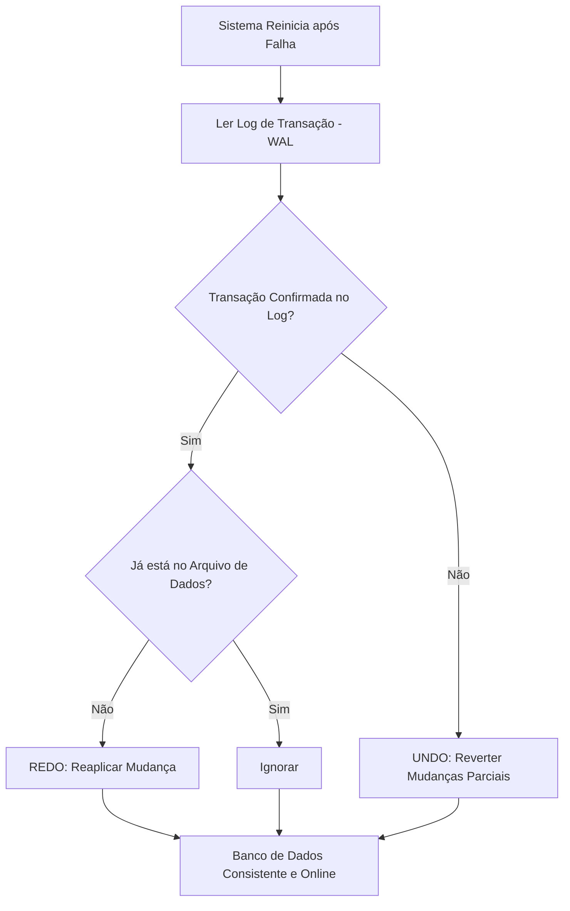

# Skill: Database: Transações ACID - Atomicidade, Consistência, Isolamento e Durabilidade

## Introdução

Esta skill aborda as **Transações ACID**, o conjunto de propriedades que garante a confiabilidade e a integridade dos dados em um banco de dados relacional, mesmo em face de falhas de hardware, quedas de energia ou acessos simultâneos de múltiplos usuários. Uma transação é uma unidade lógica de trabalho que agrupa uma ou mais operações de banco de dados (como `INSERT`, `UPDATE`, `DELETE`) que devem ser tratadas como um único bloco indivisível. Sem as propriedades ACID, seria impossível construir sistemas financeiros, de e-commerce ou de saúde seguros e consistentes.

Exploraremos cada um dos pilares do ACID: **Atomicidade** (tudo ou nada), **Consistência** (regras de negócio mantidas), **Isolamento** (transações não interferem entre si) e **Durabilidade** (dados persistidos permanentemente). Discutiremos como os SGBDs implementam essas garantias através de logs de transação (WAL) e mecanismos de controle de concorrência (Locks e MVCC). Este conhecimento é fundamental para qualquer IA ou desenvolvedor que precise projetar sistemas onde a perda ou a corrupção de dados não é uma opção.

## Glossário Técnico

*   **Transação**: Uma sequência de operações de banco de dados que formam uma única unidade lógica de trabalho.
*   **ACID**: Acrônimo para Atomicidade, Consistência, Isolamento e Durabilidade.
*   **`COMMIT`**: Comando que confirma permanentemente todas as alterações feitas durante a transação.
*   **`ROLLBACK`**: Comando que desfaz todas as alterações feitas durante a transação, retornando o banco ao estado anterior.
*   **Atomicidade**: Garante que todas as operações da transação sejam concluídas com sucesso ou que nenhuma delas seja aplicada.
*   **Consistência**: Garante que a transação leve o banco de dados de um estado válido para outro estado válido, respeitando todas as restrições (constraints).
*   **Isolamento**: Garante que a execução simultânea de transações produza o mesmo resultado que se elas fossem executadas sequencialmente.
*   **Durabilidade**: Garante que, uma vez confirmada (commit), a transação permaneça gravada mesmo em caso de falha do sistema.
*   **WAL (Write-Ahead Logging)**: Técnica onde as mudanças são gravadas em um log antes de serem aplicadas aos arquivos de dados principais.

## Conceitos Fundamentais

### 1. Os Quatro Pilares do ACID

| Propriedade | Descrição | Exemplo Prático |
| :--- | :--- | :--- |
| **Atomicidade** | "Tudo ou Nada". Se uma parte falha, tudo é desfeito. | Transferência bancária: se o débito na conta A funciona mas o crédito na conta B falha, o débito é revertido. |
| **Consistência** | O banco deve respeitar todas as regras (PK, FK, CHECK) antes e depois da transação. | Se uma regra diz que o saldo não pode ser negativo, a transação que tentaria deixar o saldo negativo falhará. |
| **Isolamento** | Transações simultâneas não devem ver os dados parciais umas das outras. | Dois usuários comprando o último item do estoque ao mesmo tempo: apenas um deve conseguir concluir a compra. |
| **Durabilidade** | Uma vez que o banco diz "OK" (Commit), o dado está seguro no disco. | Mesmo que o servidor desligue logo após o commit, o dado estará lá quando ele ligar novamente. |

### 2. Ciclo de Vida de uma Transação

Uma transação típica segue este fluxo:
1.  **`BEGIN TRANSACTION`**: Início do bloco de trabalho.
2.  **Operações DML**: Execução de `INSERT`, `UPDATE`, `DELETE`.
3.  **Validação**: O SGBD verifica se alguma restrição foi violada.
4.  **`COMMIT`** ou **`ROLLBACK`**: Se tudo estiver correto, confirma; se houver erro, desfaz.

### 3. Como o SGBD Garante a Durabilidade (WAL)

Para garantir que os dados não se percam em uma queda de energia, os SGBDs modernos usam o **Write-Ahead Logging (WAL)**. Antes de alterar a tabela real no disco (o que é lento), o banco grava a intenção da mudança em um arquivo de log sequencial (o que é muito rápido). Se o sistema cair, ao reiniciar, o banco lê o log e reaplica as transações confirmadas que ainda não tinham chegado ao arquivo de dados principal.

## Histórico e Evolução

O conceito de transações ACID foi formalizado por Jim Gray no final dos anos 70. Gray recebeu o Prêmio Turing por suas contribuições fundamentais para o processamento de transações. Nos anos 2000, com o surgimento do NoSQL e de sistemas distribuídos em escala global, o modelo ACID foi desafiado pelo **Teorema CAP**, que sugere que é impossível garantir Consistência, Disponibilidade e Tolerância a Partições simultaneamente. Isso levou ao surgimento do modelo **BASE** (Basically Available, Soft state, Eventual consistency), mas o ACID continua sendo o padrão ouro para sistemas que exigem integridade absoluta.

## Exemplos Práticos e Casos de Uso

### Cenário: Transferência Bancária entre Contas

```sql
-- Iniciando a transação
BEGIN TRANSACTION;

-- 1. Retirando dinheiro da conta de origem
UPDATE CONTAS
SET saldo = saldo - 100.00
WHERE id_conta = 'A' AND saldo >= 100.00;

-- 2. Verificando se a linha foi realmente alterada (opcional na lógica da app)
-- Se o saldo era insuficiente, a app deve disparar um ROLLBACK aqui.

-- 3. Depositando dinheiro na conta de destino
UPDATE CONTAS
SET saldo = saldo + 100.00
WHERE id_conta = 'B';

-- 4. Confirmando a transação
COMMIT;

-- Se qualquer erro ocorrer entre o passo 1 e 3, o SGBD ou a app executa:
-- ROLLBACK;
```

Neste exemplo, a atomicidade garante que o dinheiro não "desapareça" (saia de A mas não chegue em B). A consistência garante que o saldo de A não fique negativo se houver uma restrição `CHECK`. O isolamento garante que outra transação não veja o saldo de A reduzido antes de B ser aumentado. A durabilidade garante que a transferência seja permanente após o `COMMIT`.

## Análise de Fluxo e Diagramas (em Texto)

### Fluxo de Recuperação Pós-Falha (Recovery)



**Explicação**: O diagrama mostra como o SGBD usa o log para garantir o ACID após um crash. Ele refaz (REDO) o que foi confirmado mas não gravado no disco final, e desfaz (UNDO) o que começou mas não terminou (Atomicidade).

## Boas Práticas e Padrões de Projeto

*   **Mantenha Transações Curtas**: Transações longas seguram "locks" (travas) nos dados, impedindo outros usuários de trabalhar e aumentando o risco de "deadlocks".
*   **Trate Erros na Aplicação**: Sempre envolva suas chamadas de banco em blocos `try-catch` para garantir que um `ROLLBACK` seja executado em caso de falha.
*   **Evite Interação com o Usuário dentro da Transação**: Nunca abra uma transação e espere o usuário clicar em um botão; isso travará o banco de dados desnecessariamente.
*   **Use o Nível de Isolamento Correto**: Nem toda transação precisa do isolamento máximo (Serializable). Entenda os trade-offs entre performance e consistência.
*   **Cuidado com Autocommit**: Muitos drivers de banco de dados vêm com `autocommit` ligado por padrão, o que trata cada comando SQL como uma transação individual. Desligue-o quando precisar agrupar operações.

## Comparativos Detalhados

| Propriedade | Foco Principal | Mecanismo de Implementação |
| :--- | :--- | :--- |
| **Atomicidade** | Unidade de Trabalho | Log de Transação (Undo/Redo) |
| **Consistência** | Regras de Negócio | Constraints (PK, FK, CHECK) |
| **Isolamento** | Concorrência | Locks, MVCC, Níveis de Isolamento |
| **Durabilidade** | Persistência | WAL, Checkpoints, Disco Rígido |

| Modelo | Consistência | Disponibilidade | Uso Ideal |
| :--- | :--- | :--- | :--- |
| **ACID** | Forte e Imediata | Pode ser afetada por travas | Finanças, ERPs, Dados Críticos |
| **BASE** | Eventual | Alta (Sempre disponível) | Redes Sociais, Big Data, Cache |

## Ferramentas e Recursos

A maioria dos SGBDs oferece comandos para monitorar transações ativas (ex: `pg_stat_activity` no PostgreSQL ou `sys.dm_tran_active_transactions` no SQL Server). Ferramentas de APM (Application Performance Monitoring) como New Relic ou Datadog ajudam a identificar transações lentas que podem estar causando gargalos de concorrência no sistema.

## Tópicos Avançados e Pesquisa Futura

O futuro das transações envolve o **Distributed ACID** em escala global, onde bancos de dados como CockroachDB e Google Spanner usam relógios atômicos e protocolos de consenso (como Paxos ou Raft) para garantir propriedades ACID entre data centers em diferentes continentes. Outra área de evolução são as **Transações em Memória (In-Memory Transactions)**, que eliminam o gargalo do disco usando memórias não voláteis (NVM) para garantir durabilidade com latência quase zero. Além disso, a pesquisa em "Deterministic Databases" busca eliminar a necessidade de locks complexos através da pré-ordenação das transações.

## Perguntas Frequentes (FAQ)

*   **P: O que acontece se eu esquecer de dar `COMMIT` ou `ROLLBACK`?**
    *   R: A transação permanecerá aberta, segurando travas nos dados e impedindo outros processos. Eventualmente, o SGBD ou o driver da aplicação matará a conexão por timeout, executando um `ROLLBACK` automático.
*   **P: O ACID garante que meus dados nunca serão perdidos?**
    *   R: Ele garante que o banco de dados fará a sua parte. No entanto, falhas catastróficas de hardware (como a destruição física de todos os discos) ainda exigem estratégias de backup e replicação geográfica.

## Referências Cruzadas

*   **`[[05_Tipos_de_Dados_SQL_e_Restricoes_Constraints]]`**
*   **`[[14_Controle_de_Concorrencia_Locks_e_Niveis_de_Isolamento]]`**
*   **`[[19_Backup_e_Recuperacao_Disaster_Recovery_Estrategias]]`**

## Referências

[1] Gray, J., & Reuter, A. (1992). *Transaction Processing: Concepts and Techniques*. Morgan Kaufmann.
[2] Silberschatz, A., Korth, H. F., & Sudarshan, S. (2019). *Database System Concepts*. McGraw-Hill.
[3] Haerder, T., & Reuter, A. (1983). *Principles of Transaction-Oriented Database Recovery*. ACM Computing Surveys.
