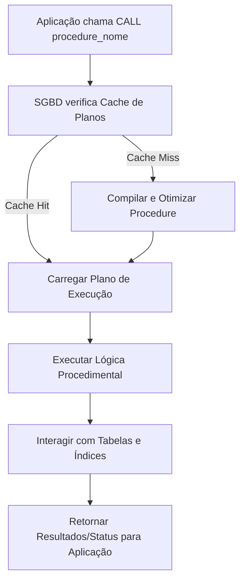

# Skill: Database: Stored Procedures e Functions - Lógica no Banco de Dados

## Introdução

Esta skill aborda as **Stored Procedures (Procedimentos Armazenados)** e as **Functions (Funções)**, os mecanismos que permitem embutir lógica de programação diretamente no servidor de banco de dados. Enquanto o SQL padrão é declarativo, as linguagens procedimentais (como PL/pgSQL no PostgreSQL, T-SQL no SQL Server e PL/SQL no Oracle) permitem o uso de variáveis, loops, condicionais e tratamento de erros. Essa abordagem permite que IAs e desenvolvedores criem operações complexas que são executadas com alta performance, reduzindo o tráfego de rede entre a aplicação e o banco.

Exploraremos as diferenças fundamentais entre Procedures e Functions, os benefícios de performance e segurança que elas proporcionam, e os riscos associados à centralização da lógica de negócio no banco de dados. Discutiremos como essas estruturas são compiladas e otimizadas pelo SGBD, além de abordar o uso de parâmetros de entrada e saída. Este conhecimento é essencial para arquitetos de sistemas que precisam decidir onde a lógica deve residir para garantir a escalabilidade e a manutenibilidade do software.

## Glossário Técnico

*   **Stored Procedure**: Um conjunto de comandos SQL e lógica procedimental armazenado no banco de dados que pode ser chamado por nome.
*   **Function (UDF - User Defined Function)**: Similar a uma procedure, mas projetada para retornar um valor (ou uma tabela) e pode ser usada dentro de comandos `SELECT`.
*   **PL/pgSQL / T-SQL / PL/SQL**: Extensões procedimentais do SQL específicas de cada SGBD.
*   **Parâmetros IN / OUT / INOUT**: Variáveis usadas para passar dados para dentro e para fora de uma procedure ou function.
*   **Tratamento de Erros (Exception Handling)**: Blocos de código que capturam e gerenciam falhas durante a execução da lógica no banco.
*   **Compilação**: O processo onde o SGBD transforma o código procedimental em um plano de execução otimizado e reutilizável.
*   **Tráfego de Rede (Network Round-trip)**: O tempo gasto enviando comandos e recebendo dados entre a aplicação e o servidor de banco de dados.
*   **Lógica de Negócio (Business Logic)**: As regras e cálculos específicos de um domínio que definem como o sistema deve se comportar.

## Conceitos Fundamentais

### 1. Stored Procedures vs. Functions

Embora parecidas, elas têm propósitos e comportamentos distintos:

| Característica | Stored Procedure | Function |
| :--- | :--- | :--- |
| **Retorno** | Pode retornar múltiplos valores (OUT) ou nenhum. | **Deve** retornar um valor (escalar ou tabela). |
| **Uso no SQL** | Chamada via `CALL` ou `EXECUTE`. | Pode ser usada no `SELECT`, `WHERE`, `JOIN`. |
| **Transações** | Pode iniciar e confirmar transações (`COMMIT/ROLLBACK`). | Geralmente não pode gerenciar transações. |
| **Efeitos Colaterais** | Pode alterar dados livremente. | Deve ser preferencialmente "pura" (sem efeitos colaterais). |
| **Propósito** | Lógica de processo, automação, manutenção. | Cálculos, transformações de dados, filtros. |

### 2. Benefícios da Lógica no Banco

*   **Performance**: Como o código roda no servidor, não há necessidade de enviar grandes volumes de dados para a aplicação processar. O SGBD também mantém o plano de execução em cache.
*   **Segurança**: Você pode dar permissão para um usuário executar uma procedure sem dar permissão de leitura direta nas tabelas subjacentes.
*   **Consistência**: Garante que a mesma regra de negócio seja aplicada independentemente de qual aplicação (Web, Mobile, BI) esteja acessando o banco.
*   **Redução de Tráfego**: Uma única chamada de procedure pode realizar dezenas de operações internas, enviando apenas o resultado final para a aplicação.

### 3. Riscos e Desvantagens

*   **Dificuldade de Versionamento**: O código no banco é mais difícil de versionar e testar do que o código na aplicação (embora ferramentas modernas ajudem nisso).
*   **Portabilidade**: Procedures escritas em T-SQL não rodam no PostgreSQL sem uma reescrita completa.
*   **Carga no Servidor**: Processamento pesado no banco pode tirar recursos que seriam usados para consultas e indexação, tornando o servidor um gargalo.
*   **Depuração Complexa**: Debugar lógica no banco de dados é geralmente mais difícil do que em linguagens como Python ou Java.

## Histórico e Evolução

As Stored Procedures ganharam popularidade nos anos 90 com a arquitetura cliente-servidor, onde a rede era lenta e era vital processar o máximo possível no servidor. Com o surgimento de frameworks modernos e ORMs, a tendência mudou para manter a lógica na aplicação. No entanto, em sistemas de alta performance, Big Data e ambientes legados robustos, a lógica no banco continua sendo uma ferramenta indispensável. SGBDs modernos agora permitem escrever procedures em linguagens como Python, JavaScript e Java (via extensões), unindo o poder do banco com a flexibilidade das linguagens modernas.

## Exemplos Práticos e Casos de Uso

### Cenário: Processamento de Folha de Pagamento

```sql
-- Exemplo de Function no PostgreSQL (PL/pgSQL)
CREATE OR REPLACE FUNCTION calcular_imposto(salario NUMERIC)
RETURNS NUMERIC AS $$
BEGIN
    IF salario < 2000 THEN
        RETURN 0;
    ELSE
        RETURN salario * 0.15;
    END IF;
END;
$$ LANGUAGE plpgsql;

-- Exemplo de Stored Procedure no PostgreSQL
CREATE OR REPLACE PROCEDURE processar_folha(id_empresa INT)
AS $$
DECLARE
    func RECORD;
BEGIN
    FOR func IN SELECT id_funcionario, salario FROM FUNCIONARIOS WHERE id_empresa = id_empresa LOOP
        INSERT INTO PAGAMENTOS (id_funcionario, valor, imposto)
        VALUES (func.id_funcionario, func.salario, calcular_imposto(func.salario));
    END LOOP;
    COMMIT; -- Procedures podem gerenciar transações
END;
$$ LANGUAGE plpgsql;

-- Chamando a procedure
CALL processar_folha(10);
```

Neste exemplo, a lógica de cálculo de imposto é centralizada em uma função que pode ser usada em qualquer `SELECT`. A procedure `processar_folha` automatiza um processo em lote, garantindo que todos os pagamentos sejam inseridos de forma atômica e eficiente.

## Análise de Fluxo e Diagramas (em Texto)

### Fluxo de Execução de uma Procedure



**Explicação**: O diagrama destaca que a primeira execução de uma procedure pode ser ligeiramente mais lenta devido à compilação (C), mas as execuções subsequentes são extremamente rápidas porque o SGBD reutiliza o plano de execução otimizado (D).

## Boas Práticas e Padrões de Projeto

*   **Mantenha Procedures Focadas**: Evite criar "God Procedures" que fazem tudo. Divida a lógica em funções e procedimentos menores e reutilizáveis.
*   **Use Tratamento de Erros**: Sempre use blocos `EXCEPTION` ou `TRY...CATCH` para garantir que o banco não fique em um estado inconsistente em caso de falha.
*   **Evite Lógica de Interface**: O banco de dados deve processar dados, não formatar strings para exibição no front-end.
*   **Documente Parâmetros**: Use comentários claros para explicar o que cada parâmetro de entrada e saída faz.
*   **Cuidado com Loops**: Loops em SQL podem ser lentos. Sempre que possível, prefira operações baseadas em conjuntos (`INSERT INTO ... SELECT`) em vez de percorrer registros um a um.
*   **Versionamento Externo**: Mantenha o código das suas procedures em arquivos `.sql` no seu repositório Git, usando ferramentas de migração para aplicá-las ao banco.

## Comparativos Detalhados

| Característica | Lógica na Aplicação | Lógica no Banco (Procedures) |
| :--- | :--- | :--- |
| **Escalabilidade** | Fácil (basta adicionar mais servidores de app). | Difícil (o banco é um recurso centralizado). |
| **Performance** | Lenta para grandes volumes (tráfego de rede). | Rápida (processamento local no servidor). |
| **Manutenibilidade** | Alta (ferramentas de refatoração e teste). | Média/Baixa (ferramentas limitadas). |
| **Segurança** | Depende da camada de acesso. | Alta (permissões granulares por objeto). |

## Ferramentas e Recursos

Ferramentas como o **DBeaver**, **pgAdmin** e **SQL Server Management Studio** oferecem editores de código com realce de sintaxe e depuradores integrados para procedures e functions. Para testes automatizados de lógica no banco, ferramentas como o **pgTAP** (PostgreSQL) ou o **tSQLt** (SQL Server) permitem criar suítes de testes unitários diretamente no SQL.

## Tópicos Avançados e Pesquisa Futura

O futuro da lógica no banco envolve a **Integração Nativa com IA**, onde procedures poderão chamar modelos de machine learning para realizar previsões ou classificações de dados em tempo real durante a inserção. Outra área de evolução são as **Serverless Functions no Banco**, onde o código procedimental é executado em ambientes isolados e escaláveis fora do processo principal do SGBD, reduzindo o risco de instabilidade. Além disso, a padronização de linguagens como o **SQL/PSM** busca reduzir a fragmentação entre os diferentes dialetos procedimentais dos fabricantes.

## Perguntas Frequentes (FAQ)

*   **P: Procedures são sempre mais rápidas que SQL puro?**
    *   R: Não necessariamente. Para consultas simples, o overhead de chamar uma procedure pode ser maior. Elas brilham quando você precisa de múltiplas operações interdependentes ou lógica complexa que exigiria muitas viagens de rede.
*   **P: Posso usar uma Function para deletar dados?**
    *   R: Tecnicamente sim, mas é uma má prática. Funções devem ser usadas para cálculos e retorno de dados. Operações que alteram o estado do banco (DML) devem ser feitas em Procedures.

## Referências Cruzadas

*   **`[[07_Linguagem_de_Manipulacao_de_Dados_DML_Insert_Update_Delete]]`**
*   **`[[16_Triggers_e_Automacao_de_Eventos_no_Banco]]`**
*   **`[[35_Database_Migration_Ferramentas_e_Versionamento_de_Esquema]]`**

## Referências

[1] Silberschatz, A., Korth, H. F., & Sudarshan, S. (2019). *Database System Concepts*. McGraw-Hill.
[2] Feuerstein, S., & Pribyl, B. (2014). *Oracle PL/SQL Programming*. O'Reilly Media.
[3] PostgreSQL Documentation. *PL/pgSQL - SQL Procedural Language*.
