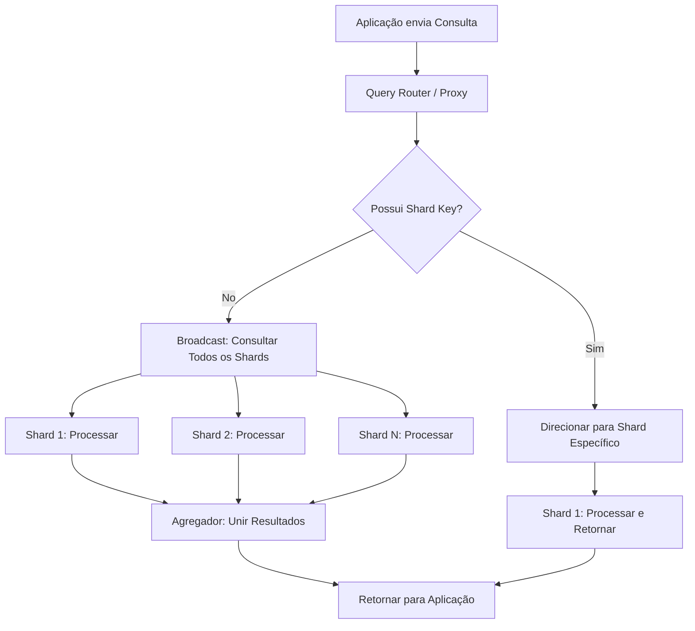

# Skill: Database: Particionamento de Tabelas e Sharding Horizontal

## Introdução

Esta skill aborda o **Particionamento de Tabelas** e o **Sharding Horizontal**, as técnicas fundamentais para lidar com bancos de dados em escala massiva (Big Data). Quando uma única tabela cresce para bilhões de registros, as operações de busca, inserção e manutenção tornam-se extremamente lentas e consomem recursos excessivos. O particionamento resolve esse problema dividindo uma tabela lógica em partes físicas menores e mais gerenciáveis dentro do mesmo servidor, enquanto o sharding distribui essas partes entre múltiplos servidores independentes.

Exploraremos as diferentes estratégias de particionamento (`Range`, `List`, `Hash`), os benefícios de performance (Partition Pruning) e as complexidades de arquitetura introduzidas pelo sharding. Discutiremos como essas técnicas permitem a escalabilidade horizontal e como elas afetam a integridade referencial e a complexidade das consultas. Este conhecimento é vital para engenheiros de dados e arquitetos de sistemas que precisam projetar bancos de dados capazes de suportar o crescimento contínuo de dados sem perda de performance.

## Glossário Técnico

*   **Particionamento**: O processo de dividir uma tabela grande em partes menores (partições) que podem ser gerenciadas e acessadas de forma independente.
*   **Sharding**: Uma forma de particionamento horizontal onde os dados são distribuídos entre múltiplos servidores físicos (shards).
*   **Partition Key (Chave de Partição)**: A coluna usada pelo SGBD para decidir em qual partição um registro deve ser armazenado.
*   **Range Partitioning**: Particionamento baseado em intervalos de valores (ex: por data ou por ID).
*   **List Partitioning**: Particionamento baseado em uma lista explícita de valores (ex: por região ou categoria).
*   **Hash Partitioning**: Particionamento baseado em uma função hash da chave, garantindo uma distribuição uniforme dos dados.
*   **Partition Pruning**: Técnica onde o otimizador do SGBD ignora partições que não contêm os dados solicitados pela consulta, acelerando a busca.
*   **Escalabilidade Horizontal**: A capacidade de aumentar a capacidade do sistema adicionando mais servidores (nós).
*   **Data Skew (Desvio de Dados)**: Quando uma partição ou shard recebe muito mais dados que os outros, criando um gargalo de performance.

## Conceitos Fundamentais

### 1. Particionamento de Tabelas (Vertical vs. Horizontal)

Existem duas formas principais de dividir uma tabela:
*   **Particionamento Vertical**: Divide a tabela por colunas. Colunas acessadas com frequência ficam em uma tabela, e colunas raramente usadas (ou muito grandes, como BLOBs) ficam em outra.
*   **Particionamento Horizontal**: Divide a tabela por linhas. Todas as partições têm o mesmo esquema, mas cada uma contém um subconjunto diferente de registros. Este é o tipo mais comum e o foco desta skill.

### 2. Estratégias de Particionamento Horizontal

| Estratégia | Como Funciona | Melhor Para |
| :--- | :--- | :--- |
| **Range** | Divide por intervalos (ex: Jan-Mar, Abr-Jun). | Dados temporais (logs, vendas por ano). |
| **List** | Divide por valores específicos (ex: Sul, Norte, Leste). | Dados geográficos ou categorias fixas. |
| **Hash** | Aplica uma função matemática na chave. | Garantir que todas as partições tenham o mesmo tamanho. |
| **Composite** | Combina duas estratégias (ex: Range por ano e Hash por ID). | Tabelas extremamente grandes e complexas. |

### 3. Sharding: Escalando Além de um Servidor

Enquanto o particionamento ocorre dentro de um único SGBD, o sharding distribui os dados em um cluster de servidores. Isso permite que o sistema suporte volumes de dados e tráfego que excedem a capacidade de qualquer máquina individual. No entanto, o sharding introduz desafios significativos:
*   **Joins entre Shards**: Consultas que precisam unir dados de shards diferentes são lentas e complexas.
*   **Transações Distribuídas**: Garantir o ACID entre múltiplos servidores exige protocolos complexos como o Two-Phase Commit (2PC).
*   **Rebalanceamento**: Mover dados entre shards quando um servidor fica cheio ou um novo é adicionado é uma operação arriscada e demorada.

## Histórico e Evolução

O particionamento de tabelas tornou-se comum em SGBDs comerciais (como Oracle e DB2) nos anos 90 para suportar Data Warehouses. O sharding ganhou destaque nos anos 2000 com gigantes da web como Google, Facebook e eBay, que precisavam escalar bancos de dados relacionais (como MySQL) para bilhões de usuários. Recentemente, surgiram os bancos de dados **NewSQL** (como CockroachDB e TiDB), que implementam o sharding de forma nativa e transparente, oferecendo a escalabilidade do NoSQL com a consistência do SQL.

## Exemplos Práticos e Casos de Uso

### Cenário: Particionamento de uma Tabela de Logs por Data

```sql
-- Criando a tabela pai (PostgreSQL)
CREATE TABLE LOGS_ACESSO (
    id_log SERIAL,
    data_acesso TIMESTAMP NOT NULL,
    ip_origem VARCHAR(45),
    mensagem TEXT
) PARTITION BY RANGE (data_acesso);

-- Criando as partições para meses específicos
CREATE TABLE LOGS_ACESSO_2023_01 PARTITION OF LOGS_ACESSO
    FOR VALUES FROM ('2023-01-01') TO ('2023-02-01');

CREATE TABLE LOGS_ACESSO_2023_02 PARTITION OF LOGS_ACESSO
    FOR VALUES FROM ('2023-02-01') TO ('2023-03-01');

-- Consulta otimizada (Partition Pruning)
SELECT * FROM LOGS_ACESSO 
WHERE data_acesso >= '2023-01-15' AND data_acesso < '2023-01-20';
-- O SGBD lerá apenas a tabela LOGS_ACESSO_2023_01
```

Neste exemplo, o banco de dados sabe exatamente em qual partição física os dados estão, ignorando todas as outras. Isso torna a busca extremamente rápida, mesmo que a tabela lógica `LOGS_ACESSO` tenha bilhões de registros acumulados ao longo de anos.

## Análise de Fluxo e Diagramas (em Texto)

### Fluxo de Consulta em um Sistema com Sharding



**Explicação**: O diagrama mostra a importância da **Shard Key**. Se a consulta incluir a chave (C), o roteador envia o pedido diretamente para o servidor correto (D). Se não incluir, o sistema precisa perguntar a todos os servidores (E), o que é muito mais lento e ineficiente.

## Boas Práticas e Padrões de Projeto

*   **Escolha a Chave de Partição com Cuidado**: A chave deve ser usada na maioria das suas consultas para aproveitar o Partition Pruning.
*   **Evite Shards Desbalanceados**: Escolha uma chave que distribua os dados de forma uniforme para evitar que um servidor fique sobrecarregado (Hot Shard).
*   **Mantenha as Partições de Tamanho Gerenciável**: Partições muito grandes perdem o benefício de performance; partições muito pequenas criam overhead de gerenciamento.
*   **Automatize a Criação de Partições**: Use scripts ou extensões (como o `pg_partman` no PostgreSQL) para criar novas partições de data automaticamente.
*   **Cuidado com a Integridade Referencial**: Muitos SGBDs não permitem chaves estrangeiras entre partições ou shards diferentes.
*   **Planeje o Arquivamento**: O particionamento facilita muito o arquivamento de dados antigos; basta dar um `DROP` ou `DETACH` na partição de um ano atrás.

## Comparativos Detalhados

| Característica | Particionamento (Local) | Sharding (Distribuído) |
| :--- | :--- | :--- |
| **Escopo** | Único Servidor | Múltiplos Servidores |
| **Complexidade** | Média | Alta |
| **Escalabilidade** | Vertical (Limitada ao hardware) | Horizontal (Praticamente ilimitada) |
| **Custo** | Baixo | Alto (Infraestrutura e Rede) |
| **Uso Ideal** | Tabelas grandes em um único banco. | Aplicações globais com tráfego massivo. |

## Ferramentas e Recursos

SGBDs como **PostgreSQL** (com Declarative Partitioning), **MySQL** (com Partitioning Engine) e **Oracle** oferecem suporte nativo ao particionamento. Para sharding, ferramentas como **Vitess** (para MySQL) e **Citus** (para PostgreSQL) transformam bancos de dados tradicionais em sistemas distribuídos. Bancos de dados Cloud-Native como **Amazon Aurora** e **Google Spanner** gerenciam o particionamento e o sharding de forma automática e transparente para o usuário.

## Tópicos Avançados e Pesquisa Futura

O futuro do particionamento está no **Auto-Sharding Inteligente**, onde o banco de dados usa IA para monitorar padrões de acesso e mover dados entre servidores em tempo real para otimizar a performance e o custo. Outra área de evolução são os **Bancos de Dados Multimodais Distribuídos**, que particionam dados relacionais, documentos e grafos em um único cluster coerente. Além disso, a pesquisa em "Serverless Databases" busca desacoplar completamente o armazenamento do processamento, permitindo que as partições escalem de forma independente e instantânea.

## Perguntas Frequentes (FAQ)

*   **P: O particionamento substitui os índices?**
    *   R: Não. Eles trabalham juntos. O particionamento ajuda o banco a encontrar o "balde" certo de dados, e o índice ajuda a encontrar o registro específico dentro desse balde.
*   **P: Posso mudar a chave de partição de uma tabela existente?**
    *   R: É uma operação extremamente complexa e demorada, que geralmente exige a criação de uma nova tabela e a migração de todos os dados. Por isso, a escolha da chave de partição deve ser feita com muito planejamento inicial.

## Referências Cruzadas

*   **`[[11_Indexacao_B-Tree_Hash_e_Estrategias_de_Busca]]`**
*   **`[[18_Replicacao_de_Dados_Master-Slave_e_Multi-Master]]`**
*   **`[[30_Bancos_de_Dados_NewSQL_CockroachDB_e_TiDB]]`**

## Referências

[1] Silberschatz, A., Korth, H. F., & Sudarshan, S. (2019). *Database System Concepts*. McGraw-Hill.
[2] Corbett, J. C., et al. (2013). *Spanner: Google’s Globally Distributed Database*. ACM Transactions on Computer Systems.
[3] PostgreSQL Documentation. *Table Partitioning*.
