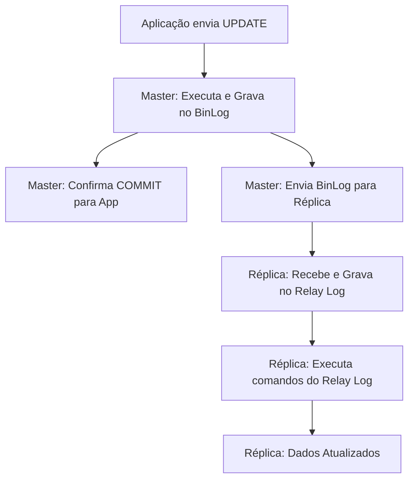

# Skill: Database: Replicação de Dados - Master-Slave e Multi-Master

## Introdução

Esta skill aborda a **Replicação de Dados**, a técnica fundamental para garantir a alta disponibilidade, a tolerância a falhas e a escalabilidade de leitura em bancos de dados. Replicar consiste em copiar dados de um servidor de banco de dados (Master ou Primary) para um ou mais servidores (Slaves ou Replicas) em tempo real ou quase real. Essa estratégia permite que IAs e desenvolvedores construam sistemas que continuam funcionando mesmo se o servidor principal falhar e que podem suportar milhões de usuários simultâneos distribuindo a carga de leitura entre as réplicas.

Exploraremos as diferentes arquiteturas de replicação, como **Master-Slave** (ou Primary-Replica) e **Multi-Master**, além dos métodos de sincronização (Síncrona vs. Assíncrona). Discutiremos os desafios de consistência introduzidos pela replicação, como o atraso de replicação (Replication Lag), e como as réplicas são usadas para backups e relatórios pesados sem afetar a performance da aplicação principal. Este conhecimento é vital para arquitetos de infraestrutura e DBAs que precisam projetar sistemas resilientes e de alta performance.

## Glossário Técnico

*   **Replicação**: O processo de copiar e manter dados em múltiplos servidores de banco de dados.
*   **Master (Primary)**: O servidor principal que recebe todas as operações de escrita (`INSERT`, `UPDATE`, `DELETE`).
*   **Slave (Replica)**: Servidor que recebe cópias dos dados do Master e é usado principalmente para operações de leitura (`SELECT`).
*   **Replicação Síncrona**: O Master espera a confirmação de que a réplica recebeu o dado antes de confirmar o `COMMIT` para a aplicação.
*   **Replicação Assíncrona**: O Master confirma o `COMMIT` imediatamente e envia o dado para a réplica em segundo plano.
*   **Replication Lag (Atraso de Replicação)**: O tempo que leva para uma mudança no Master aparecer na réplica.
*   **Failover**: O processo automático ou manual de promover uma réplica a Master quando o Master original falha.
*   **Multi-Master**: Arquitetura onde múltiplos servidores podem receber operações de escrita simultaneamente.
*   **Conflict Resolution (Resolução de Conflitos)**: A lógica necessária em sistemas Multi-Master para decidir qual dado prevalece quando dois servidores alteram o mesmo registro ao mesmo tempo.

## Conceitos Fundamentais

### 1. Arquitetura Master-Slave (Primary-Replica)

Esta é a arquitetura mais comum e simples de gerenciar:
*   **Escrita**: Centralizada no Master. Isso evita conflitos e garante a integridade.
*   **Leitura**: Pode ser feita no Master ou distribuída entre várias réplicas. Isso permite escalar a leitura quase infinitamente.
*   **Uso Ideal**: Aplicações web tradicionais (como blogs, e-commerce, redes sociais) onde há muito mais leituras do que escritas.

### 2. Replicação Síncrona vs. Assíncrona

A escolha entre esses métodos é um trade-off clássico entre **Consistência** e **Performance**:

| Método | Vantagem | Desvantagem |
| :--- | :--- | :--- |
| **Síncrona** | Garante que a réplica tenha o dado exato do Master. Sem perda de dados em caso de falha. | Aumenta a latência de escrita; se a réplica cair, o Master para de aceitar escritas. |
| **Assíncrona** | Máxima performance de escrita; o Master não depende da saúde da réplica. | Risco de perda de dados se o Master falhar antes de enviar o log para a réplica (Replication Lag). |

### 3. Arquitetura Multi-Master

No modelo Multi-Master, qualquer nó do cluster pode aceitar escritas. Isso oferece alta disponibilidade total (se um nó cai, os outros continuam escrevendo), mas introduz uma complexidade enorme na resolução de conflitos e na garantia de que todos os nós cheguem ao mesmo estado final. É comum em bancos de dados distribuídos globalmente e em sistemas NoSQL.

## Histórico e Evolução

A replicação de banco de dados começou nos anos 80 com sistemas de mainframe para fins de backup. Nos anos 90, o MySQL popularizou a replicação assíncrona simples, permitindo que sites da web escalassem de forma barata usando hardware comum. Com o surgimento da computação em nuvem, a replicação tornou-se um serviço gerenciado (como o Amazon RDS Multi-AZ), onde o failover e a sincronização são automáticos. Recentemente, protocolos de consenso como **Paxos** e **Raft** tornaram-se a base para a replicação em bancos de dados NewSQL, garantindo consistência forte em sistemas distribuídos.

## Exemplos Práticos e Casos de Uso

### Cenário: Escalando um E-commerce Global

1.  **Master (EUA)**: Recebe todos os pedidos e cadastros de clientes.
2.  **Réplica 1 (Europa)**: Atende todas as consultas de catálogo e busca de produtos para usuários europeus (Leitura rápida).
3.  **Réplica 2 (Ásia)**: Atende consultas de usuários asiáticos.
4.  **Réplica de BI**: Dedicada exclusivamente para gerar relatórios pesados de vendas mensais, sem travar o site principal.

Se o Master nos EUA falhar, o sistema de monitoramento promove a Réplica 1 a novo Master, e a aplicação redireciona as escritas para a Europa (Failover).

## Análise de Fluxo e Diagramas (em Texto)

### Fluxo de Replicação Baseada em Log (Binary Log)

**Explicação**: O diagrama ilustra a replicação assíncrona típica. O Master não espera a réplica (C). A réplica recebe o log de mudanças (D) e o "re-executa" localmente (F). O tempo entre (B) e (G) é o **Replication Lag**.

## Boas Práticas e Padrões de Projeto

*   **Monitore o Replication Lag**: Um atraso alto pode fazer com que usuários vejam dados antigos (ex: um usuário altera seu perfil e, ao atualizar a página, vê os dados antigos vindos da réplica).
*   **Use Réplicas para Backups**: Fazer backup em uma réplica evita o impacto de performance no Master.
*   **Automatize o Failover**: Use ferramentas que detectem a queda do Master e promovam uma réplica automaticamente para minimizar o tempo de inatividade.
*   **Cuidado com a Escrita em Réplicas**: Configure suas réplicas como `read-only` para evitar que dados sejam alterados acidentalmente fora do Master, o que quebraria a sincronização.
*   **Use IDs Globais (UUIDs)**: Em sistemas Multi-Master ou com failover frequente, usar UUIDs evita conflitos de chaves primárias que poderiam ocorrer com IDs autoincrementais.
*   **Teste o Failover Regularmente**: Não espere um desastre real para descobrir que seu processo de promoção de réplica não funciona.

## Comparativos Detalhados

| Característica | Master-Slave | Multi-Master |
| :--- | :--- | :--- |
| **Complexidade** | Baixa/Média | Muito Alta |
| **Escalabilidade de Escrita** | Limitada ao Master | Alta (Distribuída) |
| **Escalabilidade de Leitura** | Alta (Múltiplas Réplicas) | Alta |
| **Consistência** | Fácil de Garantir | Difícil (Resolução de Conflitos) |
| **Uso Ideal** | Maioria das Apps Web | Apps Globais, Alta Disponibilidade Crítica |

## Ferramentas e Recursos

SGBDs como **MySQL** (com GTID), **PostgreSQL** (com Streaming Replication) e **SQL Server** (com Always On Availability Groups) possuem motores de replicação nativos e maduros. Ferramentas de terceiros como o **ProxySQL** ou o **MaxScale** atuam como roteadores inteligentes, direcionando automaticamente as escritas para o Master e as leituras para as réplicas de forma transparente para a aplicação.

## Tópicos Avançados e Pesquisa Futura

O futuro da replicação está na **Replicação Geográfica de Baixa Latência**, onde novos protocolos tentam vencer as limitações físicas da velocidade da luz através de predição e execução especulativa. Outra área de evolução é a **Replicação Lógica Seletiva**, onde apenas partes específicas do banco são replicadas para dispositivos de borda (Edge Computing) ou dispositivos móveis. Além disso, a integração de IA permite que o sistema preveja picos de carga e crie réplicas temporárias automaticamente para suportar a demanda.

## Perguntas Frequentes (FAQ)

*   **P: Posso ter réplicas de réplicas?**
    *   R: Sim, isso é chamado de "Cascading Replication". É útil para distribuir a carga de replicação do Master em ambientes com dezenas de réplicas.
*   **P: O que acontece se a rede entre o Master e a Réplica cair?**
    *   R: O Master continuará funcionando (se for assíncrono). A réplica ficará desatualizada. Quando a rede voltar, a réplica solicitará os logs que perdeu e tentará "alcançar" o Master.

## Referências Cruzadas

*   **`[[13_Transacoes_ACID_Atomicidade_Consistencia_Isolamento_Durabilidade]]`**
*   **`[[17_Particionamento_de_Tabelas_e_Sharding_Horizontal]]`**
*   **`[[19_Backup_e_Recuperacao_Disaster_Recovery_Estrategias]]`**

## Referências

[1] Silberschatz, A., Korth, H. F., & Sudarshan, S. (2019). *Database System Concepts*. McGraw-Hill.
[2] Kleppmann, M. (2017). *Designing Data-Intensive Applications*. O'Reilly Media.
[3] MySQL Documentation. *Replication*.
