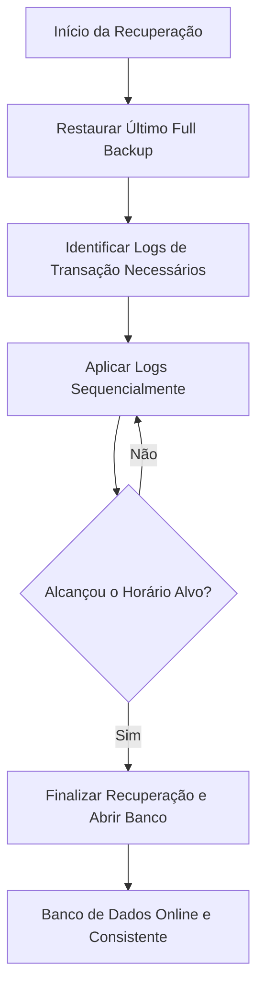

# Skill: Database: Backup e Recuperação - Disaster Recovery Estratégias

## Introdução

Esta skill aborda o **Backup e a Recuperação** de bancos de dados, as práticas críticas para garantir a sobrevivência dos dados em face de desastres, erros humanos ou ataques cibernéticos. O backup é a cópia de segurança dos dados, enquanto a recuperação é o processo de restaurar o banco de dados a um estado consistente após uma falha. Sem uma estratégia de backup robusta e testada, qualquer organização corre o risco de perda total de informações, o que pode levar à falência ou a graves consequências legais.

Exploraremos os diferentes tipos de backup (`Full`, `Incremental`, `Differential`), os métodos de recuperação (`Point-in-Time Recovery - PITR`) e os conceitos de **RPO (Recovery Point Objective)** e **RTO (Recovery Time Objective)**. Discutiremos como os logs de transação (WAL) são usados para reconstruir o banco de dados e como as estratégias de replicação geográfica e armazenamento em nuvem fortalecem o plano de recuperação de desastres (Disaster Recovery). Este conhecimento é a última linha de defesa para DBAs e engenheiros de confiabilidade de sistemas (SREs).

## Glossário Técnico

*   **Backup**: Uma cópia dos dados do banco de dados usada para restauração em caso de perda.
*   **Restore (Restauração)**: O processo de copiar os dados do backup de volta para o banco de dados.
*   **Recovery (Recuperação)**: O processo de tornar o banco de dados consistente após o restore, aplicando logs de transação.
*   **Full Backup**: Cópia completa de todos os dados do banco de dados.
*   **Incremental Backup**: Cópia apenas dos dados que mudaram desde o último backup (Full ou Incremental).
*   **Differential Backup**: Cópia de todos os dados que mudaram desde o último Full Backup.
*   **PITR (Point-in-Time Recovery)**: Capacidade de restaurar o banco de dados para um momento exato no passado (ex: 10:15:30 de ontem).
*   **RPO (Recovery Point Objective)**: A quantidade máxima de dados que a organização aceita perder (medida em tempo, ex: "perda máxima de 15 minutos").
*   **RTO (Recovery Time Objective)**: O tempo máximo que o sistema pode ficar fora do ar durante a recuperação (ex: "voltar em 2 horas").
*   **WAL (Write-Ahead Log) / Archive Log**: Arquivos que registram todas as mudanças no banco e são essenciais para o PITR.

## Conceitos Fundamentais

### 1. Tipos de Backup e Trade-offs

A escolha da estratégia de backup depende do volume de dados e dos requisitos de RPO/RTO:

| Tipo | Vantagem | Desvantagem |
| :--- | :--- | :--- |
| **Full** | Restauração mais simples e rápida. | Lento para criar; ocupa muito espaço. |
| **Incremental** | Rápido para criar; ocupa pouco espaço. | Restauração complexa (exige o último Full + todos os Incrementais). |
| **Differential** | Restauração mais rápida que o Incremental. | Ocupa mais espaço que o Incremental ao longo do tempo. |

Uma estratégia comum é realizar um Full Backup semanal, Differential Backups diários e arquivamento de logs de transação a cada 15 minutos para garantir um RPO baixo.

### 2. RPO e RTO: Definindo a Estratégia

Estes dois indicadores definem o custo e a complexidade da sua infraestrutura de backup:
*   **RPO Baixo (Segundos/Minutos)**: Exige replicação síncrona ou arquivamento constante de logs (WAL Archiving).
*   **RTO Baixo (Minutos/Horas)**: Exige hardware de reserva pronto (Hot Standby), backups em discos rápidos e automação de restauração.

### 3. Point-in-Time Recovery (PITR)

O PITR é a técnica mais avançada de recuperação. Ele funciona combinando um Full Backup antigo com a sequência de logs de transação gerados desde então. O SGBD restaura o backup e "re-executa" todos os comandos do log até o segundo exato solicitado pelo administrador. Isso é vital para reverter erros humanos, como um `DELETE` sem `WHERE` acidental.

## Histórico e Evolução

Nos primórdios, os backups eram feitos em fitas magnéticas e levados fisicamente para cofres fora da empresa (Off-site storage). Com o surgimento da internet rápida e do armazenamento em nuvem (como Amazon S3), os backups tornaram-se digitais e automatizados. SGBDs modernos agora oferecem "Backups Contínuos" e "Snapshots" de baixo impacto, permitindo que cópias de segurança sejam feitas sem travar o banco de dados ou degradar a performance dos usuários.

## Exemplos Práticos e Casos de Uso

### Cenário: Recuperação de um Erro Humano Crítico

1.  **Evento**: Às 14:05, um desenvolvedor executa um `DROP TABLE CLIENTES` por engano no banco de produção.
2.  **Ação**: O DBA identifica o erro e inicia o processo de PITR.
3.  **Processo**:
    *   Restaura o último Full Backup (feito às 02:00 da manhã).
    *   Solicita ao SGBD a recuperação até o momento `14:04:59`.
    *   O SGBD lê os logs de transação das últimas 12 horas e reaplica todas as vendas e cadastros.
4.  **Resultado**: O banco volta ao estado exato de um segundo antes do erro, com perda zero de dados legítimos.

## Análise de Fluxo e Diagramas (em Texto)

### Fluxo de Recuperação Point-in-Time (PITR)

**Explicação**: O diagrama mostra que a recuperação é um processo cumulativo. O backup fornece a base, e os logs (D) fornecem os detalhes de tudo o que aconteceu depois. A precisão do PITR depende da integridade de cada arquivo de log gerado desde o backup.

## Boas Práticas e Padrões de Projeto

*   **Regra 3-2-1**: Tenha pelo menos 3 cópias dos dados, em 2 tipos de mídia diferentes, com 1 cópia fora do local físico (Off-site/Cloud).
*   **Teste seus Backups**: Um backup que nunca foi restaurado com sucesso não é um backup, é apenas um arquivo inútil. Realize testes de restauração periódicos.
*   **Automatize Tudo**: Não dependa de humanos para lembrar de fazer backup. Use ferramentas de agendamento e monitore falhas.
*   **Criptografe os Backups**: Backups contêm dados sensíveis e são alvos frequentes de hackers. Proteja-os com criptografia forte.
*   **Mantenha Logs Separados**: Armazene seus logs de transação em um disco ou servidor diferente dos arquivos de dados para evitar perda total em caso de falha física do disco.
*   **Documente o Plano de DR**: Em um momento de crise, ninguém quer procurar manuais. Tenha um guia passo-a-passo claro de como restaurar o sistema.

## Comparativos Detalhados

| Característica | Backup Físico (Snapshot/Cópia de Arquivos) | Backup Lógico (SQL Dump/Export) |
| :--- | :--- | :--- |
| **Velocidade** | Muito Rápido (Cópia de blocos) | Lento (Gera comandos SQL) |
| **Tamanho** | Grande (Copia todo o espaço alocado) | Menor (Apenas dados reais) |
| **Flexibilidade** | Baixa (Deve restaurar no mesmo SGBD/Versão) | Alta (Pode restaurar em versões diferentes) |
| **Uso Ideal** | Recuperação de desastres em larga escala. | Migração de dados ou cópias de tabelas pequenas. |

## Ferramentas e Recursos

SGBDs possuem ferramentas nativas como `pg_dump` e `pg_basebackup` (PostgreSQL), `mysqldump` e `MySQL Enterprise Backup` (MySQL), e `RMAN` (Oracle). Na nuvem, serviços como **AWS Backup**, **Azure Backup** e **Google Cloud SQL Backups** gerenciam snapshots e retenção de logs de forma automática, oferecendo durabilidade de "onze noves" (99.999999999%).

## Tópicos Avançados e Pesquisa Futura

O futuro do backup está nos **Backups Imutáveis**, projetados para combater ataques de Ransomware, onde nem mesmo o administrador do banco pode deletar ou alterar o backup por um período determinado. Outra área de evolução é a **Recuperação Instantânea (Instant Recovery)**, onde o banco de dados pode ser montado diretamente a partir do arquivo de backup ou snapshot sem a necessidade de copiar os dados primeiro, reduzindo o RTO para segundos. Além disso, a IA está sendo usada para prever falhas de hardware e iniciar backups preventivos ou mover dados para servidores saudáveis antes que o desastre ocorra.

## Perguntas Frequentes (FAQ)

*   **P: Qual a diferença entre Backup e Replicação?**
    *   R: A replicação protege contra falhas de hardware (se um servidor cai, o outro assume). O backup protege contra perda de dados (se você deletar uma tabela no Master, a replicação deletará na Réplica também; apenas o backup pode trazê-la de volta).
*   **P: Devo fazer backup do banco de dados inteiro todo dia?**
    *   R: Depende do tamanho. Para bancos pequenos, sim. Para bancos de Terabytes, o ideal é um Full Backup semanal e diferenciais/incrementais diários, com arquivamento de logs constante.

## Referências Cruzadas

*   **`[[13_Transacoes_ACID_Atomicidade_Consistencia_Isolamento_Durabilidade]]`**
*   **`[[18_Replicacao_de_Dados_Master-Slave_e_Multi-Master]]`**
*   **`[[36_Monitoramento_de_Banco_de_Dados_Metricas_e_Alertas]]`**

## Referências

[1] Silberschatz, A., Korth, H. F., & Sudarshan, S. (2019). *Database System Concepts*. McGraw-Hill.
[2] Chodorow, K. (2013). *MongoDB: The Definitive Guide*. O'Reilly Media (Seção sobre Backup).
[3] PostgreSQL Documentation. *Backup and Restore*.
