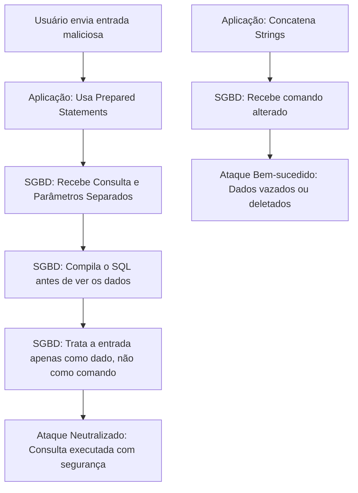

# Skill: Database: Segurança e Controle de Acesso - RBAC e Criptografia

## Introdução

Esta skill aborda a **Segurança de Bancos de Dados**, o conjunto de práticas e tecnologias destinadas a proteger as informações contra acessos não autorizados, vazamentos de dados e ataques maliciosos. Em um mundo onde os dados são o ativo mais valioso de uma organização, a segurança do banco de dados é a prioridade máxima. O controle de acesso garante que apenas usuários e aplicações autorizados possam interagir com os dados, enquanto a criptografia protege as informações tanto em repouso quanto em trânsito.

Exploraremos o modelo **RBAC (Role-Based Access Control)**, os comandos de controle de privilégios (`GRANT`, `REVOKE`), e as diferentes camadas de criptografia (TDE, SSL/TLS). Discutiremos a importância da auditoria de segurança, a proteção contra ataques de **SQL Injection** e o princípio do privilégio mínimo. Este conhecimento é fundamental para DBAs, engenheiros de segurança e desenvolvedores que precisam construir sistemas que não apenas funcionem, mas que sejam resilientes a ameaças cibernéticas e estejam em conformidade com leis de privacidade como a LGPD e o GDPR.

## Glossário Técnico

*   **Autenticação**: O processo de verificar a identidade de um usuário ou aplicação (ex: login e senha).
*   **Autorização**: O processo de determinar quais ações um usuário autenticado pode realizar (ex: ler uma tabela, mas não deletar).
*   **RBAC (Role-Based Access Control)**: Modelo de controle de acesso baseado em papéis ou funções (ex: "Analista", "Gerente", "DBA").
*   **Privilégio**: Uma permissão específica concedida a um usuário ou papel (ex: `SELECT`, `INSERT`, `UPDATE`).
*   **`GRANT`**: Comando SQL usado para conceder privilégios a um usuário ou papel.
*   **`REVOKE`**: Comando SQL usado para remover privilégios concedidos anteriormente.
*   **Criptografia em Repouso (At Rest)**: Proteção dos dados armazenados nos arquivos físicos do banco de dados (ex: TDE).
*   **Criptografia em Trânsito (In Transit)**: Proteção dos dados enquanto eles viajam pela rede entre a aplicação e o banco (ex: SSL/TLS).
*   **SQL Injection**: Ataque onde um invasor insere comandos SQL maliciosos em campos de entrada da aplicação para manipular o banco de dados.
*   **Auditoria (Auditing)**: O registro de todas as atividades realizadas no banco de dados para fins de conformidade e investigação.

## Conceitos Fundamentais

### 1. Controle de Acesso Baseado em Papéis (RBAC)

Em vez de conceder permissões individualmente para cada usuário, o RBAC organiza os privilégios em "Papéis" (Roles). Isso simplifica drasticamente a gestão da segurança:
*   **Criação de Papéis**: Define-se um papel como `leitor_vendas` com permissão de `SELECT` nas tabelas de pedidos.
*   **Atribuição de Usuários**: Novos funcionários são simplesmente associados ao papel `leitor_vendas`.
*   **Manutenção Centralizada**: Se a regra mudar, você altera apenas o papel, e todos os usuários associados herdam a mudança automaticamente.

### 2. O Princípio do Privilégio Mínimo (PoLP)

Este é o pilar da segurança: cada usuário ou aplicação deve ter apenas as permissões estritamente necessárias para realizar sua função.
*   **Aplicação Web**: Deve ter permissões de `SELECT`, `INSERT`, `UPDATE` apenas nas tabelas que usa. Nunca deve ser `superuser` ou `db_owner`.
*   **Analista de BI**: Deve ter apenas permissão de `SELECT` em Views específicas, sem acesso aos dados sensíveis (como senhas ou CPFs).
*   **DBA**: Deve ter acesso total, mas suas ações devem ser rigorosamente auditadas.

### 3. Criptografia de Dados

A criptografia protege os dados em diferentes estados:
*   **TDE (Transparent Data Encryption)**: Criptografa os arquivos de dados e logs no disco. Se alguém roubar o HD físico, não conseguirá ler os dados sem a chave de criptografia.
*   **SSL/TLS**: Garante que a comunicação entre o servidor e o cliente seja privada e íntegra, impedindo ataques de "Man-in-the-Middle".
*   **Criptografia de Coluna**: Criptografa dados sensíveis (como números de cartão de crédito) antes de gravá-los, exigindo uma chave específica para a leitura, mesmo para quem tem acesso à tabela.

## Histórico e Evolução

Nos primórdios, a segurança do banco de dados dependia quase inteiramente da segurança física do servidor. Com a internet, surgiram os firewalls e a autenticação por senha. Nos anos 2000, o foco mudou para a proteção contra SQL Injection e a conformidade regulatória (SOX, PCI-DSS). Recentemente, com a LGPD e o GDPR, o foco expandiu-se para a **Privacidade por Design**, incluindo técnicas como anonimização de dados, mascaramento dinâmico e bancos de dados que suportam criptografia homomórfica (processamento de dados sem descriptografá-los).

## Exemplos Práticos e Casos de Uso

### Cenário: Configuração de Segurança para uma Aplicação de E-commerce

```sql
-- 1. Criando papéis específicos
CREATE ROLE app_ecommerce;
CREATE ROLE analista_bi;

-- 2. Concedendo privilégios mínimos para a aplicação
GRANT SELECT, INSERT, UPDATE ON PRODUTOS, PEDIDOS, CLIENTES TO app_ecommerce;
GRANT USAGE ON SEQUENCE pedidos_id_seq TO app_ecommerce;

-- 3. Concedendo privilégios de leitura apenas para o analista
GRANT SELECT ON v_vendas_mensais TO analista_bi;

-- 4. Criando um usuário para o servidor de aplicação e associando ao papel
CREATE USER srv_web_01 WITH PASSWORD 'senha_forte_e_secreta';
GRANT app_ecommerce TO srv_web_01;

-- 5. Revogando permissões desnecessárias (ex: deletar produtos)
REVOKE DELETE ON PRODUTOS FROM app_ecommerce;
```

Neste exemplo, o servidor web (`srv_web_01`) tem apenas as permissões necessárias para operar o site. Se o servidor for invadido, o hacker não conseguirá deletar o catálogo de produtos ou acessar dados que não foram explicitamente permitidos.

## Análise de Fluxo e Diagramas (em Texto)

### Fluxo de Defesa contra SQL Injection



**Explicação**: O diagrama mostra que a segurança começa na aplicação. O uso de **Prepared Statements** (B) é a defesa número um, pois garante que o banco de dados nunca interprete a entrada do usuário como parte do comando SQL.

## Boas Práticas e Padrões de Projeto

*   **Nunca use o usuário 'root' ou 'sa'**: Crie usuários específicos para cada aplicação e tarefa.
*   **Use Senhas Fortes e Rotação**: Troque as senhas de serviço periodicamente e use cofres de senhas (como HashiCorp Vault).
*   **Habilite a Auditoria**: Registre tentativas de login falhas e alterações em tabelas críticas.
*   **Mantenha o SGBD Atualizado**: Aplique patches de segurança assim que forem lançados para proteger contra vulnerabilidades conhecidas.
*   **Mascaramento de Dados (Data Masking)**: Em ambientes de teste ou para analistas, oculte partes de dados sensíveis (ex: `***.***.123-45`).
*   **Firewall de Banco de Dados**: Restrinja o acesso ao banco apenas aos IPs conhecidos dos servidores de aplicação.
*   **Criptografe Backups**: Um backup não criptografado é um vazamento de dados esperando para acontecer.

## Comparativos Detalhados

| Técnica | Protege Contra | Camada |
| :--- | :--- | :--- |
| **RBAC** | Acesso não autorizado por usuários internos/aplicações. | Lógica/Banco |
| **TDE** | Roubo físico de discos ou arquivos de backup. | Física/Disco |
| **SSL/TLS** | Interceptação de dados na rede (Sniffing). | Rede/Transporte |
| **Prepared Statements** | SQL Injection. | Aplicação/Código |
| **Auditoria** | Abuso de privilégios e investigações pós-incidente. | Gestão/Logs |

## Ferramentas e Recursos

SGBDs modernos oferecem ferramentas integradas como o **SQL Server Audit**, o **Oracle Database Vault** e extensões de auditoria para PostgreSQL (como o `pgaudit`). Para conformidade, ferramentas como o **SonarG** ou o **Imperva** monitoram o tráfego do banco de dados em tempo real para detectar comportamentos anômalos que possam indicar um ataque ou vazamento de dados.

## Tópicos Avançados e Pesquisa Futura

O futuro da segurança de bancos de dados envolve a **Segurança Baseada em IA**, onde modelos de machine learning detectam padrões de acesso suspeitos (ex: um analista baixando milhões de registros às 3 da manhã) e bloqueiam o acesso automaticamente. Outra área de evolução é a **Criptografia Homomórfica**, que permite realizar cálculos em dados criptografados sem nunca revelá-los em texto claro. Além disso, a tecnologia de **Blockchain** está sendo explorada para criar logs de auditoria imutáveis e invioláveis para bancos de dados críticos.

## Perguntas Frequentes (FAQ)

*   **P: Qual a diferença entre `GRANT` e `ROLE`?**
    *   R: `GRANT` é o comando para dar uma permissão. `ROLE` é um grupo de permissões. Você dá permissões (`GRANT`) para uma `ROLE` e depois associa usuários a essa `ROLE`.
*   **P: Criptografia deixa o banco de dados lento?**
    *   R: Sim, há um pequeno overhead de CPU para criptografar e descriptografar os dados. No entanto, em hardwares modernos com suporte a instruções AES-NI, esse impacto é geralmente inferior a 5%, o que é um preço pequeno a pagar pela segurança.

## Referências Cruzadas

*   **`[[06_Linguagem_de_Definicao_de_Dados_DDL_Create_Alter_Drop]]`**
*   **`[[19_Backup_e_Recuperacao_Disaster_Recovery_Estrategias]]`**
*   **`[[38_Privacidade_de_Dados_LGPD_GDPR_e_Anonimizacao]]`**

## Referências

[1] Silberschatz, A., Korth, H. F., & Sudarshan, S. (2019). *Database System Concepts*. McGraw-Hill.
[2] Afyouni, H. (2006). *Database Security and Auditing*. Course Technology.
[3] OWASP. *SQL Injection Prevention Cheat Sheet*.
